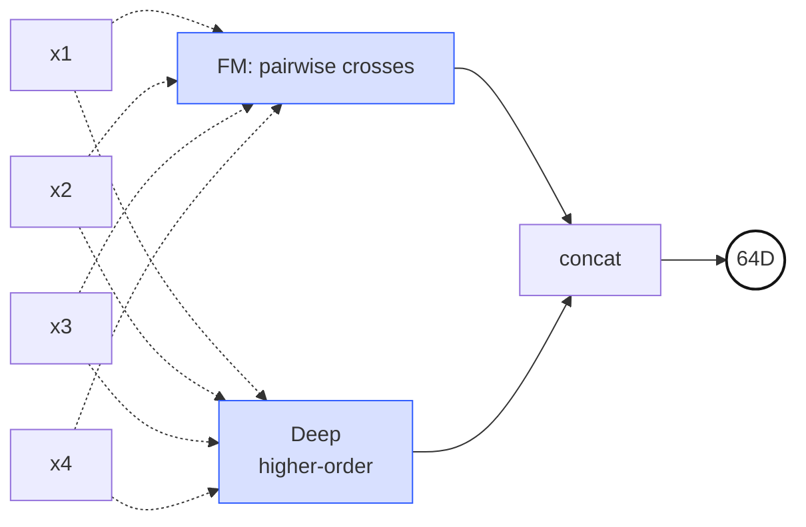
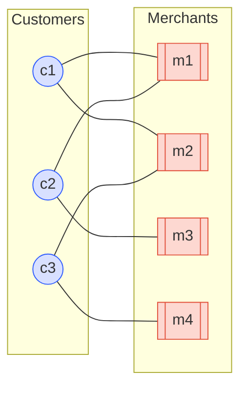
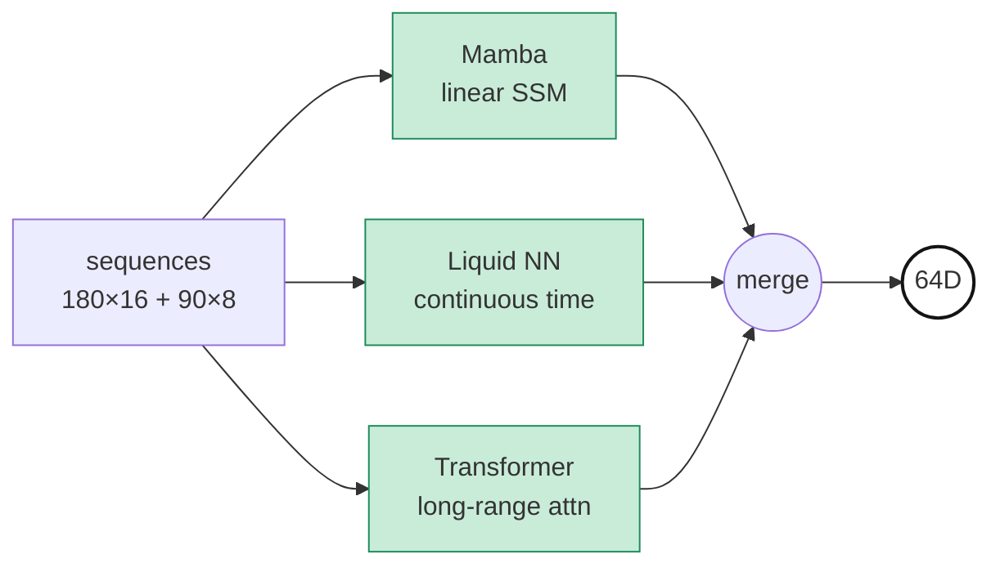
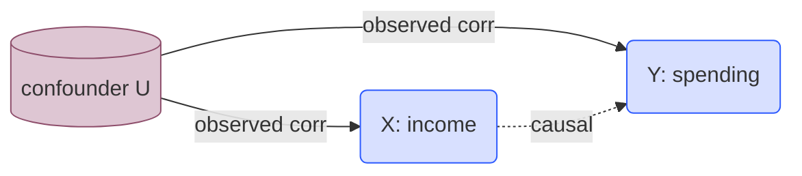

*PLE-3 of the "Study Thread" series — a parallel English/Korean sub-thread running PLE-1 → PLE-6 that summarizes the papers and math foundations behind the PLE architecture used in this project. Source: the on-prem `기술참조서/PLE_기술_참조서` document. PLE-2 declared that this project assembles its Shared Expert Pool from heterogeneous members. This third post tours those seven members one by one — the goal is a single-pass overview of which mathematical lens each Expert uses to read the same customer differently. The deeper mathematical background of each individual Expert is handled in dedicated later sub-threads (DeepFM-\*, HGCN-\*, TDA-\*, Temporal-\*, Causal-\*, OT-\*, and so on).*

The seven Experts are one idea structured in concrete code: **the same customer data is read through seven completely different mathematical viewpoints.** PLE-2 argued the *why* of heterogeneity — parameter efficiency vs expressive power, interpretability, natural role specialization across tasks. This post is the *who*. A single customer arrives as a 644-dimensional feature vector plus auxiliary inputs (graph neighborhoods, sequences, persistence diagrams). Seven specialists analyze the same person with their own methodology — symmetric pairwise crosses, neighbor preferences, hyperbolic hierarchy, temporal dynamics, topological shape, causal structure, distributional distance — and each files a 64- or 128-dimensional opinion.

## 1. DeepFM — Symmetric Pairwise Feature Crosses

In classical ML, feature crosses like "income × age" or "visit-frequency × recency" were hand-crafted by domain experts and fed into the model as engineered features. Factorization Machines (Rendle, 2010) removed the manual step: every pairwise interaction is learned automatically, but instead of one parameter per pair, each feature carries a $k$-dimensional latent vector $\mathbf{v}_i$, and the pair strength is parameterized as the inner product $\langle \mathbf{v}_i, \mathbf{v}_j \rangle$, scaling as $O(nk)$ instead of $O(n^2)$.

DeepFM (Guo et al., 2017) adds a Deep tower on top. The FM part models second-order crosses symmetrically while the deep MLP captures higher-order nonlinearities. In our project this Expert ingests the normalized 644D feature vector and learns the invisible "combination switches" — the hidden AND-gates between pairs of features that predict specific customer behavior. It is also the only Expert in the pool that keeps per-feature-name interpretability at any level.

> **Two parallel towers.** The FM tower crosses every feature pair through a symmetric inner product $\langle \mathbf{v}_i, \mathbf{v}_j \rangle$; the Deep tower extracts higher-order nonlinear interactions from the same input. The two branches are concatenated and projected to 64D.

$$\hat{y}_{FM} = w_0 + \sum_{i=1}^{n} w_i x_i + \sum_{i=1}^{n} \sum_{j=i+1}^{n} \langle \mathbf{v}_i, \mathbf{v}_j \rangle \, x_i x_j$$

> **History — Rendle, ICDM 2010; Guo/Tang/Ye/Li/He, IJCAI 2017.** FM was originally proposed as a generalization of matrix factorization for sparse data. DeepFM matched or beat Wide&Deep on the Criteo CTR benchmark with no hand-crafted crosses and is now effectively an industry standard.

**Output: 64D**

## 2. LightGCN — Customer–Merchant Bipartite Graph Collaborative Signal

LightGCN reframes collaborative filtering as graph convolution. It strips the standard GCN down by removing the feature-transformation matrix and nonlinearity, leaving only "normalized weighted aggregation of neighbor embeddings." What remains is lightweight, fast to train, and less prone to overfitting than NGCF or its descendants.

We pre-train LightGCN offline on the customer–merchant bipartite graph, producing a 64-dimensional embedding per customer, which is then fed directly to the PLE Expert as input. The information carried here is genuinely community-level — "what do people with similar spending patterns end up preferring?" — and cannot be reconstructed from any individual feature. While other Experts look at the customer's internal state, LightGCN looks at the taste of the neighborhood they belong to.

> **Bipartite graph.** Blue circles are customers, orange boxes are merchants, edges are transactions. LightGCN propagates 2-hop community signal — "c1 and c2 both connect to m1, so their embeddings pull toward each other" — using nothing more than normalized neighbor averaging.

$$\mathbf{e}_u^{(k+1)} = \sum_{i \in \mathcal{N}_u} \frac{1}{\sqrt{|\mathcal{N}_u|}\sqrt{|\mathcal{N}_i|}} \, \mathbf{e}_i^{(k)}$$

> **History — He/Deng/Wang/Li/Zhang/Wang, SIGIR 2020.** A direct graph-era descendant of Koren's Matrix Factorization (Netflix Prize, 2009). It became the textbook example of "deeper is not always better" — by removing almost everything NGCF had added, it performed *better* on standard benchmarks.

**Output: 64D**

## 3. Unified HGCN — Merchant Hierarchy in Hyperbolic Space

Structures like MCC codes, product taxonomies, and regional hierarchies are fundamentally **trees** — the number of nodes grows exponentially with depth. The problem is that embedding a deep tree into Euclidean space is essentially hopeless: no matter how many dimensions you add, there is never enough room at large radius to preserve the exponential fan-out of tree distances. As Krioukov et al. (2010) pointed out, **hyperbolic space is precisely the geometry whose sphere area grows exponentially with radius**, which makes trees fit naturally.

HGCN (Chami et al., NeurIPS 2019) carried this idea into graph convolutions: node embeddings live on the Poincaré disk, aggregation happens in the tangent space, and the exponential map brings the result back onto the manifold. Our implementation extends it with merchant co-visit signals, producing a **unified** variant that consumes a 47D input (20D hierarchy coordinates + 27D merchant slice) and outputs 128D. Unified HGCN is the only 128D Expert — the extra capacity pays for the learnable curvature parameter and the richer hyperbolic operations.

> **Hyperbolic geometry schematic — (a) tessellation mesh + (b) example geodesics.** (a) The Poincaré disk is tiled with a high-density triangle cell network. Cells further from the center appear visually smaller because the disk is a conformal projection — in the underlying hyperbolic metric every cell has the same size. (b) Hyperbolic *straight lines* (geodesics) come in two shapes: a **diameter geodesic** (straight orange line through the origin), and **circular arc geodesics** (curved orange arcs) which intersect the boundary **orthogonally**. In the Euclidean plane a radius-$r$ circle has circumference $2\pi r$; in the hyperbolic plane it grows **exponentially** as $\sinh(r)$, which is exactly why tree-structured data (child counts growing geometrically per depth) fits here without running out of room.

$$d_{\mathcal{P}}(\mathbf{x}, \mathbf{y}) = \cosh^{-1}\!\left(1 + 2 \frac{\|\mathbf{x} - \mathbf{y}\|^2}{(1-\|\mathbf{x}\|^2)(1-\|\mathbf{y}\|^2)}\right)$$

> **Analogy — "a tree's home".** On a flat sheet of paper, a tree's branches quickly run out of room and overlap. Hyperbolic space keeps opening up exponentially as you move away from the root, so a tree can spread out infinite branches while preserving the same distance ratios. MCC and product hierarchies, in this space, are trees that finally found a room large enough to live in.

**Output: 128D**

## 4. Temporal — Sequence Dynamics (Mamba + LNN + Transformer)

Customer time flows at multiple speeds simultaneously — intraday transaction patterns, weekly habits, monthly lifecycle shifts, yearly life-stage transitions. No single sequence model captures all scales well. This Expert is therefore an ensemble of three.

Mamba (Gu & Dao, 2023) is a selective state-space model that captures long-range dependencies in linear time. LNN (Liquid Neural Networks, Hasani et al., 2021) is a continuous-time ODE-based recurrent model robust to irregular sampling intervals. The Transformer branch uses attention for explicit long-range interactions. The three consume `txn_seq` (180 days × 16 features) and `session_seq` (90 days × 8 features) in parallel and their outputs are fused into a 64D summary — ensemble diversity, pulled inside a single Expert.

> **Three sequence paradigms in parallel.** The same input is processed by SSM (linear recurrence), ODE (continuous-time dynamics), and Attention (explicit pairwise) branches in parallel, then fused to a single 64D summary. Ensemble diversity, folded inside one Expert.

$$\mathbf{h}_t = \bar{\mathbf{A}}_t \mathbf{h}_{t-1} + \bar{\mathbf{B}}_t \mathbf{x}_t, \qquad \mathbf{y}_t = \mathbf{C}_t \mathbf{h}_t$$

> **History — Gu & Dao, 2023 (Mamba); Hasani/Lechner et al., AAAI 2021 (LNN); Vaswani et al., NeurIPS 2017 (Transformer).** Three fundamentally different sequence-computation paradigms — selective state-space, continuous-time ODE, and dot-product attention — run in parallel inside one Expert. The diversity argument for ensembling has been moved inside the model.

**Output: 64D**

## 5. PersLay — The Topological Shape of Transaction Patterns

If you plot a customer's transactions as a point cloud in time-amount space, an entire class of information emerges that statistical features cannot see: **topological features** like "how many loops live here", "how many clusters merge at what threshold", "how persistent are the empty regions". Persistent Homology (Edelsbrunner / Letscher / Zomorodian, 2002) quantifies exactly this — as a filtration threshold sweeps, it records when homology features (connected components, holes) are born and when they die, producing a **barcode**, also known as a persistence diagram.

The trouble is that barcodes are variable-length point sets and cannot be fed to a neural network directly. PersLay (Carrière et al., AISTATS 2020) solves this with a differentiable parameterized pooling: each point $(b, d)$ is mapped through a position embedding $\phi(b, d)$ and weighted by a persistence function $\psi(d - b)$, then summed to a fixed-dimensional vector. Our system feeds it two diagrams — short (90-day app logs) and long (12-month financial transactions).

> **Persistence barcode.** The horizontal axis is the filtration scale — as ε grows the simplicial complex expands — and each horizontal bar is the **lifespan** of one topological feature (connected component, loop, or void) from birth to death. Long bars indicate genuine structural features; short bars are noise. PersLay converts this barcode directly into a fixed-dimensional vector via differentiable parameterized pooling.

$$\text{PersLay}(D) = \sum_{(b, d) \in D} \phi(b, d) \cdot \psi(d - b)$$

> **Analogy — "contour lines of a spending landscape".** Treat transaction activity as elevation over time. Under one threshold you see several "islands"; raise the threshold and the islands merge into larger landmasses. How many islands existed, how long they remained islands (their *persistence*), and when they merged — that is the topology of this customer's spending behavior.

**Output: 64D**

## 6. Causal — Directional Causal Structure Between Features

Correlation is symmetric: $\text{corr}(X, Y) = \text{corr}(Y, X)$. But "rising income causes rising spending" and "rising spending causes rising income" are entirely different claims, and in finance and policy the direction is decisive. Pearl's do-calculus made this distinction mathematically rigorous — in general, the observational conditional $P(Y \mid X = x)$ and the interventional $P(Y \mid do(X = x))$ are not equal.

This Expert learns a differentiable DAG structure (NOTEARS-style, Zheng et al., NeurIPS 2018) over the 644D input and extracts a **causal representation that has been de-confounded** along estimated directional edges. Where other Experts describe "what this customer looks like", the Causal Expert supplies the raw material to simulate "how this customer's outcome would shift if we intervened on a specific feature." The downstream CGC gate learns to weight this view higher for intervention-oriented tasks (e.g. next-best-action, treatment effect).

> **The do-operator.** The observational P(Y|X) is entangled with the back-door path through the confounder U, but do(X=x) surgically severs U → X and leaves only the pure causal path X → Y.

$$P(Y = y \mid do(X = x)) \neq P(Y = y \mid X = x) \quad \text{(in general)}$$

> **History — Pearl, *Causality* (2nd ed., 2009); Zheng/Aragam/Ravikumar/Xing, NOTEARS, NeurIPS 2018.** Pearl's do-calculus was central to his 2011 Turing Award. NOTEARS turned DAG structure learning from a combinatorial problem ($2^{n^2}$ search) into a continuous optimization problem, making it GPU-tractable for the first time.

**Output: 64D**

## 7. Optimal Transport — Distances Between Distributions

Suppose a customer's monthly spending distribution (share of spend across categories) is compared to a set of prototype distributions — "loyal", "churn-risk", "value-growth" personas. L2 distance ignores distributional shape; KL divergence explodes on zero-support regions. **Wasserstein distance** is defined as the minimum transport cost to reshape one distribution into the other, and therefore respects the underlying geometry between distributions.

Monge's original problem (1781) sat dormant as an impractical computational object for two centuries. Cuturi's Sinkhorn approximation (NeurIPS 2013) added entropic regularization, collapsing transport computation to something you can call millions of times per epoch on a GPU. This Expert reinterprets the 644D input as a distribution, computes Wasserstein distances against learned prototype distributions, and summarizes the pattern of these distances in 64D. Its answer is "geometrically, which persona is this customer closest to?"

> **Transport plan γ.** Each matching line pairs a blue (source) sample with a red (target) sample. The sum of (distance × mass) across all pairs is the *cost*, and the plan γ that minimises this total cost defines the Wasserstein distance — a geometric distance that respects both shape and location of the two distributions.

$$W_1(\mu, \nu) = \inf_{\gamma \in \Pi(\mu, \nu)} \int \|x - y\|_1 \, d\gamma(x, y)$$

> **Analogy — "moving a pile of sand".** You have a pile of sand shaped like $\mu$ and need to reshape it into $\nu$. The minimum total (mass × distance) you must move defines the distance between the distributions. L2, by contrast, just compares pointwise heights and cannot tell whether the piles are sitting next to each other or a mile apart.

**Output: 64D**

## Why All Seven — Cross-Fertilization, Not Redundancy

PLE-2 already argued the *why* of a heterogeneous pool — parameter efficiency, interpretability, and natural specialization across tasks. One extra point remains worth making here: of the seven, **DeepFM, Causal, and Optimal Transport all consume the same 644D normalized input**, and yet they extract three irreducibly different structures from it — symmetric pairwise crosses, directional causal edges, and distributional geometry. None of the three can be derived from the others. The remaining four (LightGCN, Unified HGCN, Temporal, PersLay) each receive domain-specific inputs — graph neighborhoods, hyperbolic coordinates, raw sequences, persistence diagrams — and expose yet another slice of the same customer. The CGC gate then learns, per task, *which lens this task needs*. The math of that gating follows in **PLE-4**, split across its two stages (CGCLayer + CGCAttention).

| # | Expert | One-line role | Output |
|---|---|---|---|
| 1 | DeepFM | Symmetric pairwise feature crosses | 64D |
| 2 | LightGCN | Preferences of neighbor customers (CF) | 64D |
| 3 | Unified HGCN | Hierarchy in hyperbolic space | 128D |
| 4 | Temporal | Sequence dynamics (SSM + ODE + Attn) | 64D |
| 5 | PersLay | Topological shape of transactions | 64D |
| 6 | Causal | Directional causal structure | 64D |
| 7 | Optimal Transport | Wasserstein distance between distributions | 64D |
