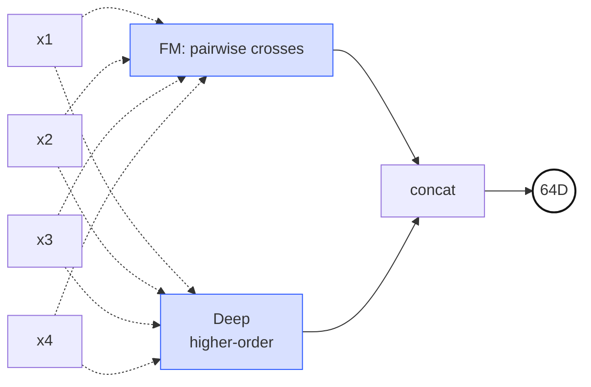
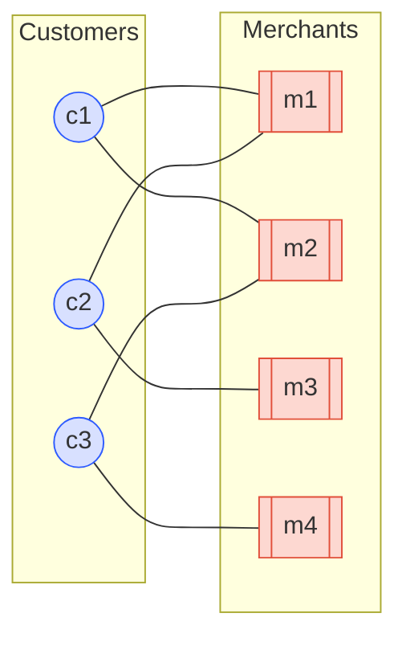
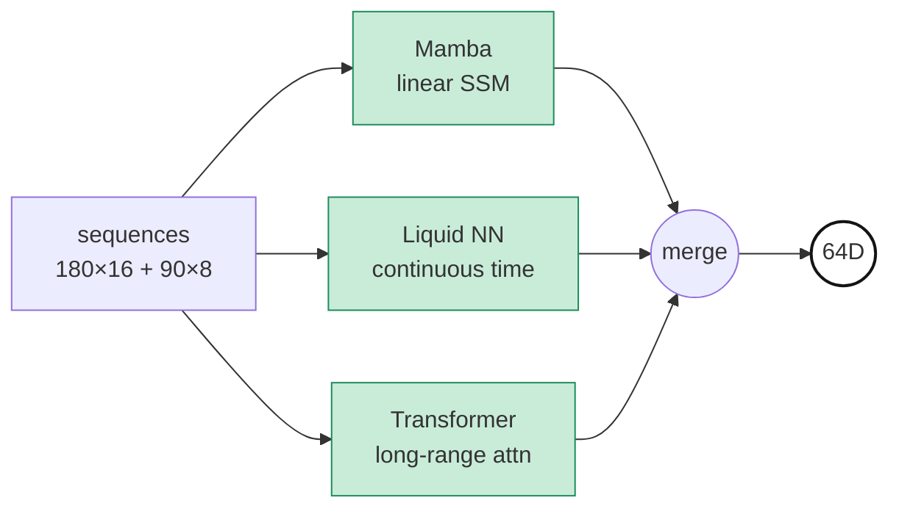
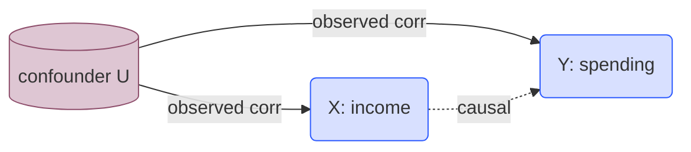

*PLE-3 of the "Study Thread" series — a parallel English/Korean sub-thread running PLE-1 → PLE-6 that summarizes the papers and math foundations behind the PLE architecture used in this project. Source: the on-prem `기술참조서/PLE_기술_참조서` document. PLE-2 landed on the decision to use a heterogeneous Shared Expert Pool. But why seven? Why these seven, not another seven? Why not GAT or DIN or SASRec? This third post answers those questions concretely — for each seat, what gap it fills, what alternatives we considered, and why this specific one won.*

## Why seven, and why these seven

PLE-2's decision was to make the Shared Expert pool heterogeneous. But the scale and the roster were still open. Wouldn't five do? Wouldn't ten be better? Why isn't GAT here? DIN? SASRec?

The number and the members resolve into one principle: **the minimum set that extracts mathematically irreducible structures from the same customer data.** Six leaves a gap; eight would introduce redundancy — what follows is, seat by seat, why this specific seat went to this specific expert.

A single customer arrives as a 644-dimensional normalized feature vector plus auxiliary inputs (graph neighborhoods, sequences, persistence diagrams). Seven specialists analyze the same person with their own methodology — symmetric pairwise crosses, neighbor preferences, hyperbolic hierarchy, temporal dynamics, topological shape, causal structure, distributional distance — and each files a 64- or 128-dimensional opinion.

## 1. DeepFM — Symmetric Pairwise Feature Crosses

**Gap to fill.** A symmetric representation of 2nd-order feature interactions. "Income × age" or "visit-frequency × recency" routinely outperforms either feature alone — what we needed was a way to *learn* these crosses rather than hand-craft them, and keep combination count from blowing up as $O(n^2)$.

**Alternatives considered.** Wide & Deep (Cheng et al., 2016) requires you to write the cross features manually on the wide side. xDeepFM stacks CIN on top of FM for explicit higher-order crosses, but doubles the parameter load. GDCN (2023) is newer but has no benchmark at our scale (644D normalized input).

**Why DeepFM.** The FM part scales stably at $O(nk)$ (Rendle 2010) and the Deep part stacks cheap nonlinear higher-order interactions on top. More importantly, the FM crosses retain interpretability — "the pair $\langle v_A, v_B \rangle$ is large" is a sanity-checkable learned interaction. DeepFM is the *only* expert in the heterogeneous pool where feature-name-level interpretability survives.

> **Two parallel towers.** The FM tower crosses every feature pair through a symmetric inner product $\langle \mathbf{v}_i, \mathbf{v}_j \rangle$; the Deep tower extracts higher-order nonlinear interactions from the same input. The two branches are concatenated and projected to 64D.

$$\hat{y}_{FM} = w_0 + \sum_{i=1}^{n} w_i x_i + \sum_{i=1}^{n} \sum_{j=i+1}^{n} \langle \mathbf{v}_i, \mathbf{v}_j \rangle \, x_i x_j$$

> **History — Rendle, ICDM 2010; Guo/Tang/Ye/Li/He, IJCAI 2017.** FM was originally proposed as a generalization of matrix factorization for sparse data. DeepFM matched or beat Wide&Deep on the Criteo CTR benchmark with no hand-crafted crosses and is now effectively an industry standard.

**Output: 64D**

## 2. LightGCN — Customer–Merchant Bipartite Graph Collaborative Signal

**Gap to fill.** A *community-level* signal that cannot be reconstructed from individual features. What merchants do customers with similar spending patterns prefer? No amount of a customer's own 644D feature vector gives this — the signal lives in the bipartite graph, not the node.

**Alternatives considered.** Standard GCN (Kipf & Welling 2017) carries feature transformations and nonlinearities that tend to overfit for recommendation — which is exactly what NGCF (He et al., SIGIR 2019) ran into. GraphSAGE and GAT add neighbor sampling and attention on top, but in our bipartite collaborative setup the added complexity costs more than it buys.

**Why LightGCN.** He et al. (SIGIR 2020) stripped GCN of feature transformation and nonlinearity — a radical simplification — and it beat NGCF, the textbook case for "deeper is not always better." It pre-trains offline (batch-friendly), converges fast, overfits less. For the single role of "extract bipartite collaborative signal," the right tool is the minimally decorated one.

> **Bipartite graph.** Blue circles are customers, orange boxes are merchants, edges are transactions. LightGCN propagates 2-hop community signal — "c1 and c2 both connect to m1, so their embeddings pull toward each other" — using nothing more than normalized neighbor averaging.

$$\mathbf{e}_u^{(k+1)} = \sum_{i \in \mathcal{N}_u} \frac{1}{\sqrt{|\mathcal{N}_u|}\sqrt{|\mathcal{N}_i|}} \, \mathbf{e}_i^{(k)}$$

> **History — He/Deng/Wang/Li/Zhang/Wang, SIGIR 2020.** A direct graph-era descendant of Koren's Matrix Factorization (Netflix Prize, 2009). It became the textbook example of "deeper is not always better" — by removing almost everything NGCF had added, it performed *better* on standard benchmarks.

**Output: 64D**

## 3. Unified HGCN — Merchant Hierarchy in Hyperbolic Space

**Gap to fill.** Structures like MCC codes, product taxonomies, and regional hierarchies are fundamentally trees — the number of nodes grows exponentially with depth. Fitting that into Euclidean space is hopeless: no matter how many dimensions you add, there is never enough room at large radius to preserve tree distances. A separate representation space that can absorb a deep hierarchy without distortion was required.

**Alternatives considered.** Vanilla GCN suffers from increasing distortion as the hierarchy deepens. Tree-LSTM handles hierarchy well but struggles to mix in co-visit graph information. Knowledge graph embeddings (TransE and kin) handle relation types but lack smooth distance semantics.

**Why Unified HGCN.** Krioukov et al. (2010) noted that hyperbolic space has exponentially growing sphere area in radius, so trees fit naturally. HGCN (Chami et al., NeurIPS 2019) ported the idea into GCNs — node embeddings on the Poincaré disk, aggregation in the tangent space, exponential map back. We extended it with merchant-to-merchant co-visit signal to produce a **unified** variant that fuses HGCN and Merchant-HGCN. This is the only 128D expert in the pool — the extra capacity pays for the learnable curvature parameter and the heavier manifold operations. (That heterogeneous dim is the problem PLE-4 fixes with `dim_normalize`.)

> **Hyperbolic geometry schematic — (a) tessellation mesh + (b) example geodesics.** (a) The Poincaré disk is tiled with a high-density triangle cell network. Cells further from the center appear visually smaller because the disk is a conformal projection — in the underlying hyperbolic metric every cell has the same size. (b) Hyperbolic *straight lines* (geodesics) come in two shapes: a **diameter geodesic** (straight orange line through the origin), and **circular arc geodesics** (curved orange arcs) which intersect the boundary **orthogonally**. In the Euclidean plane a radius-$r$ circle has circumference $2\pi r$; in the hyperbolic plane it grows **exponentially** as $\sinh(r)$, which is exactly why tree-structured data (child counts growing geometrically per depth) fits here without running out of room.

$$d_{\mathcal{P}}(\mathbf{x}, \mathbf{y}) = \cosh^{-1}\!\left(1 + 2 \frac{\|\mathbf{x} - \mathbf{y}\|^2}{(1-\|\mathbf{x}\|^2)(1-\|\mathbf{y}\|^2)}\right)$$

> **Analogy — "a tree's home".** On a flat sheet of paper, a tree's branches quickly run out of room and overlap. Hyperbolic space keeps opening up exponentially as you move away from the root, so a tree can spread out infinite branches while preserving the same distance ratios. MCC and product hierarchies, in this space, are trees that finally found a room large enough to live in.

**Output: 128D**

## 4. Temporal — Sequence Dynamics (Mamba + LNN + Transformer)

**Gap to fill.** Customer time flows at multiple speeds simultaneously — intraday patterns, weekly habits, monthly lifecycle, yearly life-stage transitions. No single sequence model captures all scales well. A seat dedicated to time-series representation was required.

**Alternatives considered.** A pure Transformer pays $O(T^2)$ attention cost on 180-day sequences — heavy. Mamba alone is strong on long-range but weak on explicit pairwise comparisons. LNN alone is robust to irregular sampling but lacks representational capacity. Picking one sacrifices the other two axes.

**Why a 3-way ensemble.** The three paradigms — SSM (linear recurrence), ODE (continuous-time dynamics), Attention (explicit pairwise) — each capture a different face of customer time. We pulled ensemble diversity *inside* one Expert rather than *outside* it, so the CGC gate sees a single "Temporal" seat while that seat is internally a fusion of three time-series models. Individual submodels are kept small and a fusion layer projects to 64D.

> **Three sequence paradigms in parallel.** The same input is processed by SSM (linear recurrence), ODE (continuous-time dynamics), and Attention (explicit pairwise) branches in parallel, then fused to a single 64D summary. Ensemble diversity, folded inside one Expert.

$$\mathbf{h}_t = \bar{\mathbf{A}}_t \mathbf{h}_{t-1} + \bar{\mathbf{B}}_t \mathbf{x}_t, \qquad \mathbf{y}_t = \mathbf{C}_t \mathbf{h}_t$$

> **History — Gu & Dao, 2023 (Mamba); Hasani/Lechner et al., AAAI 2021 (LNN); Vaswani et al., NeurIPS 2017 (Transformer).** Three fundamentally different sequence-computation paradigms — selective state-space, continuous-time ODE, and dot-product attention — run in parallel inside one Expert. The diversity argument for ensembling has been moved inside the model.

**Output: 64D**

## 5. PersLay — The Topological Shape of Transaction Patterns

**Gap to fill.** Statistical features — means, variances, autocorrelations — cannot see the *shape* of spending patterns. Does the customer cycle between categories (loops)? Are there concentrated bursts (clusters)? Sudden branches in lifestyle? These are topological properties of a time × amount point cloud, not moments of a distribution. A seat for extracting them was required.

**Alternatives considered.** The TDA primitive — persistence diagrams — is a variable-length point set, unusable as a neural input. Persistence images and persistence landscapes give fixed vectors but are either non-differentiable or force resolution to be fixed ahead of time. Wasserstein-kernel methods are differentiable but scale badly.

**Why PersLay.** Carrière et al. (AISTATS 2020) converts a persistence diagram to a fixed-dimensional vector through *differentiable parameterized pooling* — each point $(b, d)$ is mapped through a position embedding $\phi(b, d)$ and a persistence weighting $\psi(d - b)$, then summed. It is the almost-unique path for letting TDA's shape information flow through a deep-learning stack. Our system feeds it short (90-day app logs) and long (12-month financial transactions) diagrams.

> **Persistence barcode.** The horizontal axis is the filtration scale — as ε grows the simplicial complex expands — and each horizontal bar is the **lifespan** of one topological feature (connected component, loop, or void) from birth to death. Long bars indicate genuine structural features; short bars are noise. PersLay converts this barcode directly into a fixed-dimensional vector via differentiable parameterized pooling.

$$\text{PersLay}(D) = \sum_{(b, d) \in D} \phi(b, d) \cdot \psi(d - b)$$

> **Analogy — "contour lines of a spending landscape".** Treat transaction activity as elevation over time. Under one threshold you see several "islands"; raise the threshold and the islands merge into larger landmasses. How many islands existed, how long they remained islands (their *persistence*), and when they merged — that is the topology of this customer's spending behavior.

**Output: 64D**

## 6. Causal — Directional Causal Structure Between Features

**Gap to fill.** Correlation is symmetric: $\text{corr}(X, Y) = \text{corr}(Y, X)$. "Rising income causes rising spending" and "rising spending causes rising income" are entirely different claims, and in finance or policy intervention the direction is decisive. A dedicated seat for modeling directionality and confounder removal was required.

**Alternatives considered.** SHAP and LIME are post-hoc and decompose correlations, not causal structure. Bayesian networks learn DAGs via combinatorial optimization ($2^{n^2}$) — not GPU-friendly. Instrumental variables require actual intervention instruments, which we do not have.

**Why NOTEARS-style Causal.** Zheng et al. (NeurIPS 2018) reframed DAG learning from combinatorial to *continuous* optimization — they wrote the acyclicity constraint as a differentiable trace($e^W$) expression, turning it into a GPU-solvable problem. That foundation lets us learn a causal DAG on the 644D input and extract a *de-confounded* causal representation. While other experts describe "what this customer looks like," the Causal expert supplies the raw material to simulate "how this customer's outcome would shift if we intervened on a specific feature."

> **The do-operator.** The observational P(Y|X) is entangled with the back-door path through the confounder U, but do(X=x) surgically severs U → X and leaves only the pure causal path X → Y.

$$P(Y = y \mid do(X = x)) \neq P(Y = y \mid X = x) \quad \text{(in general)}$$

> **History — Pearl, *Causality* (2nd ed., 2009); Zheng/Aragam/Ravikumar/Xing, NOTEARS, NeurIPS 2018.** Pearl's do-calculus was central to his 2011 Turing Award. NOTEARS turned DAG structure learning from a combinatorial problem ($2^{n^2}$ search) into a continuous optimization problem, making it GPU-tractable for the first time.

**Output: 64D**

## 7. Optimal Transport — Distances Between Distributions

**Gap to fill.** Comparing a customer's monthly spending distribution to prototype distributions — "loyal", "churn-risk", "value-growth" personas — breaks L2 and KL. L2 discards distributional shape; KL explodes on zero-support regions. A geometric distance between distributions was required.

**Alternatives considered.** The Wasserstein distance has existed since Monge (1781), but the raw LP form was computationally intractable for two centuries. Sliced Wasserstein is fast but loses information in high dimensions. MMD is sensitive to kernel choice and tends to miss distributional geometry.

**Why Sinkhorn OT.** Cuturi (NeurIPS 2013) added entropic regularization, collapsing Wasserstein computation to something you can call millions of times per epoch on a GPU. It is differentiable and respects both shape and location of the two distributions. This expert reinterprets the 644D input as a distribution, computes Wasserstein distances against learned prototype distributions, and summarizes the distance pattern in 64D — "geometrically, which persona is this customer closest to?"

> **Transport plan γ.** Each matching line pairs a blue (source) sample with a red (target) sample. The sum of (distance × mass) across all pairs is the *cost*, and the plan γ that minimises this total cost defines the Wasserstein distance — a geometric distance that respects both shape and location of the two distributions.

$$W_1(\mu, \nu) = \inf_{\gamma \in \Pi(\mu, \nu)} \int \|x - y\|_1 \, d\gamma(x, y)$$

> **Analogy — "moving a pile of sand".** You have a pile of sand shaped like $\mu$ and need to reshape it into $\nu$. The minimum total (mass × distance) you must move defines the distance between the distributions. L2, by contrast, just compares pointwise heights and cannot tell whether the piles are sitting next to each other or a mile apart.

**Output: 64D**

## Why all seven — cross-fertilization, not redundancy

PLE-2 already argued the *why* of a heterogeneous pool — parameter efficiency, interpretability, natural specialization across tasks. One sentence to add here: **these seven do not reduce to one another.** The cleanest evidence is the same-input experiment. Three of the seven — DeepFM, Causal, Optimal Transport — take **the exact same 644D normalized feature vector** as input, and still extract three irreducibly different structures:

- DeepFM extracts **symmetric crosses** — $\langle v_i, v_j \rangle = \langle v_j, v_i \rangle$.
- Causal extracts **asymmetric directionality** — $X \to Y$ is not $Y \to X$.
- OT extracts **distributional geometry** — Wasserstein distance pattern against prototype distributions.

Three mathematically non-commutable structures from the same feature set — none of the three can be reduced to a function of the others. That is the core justification for the heterogeneous pool. The remaining four (LightGCN, Unified HGCN, Temporal, PersLay) each take domain-specific inputs — graph neighborhoods, hyperbolic coordinates, raw sequences, persistence diagrams — and expose yet another slice of the same customer that the feature vector alone cannot reveal.

The CGC gate then learns, per task, *which lens this task needs*. The math of that gating follows in **PLE-4**, split across its two stages (CGCLayer + CGCAttention). And the new problems the heterogeneous output opens up — 64D vs 128D asymmetry, random-init collapse risk, time-scale separation — are each solved there.

| # | Expert | One-line role | Output |
|---|---|---|---|
| 1 | DeepFM | Symmetric pairwise feature crosses | 64D |
| 2 | LightGCN | Preferences of neighbor customers (CF) | 64D |
| 3 | Unified HGCN | Hierarchy in hyperbolic space | 128D |
| 4 | Temporal | Sequence dynamics (SSM + ODE + Attn) | 64D |
| 5 | PersLay | Topological shape of transactions | 64D |
| 6 | Causal | Directional causal structure | 64D |
| 7 | Optimal Transport | Wasserstein distance between distributions | 64D |
