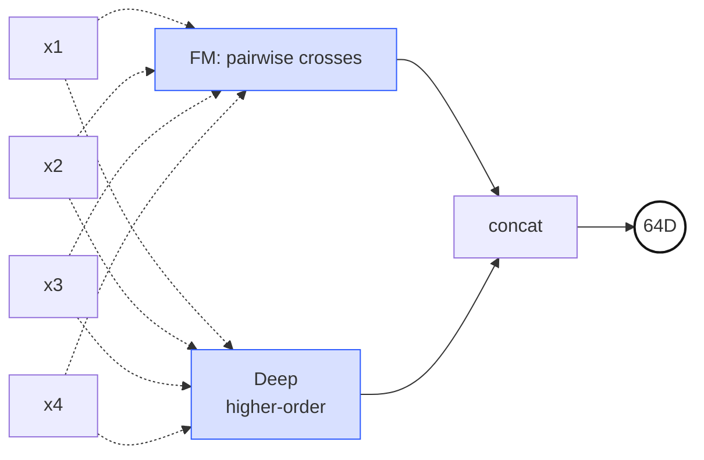
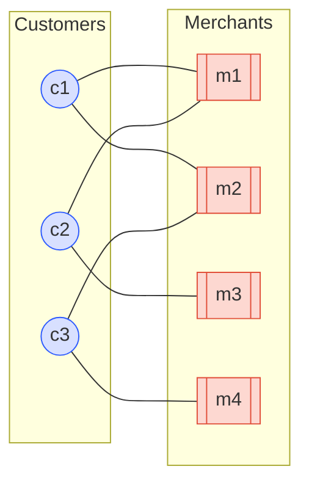
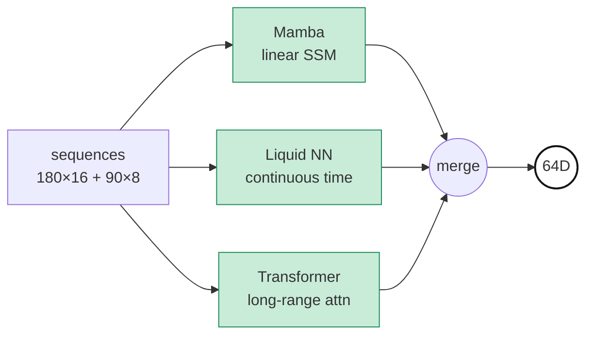
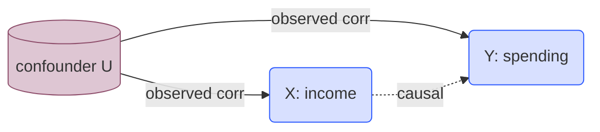

*"Study Thread" 시리즈의 PLE 서브스레드 3편. 영문/국문 병렬로 PLE-1 → PLE-6 에 걸쳐 본 프로젝트의 PLE 아키텍처 뒤에 있는 논문과 수학 기초를 정리한다. 출처는 온프렘 프로젝트 `기술참조서/PLE_기술_참조서` 이다. 이번 3편은 앞서 PLE-2 에서 "Shared Expert Pool 을 이종으로 구성한다" 고 선언했던 7명의 전문가를 한 명씩 짧게 순회한다 — 각 Expert 가 어떤 수학적 렌즈로 같은 고객을 다르게 해석하는지를 한눈에 보여주는 게 목적이고, 개별 Expert 의 깊은 수학적 배경은 이후 별도 서브스레드 (DeepFM-\*, HGCN-\*, TDA-\*, Temporal-\*, Causal-\*, OT-\* 등) 에서 전문적으로 다룬다.*

7개의 Expert 는 "같은 고객 데이터를 7가지 완전히 다른 수학적 관점으로 본다" 는 아이디어 하나를 구조화한 결과다. PLE-2 에서 이종성(heterogeneity)의 **이유** 를 다뤘다면 — 파라미터 대비 표현력, 설명가능성, 태스크 간 자연스러운 역할 분화 — 여기서는 **누가 있는지** 를 본다. 고객 한 명은 644차원의 피처 벡터, 그리고 그 위에 얹힌 그래프·시퀀스·persistence diagram 같은 보조 입력들로 기술된다. 이 동일한 사람을 7명의 전문가가 각자의 방법론으로 분석하고 — 피처 쌍의 대칭 교차로, 이웃의 취향으로, 쌍곡 공간의 계층으로, 시간의 동역학으로, 위상적 형태로, 인과 구조로, 분포 간 거리로 — 각자 64D 혹은 128D 의 의견서를 제출한다.

## 1. DeepFM — 피처 쌍의 대칭 교차 상호작용

전통 ML 에서 피처 간 교차(interaction) 는 도메인 지식으로 수동 생성하는 일이었다. "소득 × 연령", "방문빈도 × 최근성" 같은 조합을 분석가가 직접 만들어 모델에 먹였다. Factorization Machine (Rendle 2010) 은 이 수작업을 제거했다 — 모든 피처 쌍의 교차를 자동 학습하되, 각 피처마다 $k$ 차원 잠재 벡터 $\mathbf{v}_i$ 를 두고 쌍의 강도를 내적 $\langle \mathbf{v}_i, \mathbf{v}_j \rangle$ 으로 파라미터화하여 $O(nk)$ 로 스케일한다.

DeepFM (Guo et al. 2017) 은 여기에 Deep 부분을 더했다. FM 이 2차 교차를 대칭적으로 다루고, Deep 타워가 고차 비선형을 포착한다. 우리 프로젝트에서는 정규화된 644D 를 입력받아 "어떤 피처 두 개가 같이 켜졌을 때 이 고객의 특정 행동 확률이 뛰는가" 라는, 보이지 않는 조합 스위치를 학습한다. 피처 이름 하나하나를 해석 가능한 수준으로 다루는 유일한 Expert 이기도 하다.

> **두 타워 구조.** FM 타워는 모든 피처 쌍을 대칭 내적 $\langle \mathbf{v}_i, \mathbf{v}_j \rangle$ 으로 교차시키고, Deep 타워는 같은 입력에서 고차 비선형을 뽑아낸다. 두 경로의 출력을 합쳐 64D 로 내보낸다.

$$\hat{y}_{FM} = w_0 + \sum_{i=1}^{n} w_i x_i + \sum_{i=1}^{n} \sum_{j=i+1}^{n} \langle \mathbf{v}_i, \mathbf{v}_j \rangle \, x_i x_j$$

> **역사 — Rendle, ICDM 2010; Guo/Tang/Ye/Li/He, IJCAI 2017.** FM 은 원래 sparse 데이터 상의 matrix factorization 일반화로 제안되었다. DeepFM 은 Criteo CTR 벤치마크에서 Wide&Deep 대비 수작업 피처 없이 동등 이상 성능을 보이며 산업계 표준에 가까워졌다.

**출력: 64D**

## 2. LightGCN — 고객-가맹점 이분 그래프 협업 신호

협업 필터링을 그래프 컨볼루션으로 재구성한 모델이다. 표준 GCN 의 feature transformation 행렬과 nonlinearity 를 제거하고, "이웃 임베딩의 정규화된 가중 평균" 만 남겨 추천에 특화했다. 가볍고, 수렴이 빠르고, overfitting 이 적다.

우리는 오프라인에서 LightGCN 을 사전 학습해 고객별 64D 임베딩을 계산하고, 이를 PLE Expert 의 입력으로 그대로 공급한다. 이 Expert 가 제공하는 정보는 "이 고객과 유사한 소비 패턴의 사람들이 어떤 가맹점/상품을 선호했는가" 라는, 개별 피처로는 절대 복원할 수 없는 community-level 신호다. 다른 Expert 가 개인의 내적 상태를 보는 동안, LightGCN 은 그 사람이 속한 이웃의 취향을 본다.

> **이분 그래프.** 파란 원은 고객, 주황 박스는 가맹점. 엣지는 거래 이력. LightGCN 은 이 그래프 위에서 "내 이웃(m1, m2) 과 함께 다른 고객의 이웃을 공유하는 c2" 같은 2-hop 정보를 이웃 임베딩 평균만으로 전파한다.

$$\mathbf{e}_u^{(k+1)} = \sum_{i \in \mathcal{N}_u} \frac{1}{\sqrt{|\mathcal{N}_u|}\sqrt{|\mathcal{N}_i|}} \, \mathbf{e}_i^{(k)}$$

> **역사 — He/Deng/Wang/Li/Zhang/Wang, SIGIR 2020.** Koren 의 Matrix Factorization (Netflix Prize 2009) 의 그래프 버전 직계 후손이다. NGCF (He 2019) 가 복잡했던 GCN 추천을 극단적으로 단순화하면서도 성능이 더 좋았다는 점에서, "Deep 이 항상 좋은 것은 아니다" 를 보여준 대표 사례.

**출력: 64D**

## 3. Unified HGCN — 쌍곡 공간에서의 가맹점 계층

MCC 코드, 상품 트리, 지역 계층 같은 구조는 본질적으로 **나무** 다. 루트에서 멀어질수록 노드 수가 지수적으로 늘어난다. 문제는 유클리드 공간에 트리를 끼워 넣으려 하면 — 차원을 아무리 늘려도 — 깊은 계층을 거리 관계가 유지되도록 배치할 자리가 금세 부족해진다는 점이다. Krioukov et al. (2010) 이 지적했듯, **쌍곡 공간은 구(sphere) 의 넓이가 반지름에 대해 지수적으로 자라는 공간** 이라 트리가 자연스럽게 들어간다.

HGCN (Chami et al., NeurIPS 2019) 은 이 아이디어를 GCN 에 이식해, 노드 임베딩을 Poincaré 디스크 위에 올리고 tangent space 에서 aggregate 후 다시 manifold 로 exponential map 한다. 우리 구현은 여기에 가맹점 간 공동방문(co-visit) 신호를 추가해 HGCN + Merchant-HGCN 을 하나로 통합한 **unified** 변형이며, 47D 입력(계층 좌표 20D + 가맹점 slice 27D) 을 받아 128D 로 출력한다. 7명 중 유일한 128D 로, 쌍곡 기하의 곡률 파라미터까지 학습하기 위해 추가 capacity 를 준 것이다.

> **쌍곡 기하 도식 — (a) 쌍곡 테셀레이션 메쉬 + (b) geodesic 예시.** (a) Poincaré disk 모델 전체를 고밀도 삼각형 셀 네트워크로 뒤덮어, 같은 쌍곡 거리를 가진 삼각형이 경계로 갈수록 시각적으로 작아 보이는 현상을 보여준다. (b) 쌍곡 *직선* (geodesic) 은 두 가지 형태 — 중심을 지나는 **diameter geodesic** (주황 직선), 그리고 경계에 **직각 (orthogonal intersection)** 으로 만나는 **circular arc geodesic** (주황 호). 평면에서는 반지름 $r$ 원 둘레가 $2\pi r$ 인데 쌍곡 평면에서는 $\sinh(r)$ 로 지수적으로 자라서, 트리 구조처럼 자식 수가 깊이마다 기하급수로 늘어나는 데이터가 "자리가 부족하지 않게" 들어간다.

$$d_{\mathcal{P}}(\mathbf{x}, \mathbf{y}) = \cosh^{-1}\!\left(1 + 2 \frac{\|\mathbf{x} - \mathbf{y}\|^2}{(1-\|\mathbf{x}\|^2)(1-\|\mathbf{y}\|^2)}\right)$$

> **비유 — "나무의 집".** 평면에는 큰 나무를 그릴 자리가 부족해서 가지가 서로 겹친다. 쌍곡 공간은 뿌리에서 멀어질수록 자리가 지수적으로 벌어져, 같은 거리 비율을 유지하면서 무한한 가지를 펼칠 수 있다. MCC 트리 같은 계층은 이 공간에서 "살 곳을 찾은 나무" 가 된다.

**출력: 128D**

## 4. Temporal — 시퀀스 동역학 (Mamba + LNN + Transformer)

고객의 시간은 여러 속도로 동시에 흐른다. 하루 안의 거래 패턴, 주 단위의 습관, 월 단위의 라이프사이클 변화, 연 단위의 인생 단계 전환. 단일 sequence 모델로 이 스케일들을 모두 잡기는 어렵다. 그래서 이 Expert 는 세 가지 모델의 앙상블이다.

Mamba (Gu & Dao 2023) 는 selective state-space 구조로 선형 복잡도에서 장거리 의존을 포착한다. LNN (Liquid Neural Network, Hasani et al. 2021) 은 연속시간 ODE 기반으로 irregular 한 시간 간격에도 강건한 dynamics 를 학습한다. Transformer 는 attention 으로 명시적 장거리 관계를 본다. 세 모델이 txn_seq (180일×16피처) 와 session_seq (90일×8피처) 를 각자의 방식으로 인코딩하고, 그 결과를 64D 로 통합한다.

> **세 가지 시퀀스 패러다임의 병렬.** 같은 입력을 SSM(선형 recurrence) / ODE(연속시간 dynamics) / Attention(explicit pairwise) 세 엔진이 각자 처리하고 합쳐 64D 로 요약한다. 앙상블 다양성이 Expert 내부로 들어온 구조.

$$\mathbf{h}_t = \bar{\mathbf{A}}_t \mathbf{h}_{t-1} + \bar{\mathbf{B}}_t \mathbf{x}_t, \qquad \mathbf{y}_t = \mathbf{C}_t \mathbf{h}_t$$

> **역사 — Gu & Dao 2023 (Mamba); Hasani/Lechner et al., AAAI 2021 (LNN); Vaswani et al., NeurIPS 2017 (Transformer).** SSM/ODE/Attention 이라는 세 가지 서로 다른 sequence 계산 패러다임을 하나의 Expert 안에서 병렬로 돌리는 설계. 앙상블의 다양성이 Expert 내부로 들어온 형태다.

**출력: 64D**

## 5. PersLay — 거래 패턴의 위상적 형태

고객의 거래 시퀀스를 시간-금액 평면의 점구름으로 보면, "얼마나 오래 살아남는 루프·클러스터·빈 공간이 있는가" 라는 **위상적(topological) 특성** 이 드러난다. 이런 정보는 평균·분산·자기상관 같은 통계적 피처로는 잡히지 않는다. Persistent Homology (Edelsbrunner/Letscher/Zomorodian 2002) 는 필터링 임계값을 바꾸면서 homology 특성(구멍·연결성분) 이 언제 태어나고 언제 죽는지를 **barcode** (또는 persistence diagram) 로 정량화한다.

문제는 barcode 가 가변 길이 포인트 집합이라 신경망 입력으로 바로 못 쓴다는 것. PersLay (Carrière et al., AISTATS 2020) 는 이를 미분가능한 parameterized pooling 으로 고정 차원 벡터로 변환한다 — 각 점 $(b, d)$ 에 대해 위치 임베딩 $\phi(b, d)$ 와 persistence weighting $\psi(d-b)$ 를 곱해 합산한다. 우리 시스템에서는 short (90일 앱 로그) 와 long (12개월 금융거래) 두 종류의 diagram 을 받아 각각 처리한다.

> **Persistence barcode.** 가로축은 filtration 스케일 (ε 를 키워가며 simplicial complex 를 확장), 각 수평선은 그 과정에서 한 위상적 특징 (연결성분 · 루프 · 보이드) 이 태어나서 사라지기까지 **살아있는 구간**. 길게 살아남은 선이 진짜 위상적 구조, 짧은 선은 노이즈. PersLay 는 이 barcode 를 그대로 미분가능한 pooling 으로 고정 차원 벡터로 변환한다.

$$\text{PersLay}(D) = \sum_{(b, d) \in D} \phi(b, d) \cdot \psi(d - b)$$

> **비유 — "소비 지도의 등고선".** 거래 데이터를 고도(시간에 따른 활동 강도) 로 보면, 어떤 임계값 아래에서 "섬" 이 몇 개로 나뉘어 있다가 어떤 임계값에서 합쳐지는지가 고객의 소비 패턴 토폴로지다. 섬이 얼마나 오래 섬으로 남았는지(persistence) 가 핵심 정보.

**출력: 64D**

## 6. Causal — 피처 간 방향성 인과 구조

상관관계는 대칭이다. $\text{corr}(X, Y) = \text{corr}(Y, X)$. 하지만 "소득이 늘면 소비가 증가" 와 "소비가 늘면 소득이 증가" 는 완전히 다른 주장이며, 특히 금융·정책 의사결정에서는 방향이 결정적이다. Pearl 의 do-calculus 는 이 구분을 수식으로 엄밀히 만들었다 — 관찰 $P(Y \mid X = x)$ 와 개입 $P(Y \mid do(X = x))$ 은 일반적으로 다르다.

이 Expert 는 644D 입력에서 NOTEARS (Zheng et al., NeurIPS 2018) 계열의 미분가능한 DAG 학습을 이용해 **교란 변수를 제거한 인과 표현** 을 추출한다. 다른 Expert 들이 "이 고객은 어떻게 생겼는가" 를 본다면, Causal Expert 는 "이 고객의 어떤 피처를 바꾸면 결과가 어떻게 움직이는가" 를 시뮬레이션할 재료를 제공한다. CGC 게이트는 이 관점을 특히 정책적·개입적 태스크(예: next-best-action, 추천 개입 효과) 에 더 가중한다.

> **do-연산자.** observational P(Y|X) 는 U 를 통한 경로와 뒤섞여 있지만, do(X=x) 는 U→X 를 끊고 순수 인과 경로만 남긴다.

$$P(Y = y \mid do(X = x)) \neq P(Y = y \mid X = x) \quad \text{(일반적으로)}$$

> **역사 — Pearl, *Causality* (2nd ed. 2009); Zheng/Aragam/Ravikumar/Xing, NOTEARS, NeurIPS 2018.** Pearl 의 do-calculus 는 2011 Turing Award 의 주요 업적. NOTEARS 는 DAG 학습을 조합 최적화($2^{n^2}$) 에서 연속 최적화로 바꿔 GPU 에서 현실적으로 풀 수 있게 만들었다.

**출력: 64D**

## 7. Optimal Transport — 분포 간 거리

고객 한 명의 월별 소비 분포(카테고리별 지출 비중) 를 prototype 분포들 — "충성 고객", "이탈 위험", "가치 상승" 같은 페르소나 — 과 비교한다고 하자. L2 나 KL divergence 는 두 분포의 "형태" 를 버리거나, zero-support 에서 발산한다. **Wasserstein distance** 는 "한 분포의 질량을 다른 분포의 모양이 되도록 옮기는 최소 수송 비용" 으로 정의되어, 분포 간 기하(geometry) 를 보존한다.

Monge (1781) 의 원형 문제는 계산 난이도 때문에 200년간 실용 도구가 아니었다. Cuturi (NeurIPS 2013) 의 Sinkhorn 근사가 entropic regularization 을 추가해 GPU 에서 수백만 번 호출 가능한 속도를 만들었다. 이 Expert 는 644D 입력을 분포로 재해석하고, 학습된 prototype 분포들과의 Wasserstein 거리 패턴을 64D 로 요약한다. "이 고객이 어떤 페르소나와 기하적으로 가까운가" 라는 질문에 대한 대답.

<svg viewBox="0 0 540 280" width="100%" style="max-width:560px;margin:20px auto;display:block;" xmlns="http://www.w3.org/2000/svg">
  <defs>
    <pattern id="ot-grid-ko" width="26" height="26" patternUnits="userSpaceOnUse">
      <path d="M 26 0 L 0 0 0 26" stroke="#1A1A1A0A" fill="none" stroke-width="1"/>
    </pattern>
  </defs>
  <rect x="30" y="20" width="480" height="210" fill="url(#ot-grid-ko)" stroke="#1A1A1A14" stroke-width="1" rx="4"/>
  <g stroke="#141414" stroke-width="0.6" fill="none" opacity="0.35">
    <line x1="80" y1="100" x2="360" y2="85"/>
    <line x1="95" y1="130" x2="390" y2="130"/>
    <line x1="110" y1="160" x2="420" y2="115"/>
    <line x1="125" y1="110" x2="370" y2="155"/>
    <line x1="140" y1="85" x2="400" y2="95"/>
    <line x1="155" y1="140" x2="440" y2="130"/>
    <line x1="85" y1="170" x2="355" y2="165"/>
    <line x1="135" y1="180" x2="415" y2="185"/>
    <line x1="170" y1="120" x2="455" y2="170"/>
    <line x1="100" y1="95" x2="380" y2="110"/>
    <line x1="165" y1="90" x2="470" y2="145"/>
    <line x1="145" y1="200" x2="430" y2="205"/>
    <line x1="180" y1="155" x2="460" y2="115"/>
    <line x1="75" y1="145" x2="345" y2="135"/>
    <line x1="120" y1="145" x2="395" y2="90"/>
  </g>
  <g fill="#D8E0FF" stroke="#2E5BFF" stroke-width="1.4">
    <circle cx="80" cy="100" r="5"/>
    <circle cx="95" cy="130" r="5"/>
    <circle cx="110" cy="160" r="5"/>
    <circle cx="125" cy="110" r="5"/>
    <circle cx="140" cy="85" r="5"/>
    <circle cx="155" cy="140" r="5"/>
    <circle cx="85" cy="170" r="5"/>
    <circle cx="135" cy="180" r="5"/>
    <circle cx="170" cy="120" r="5"/>
    <circle cx="100" cy="95" r="5"/>
    <circle cx="165" cy="90" r="5"/>
    <circle cx="145" cy="200" r="5"/>
    <circle cx="180" cy="155" r="5"/>
    <circle cx="75" cy="145" r="5"/>
    <circle cx="120" cy="145" r="5"/>
  </g>
  <g fill="#FDD8D1" stroke="#E14F3A" stroke-width="1.4">
    <circle cx="360" cy="85" r="5"/>
    <circle cx="390" cy="130" r="5"/>
    <circle cx="420" cy="115" r="5"/>
    <circle cx="370" cy="155" r="5"/>
    <circle cx="400" cy="95" r="5"/>
    <circle cx="440" cy="130" r="5"/>
    <circle cx="355" cy="165" r="5"/>
    <circle cx="415" cy="185" r="5"/>
    <circle cx="455" cy="170" r="5"/>
    <circle cx="380" cy="110" r="5"/>
    <circle cx="470" cy="145" r="5"/>
    <circle cx="430" cy="205" r="5"/>
    <circle cx="460" cy="115" r="5"/>
    <circle cx="345" cy="135" r="5"/>
    <circle cx="395" cy="90" r="5"/>
  </g>
  <text x="130" y="255" text-anchor="middle" font-family="JetBrains Mono, monospace" font-size="12" fill="#2E5BFF" font-weight="500">μ (source)</text>
  <text x="410" y="255" text-anchor="middle" font-family="JetBrains Mono, monospace" font-size="12" fill="#E14F3A" font-weight="500">ν (target)</text>
  <text x="270" y="255" text-anchor="middle" font-family="JetBrains Mono, monospace" font-size="10" fill="#6B7280">transport plan γ</text>
</svg>

> **수송 계획 γ.** 각 파란 점(source sample)을 붉은 점(target sample)과 연결하는 매칭이 transport plan γ. 매 연결선의 이동 거리 × 이동 질량을 모두 합친 값이 *비용* 이고, 이 비용을 최소화하는 γ 의 총합이 Wasserstein distance. 두 분포의 "모양·위치" 를 동시에 고려하는 기하적 거리다.

$$W_1(\mu, \nu) = \inf_{\gamma \in \Pi(\mu, \nu)} \int \|x - y\|_1 \, d\gamma(x, y)$$

> **비유 — "모래더미 옮기기".** 한 곳에 쌓인 모래더미 $\mu$ 를 다른 곳의 모양 $\nu$ 로 옮길 때, 총 이동거리 × 질량을 최소화하는 수송 계획의 비용이 두 분포의 거리다. L2 는 "두 더미의 높이 차이를 점별로 재는" 것과 같아서, 더미의 위치가 다르면 실제 이동 난이도를 반영하지 못한다.

**출력: 64D**

## 왜 7 명 모두 필요한가 — 중복이 아니라 교차수정

PLE-2 에서 이종 Expert Pool 을 쓰는 **이유** 를 이미 정리했다 — 파라미터 효율, 해석가능성, 태스크별 자연스러운 특화. 여기서는 한 가지만 덧붙인다: 7명 중 DeepFM, Causal, OT 는 **동일한 644D** 를 입력으로 받지만, 각각 대칭 교차 구조 / 방향성 인과 구조 / 분포 기하 구조를 뽑아내며 서로가 서로를 대체할 수 없다. 나머지 4명(LightGCN, Unified HGCN, Temporal, PersLay) 은 각자 고유한 도메인 입력 — 그래프, 쌍곡 좌표, 시퀀스, persistence diagram — 을 받아 동일 고객의 전혀 다른 단면을 본다. CGC 게이트가 태스크별로 "이 태스크에는 어떤 렌즈가 필요한가" 를 학습해 가중치를 배분한다. 그 게이팅의 수식을 **PLE-4** 에서 두 단계 (CGCLayer + CGCAttention) 로 나눠 따라간다.

| # | Expert | 한 줄 역할 | 출력 |
|---|---|---|---|
| 1 | DeepFM | 피처 쌍의 대칭 교차 | 64D |
| 2 | LightGCN | 이웃 고객의 취향 (협업) | 64D |
| 3 | Unified HGCN | 쌍곡 공간의 계층 구조 | 128D |
| 4 | Temporal | 시퀀스 동역학 (SSM+ODE+Attn) | 64D |
| 5 | PersLay | 거래 패턴의 위상적 형태 | 64D |
| 6 | Causal | 방향성 인과 구조 | 64D |
| 7 | Optimal Transport | 분포 간 Wasserstein 거리 | 64D |
