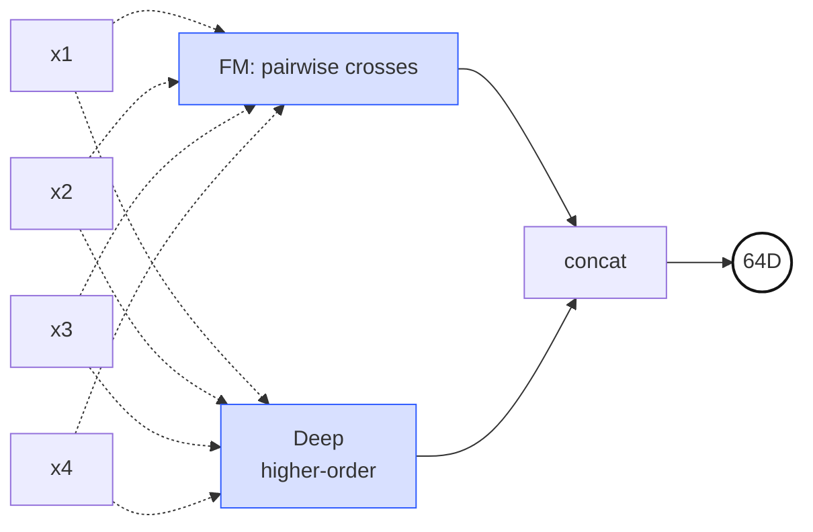
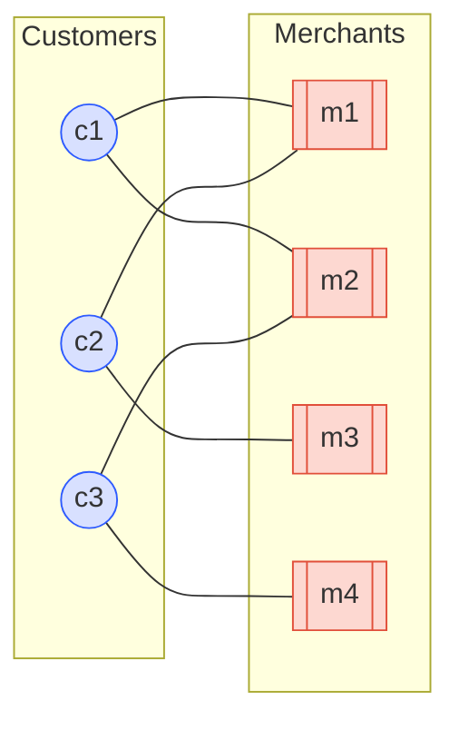
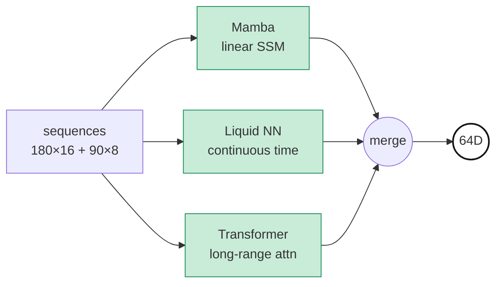
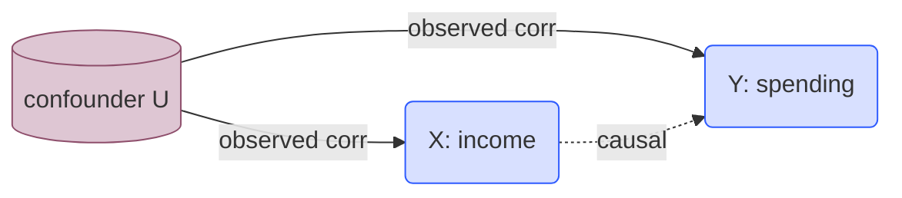

*"Study Thread" 시리즈의 PLE 서브스레드 3편. 영문/국문 병렬로 PLE-1 → PLE-6 에 걸쳐 본 프로젝트의 PLE 아키텍처 뒤에 있는 논문과 수학 기초를 정리한다. 출처는 온프렘 프로젝트 `기술참조서/PLE_기술_참조서` 이다. PLE-2 에서 "Shared Expert Pool 을 이종으로 구성한다" 는 결정이 나왔다. 그런데 왜 7명인가? 왜 이 7명이고 다른 7명이 아닌가? 이번 3편은 그 질문에 구체적으로 답한다 — 각 자리가 어떤 빈틈을 메우기 위한 것이고, 다른 후보들을 제치고 왜 이 사람이 뽑혔는지를 하나씩 짚는다.*

## 왜 7명인가, 왜 이 7명인가

PLE-2 의 결정은 "Shared Expert 를 이종으로 구성한다" 였다. 하지만 구성의 규모와 구성원은 남은 문제였다. 5명이면 되지 않나? 10명이 더 낫지 않나? GAT 나 DIN 이나 SASRec 은 왜 없나?

이 숫자와 멤버는 한 줄의 원칙으로 정리된다. **동일 고객 데이터에서 서로 환원되지 않는 수학적 구조를 뽑아내는 최소 집합** 이 되도록 뽑았다. 7 이 아니라 6 이면 빈틈이 생기고, 8 이라면 중복이 생긴다 — 여기서 각 자리가 왜 "이 자리" 인지를 하나씩 본다.

고객 한 명은 정규화된 644차원 피처 벡터로 들어오고, 그 위에 그래프, 시퀀스, persistence diagram 같은 보조 입력이 얹힌다. 7명의 전문가가 각자의 방법론으로 이 동일한 사람을 분석한다 — 피처 쌍의 대칭 교차로, 이웃의 취향으로, 쌍곡 공간의 계층으로, 시간의 동역학으로, 위상적 형태로, 인과 구조로, 분포 간 거리로 — 각자 64D 혹은 128D 의 의견서를 제출한다.

## 1. DeepFM — 피처 쌍의 대칭 교차 상호작용

**메우려는 빈틈.** 피처 간 2차 교차 상호작용의 대칭 표현이 필요했다. "소득 × 연령" 이나 "방문빈도 × 최근성" 같은 조합이 단일 피처보다 강한 신호를 줄 때가 많다. 이 교차를 손으로 만들지 않고 학습하는 것 — 그리고 조합 수가 $O(n^2)$ 로 터지지 않게 유지하는 것 — 이 전용 전문가가 필요한 이유다.

**고려한 대안들.** Wide & Deep (Cheng et al., 2016) 은 wide 쪽에 cross 를 손으로 넣어야 했다. xDeepFM 은 FM 위에 CIN 을 추가해 고차 교차를 명시적으로 다루지만, 파라미터 부담이 2배 이상이다. GDCN (2023) 은 더 최근 모델이지만 우리 규모 (644D 정규화 입력) 에서 벤치마크된 적이 없다.

**왜 DeepFM 인가.** FM 부분이 $O(nk)$ 로 안정적으로 스케일하고 (Rendle 2010), Deep 부분이 저렴한 비선형 고차 항을 얹는다. FM 교차의 해석성도 살아 있다 — "피처 A 와 피처 B 의 쌍 $\langle v_A, v_B \rangle$ 이 크다" 가 학습된 교차의 sanity check 가 된다. 이종 pool 에서 *유일하게 피처 이름 수준의 해석이 가능한* 자리다.

> **두 타워 구조.** FM 타워는 모든 피처 쌍을 대칭 내적 $\langle \mathbf{v}_i, \mathbf{v}_j \rangle$ 으로 교차시키고, Deep 타워는 같은 입력에서 고차 비선형을 뽑아낸다. 두 경로의 출력을 합쳐 64D 로 내보낸다.

$$\hat{y}_{FM} = w_0 + \sum_{i=1}^{n} w_i x_i + \sum_{i=1}^{n} \sum_{j=i+1}^{n} \langle \mathbf{v}_i, \mathbf{v}_j \rangle \, x_i x_j$$

> **역사 — Rendle, ICDM 2010; Guo/Tang/Ye/Li/He, IJCAI 2017.** FM 은 원래 sparse 데이터 상의 matrix factorization 일반화로 제안되었다. DeepFM 은 Criteo CTR 벤치마크에서 Wide&Deep 대비 수작업 피처 없이 동등 이상 성능을 보이며 산업계 표준에 가까워졌다.

**출력: 64D**

## 2. LightGCN — 고객-가맹점 이분 그래프 협업 신호

**메우려는 빈틈.** 개별 피처에서는 복원할 수 없는 *community-level* 신호가 필요했다. 비슷한 소비 패턴의 사람들이 어떤 가맹점을 선호했는지 — 개인의 644D 피처로는 알 수 없는 정보다. 이 "이웃의 취향" 을 뽑아내는 전용 자리가 필요했다.

**고려한 대안들.** 표준 GCN (Kipf & Welling 2017) 은 feature transformation 행렬과 nonlinearity 가 있어 추천용으로는 과적합되기 쉽다. NGCF (He et al., SIGIR 2019) 가 정확히 이 문제를 겪었다. GraphSAGE 나 GAT 는 이웃 샘플링이나 attention 으로 복잡도를 더 얹지만, 우리의 bipartite 협업 구조에서는 그 복잡도가 이득보다 비용이 크다.

**왜 LightGCN 인가.** He et al. (SIGIR 2020) 이 GCN 에서 feature transformation 과 nonlinearity 를 뺀 극단적 단순화로, 오히려 NGCF 보다 더 잘 됐다 — "Deep 이 항상 좋은 것은 아니다" 의 교과서적 예시다. 사전 계산이 가능하고 (오프라인 배치 학습), 학습이 빠르고, overfitting 이 적다. 이분 그래프 협업 신호라는 단일 역할에 최적화된 도구를 골랐다.

> **이분 그래프.** 파란 원은 고객, 주황 박스는 가맹점. 엣지는 거래 이력. LightGCN 은 이 그래프 위에서 "내 이웃(m1, m2) 과 함께 다른 고객의 이웃을 공유하는 c2" 같은 2-hop 정보를 이웃 임베딩 평균만으로 전파한다.

$$\mathbf{e}_u^{(k+1)} = \sum_{i \in \mathcal{N}_u} \frac{1}{\sqrt{|\mathcal{N}_u|}\sqrt{|\mathcal{N}_i|}} \, \mathbf{e}_i^{(k)}$$

> **역사 — He/Deng/Wang/Li/Zhang/Wang, SIGIR 2020.** Koren 의 Matrix Factorization (Netflix Prize 2009) 의 그래프 버전 직계 후손이다. NGCF (He 2019) 가 복잡했던 GCN 추천을 극단적으로 단순화하면서도 성능이 더 좋았다는 점에서, "Deep 이 항상 좋은 것은 아니다" 를 보여준 대표 사례.

**출력: 64D**

## 3. Unified HGCN — 쌍곡 공간에서의 가맹점 계층

**메우려는 빈틈.** MCC 코드, 상품 트리, 지역 계층 같은 구조는 본질적으로 나무다 — 루트에서 멀어질수록 노드 수가 지수적으로 늘어난다. 이걸 유클리드 공간에 끼워 넣으려면 차원을 아무리 늘려도 자리가 부족하다. 왜곡 없이 깊은 계층을 수용할 표현 공간이 별도로 필요했다.

**고려한 대안들.** 평범한 GCN 으로 계층을 다루면 깊어질수록 distortion 이 늘어난다. Tree-LSTM 은 계층은 잘 다루지만 공동 방문 같은 그래프 구조를 섞기 어렵다. Knowledge Graph 임베딩 (TransE 등) 은 관계 타입에는 좋지만 연속적인 거리 의미가 부족하다.

**왜 Unified HGCN 인가.** Krioukov et al. (2010) 이 지적한 대로 쌍곡 공간은 반지름에 대해 sphere 넓이가 지수적으로 자라는 공간이라, 트리가 자연스럽게 들어간다. HGCN (Chami et al., NeurIPS 2019) 이 이 아이디어를 GCN 에 이식했다. 우리는 여기에 가맹점 간 공동방문 (co-visit) 신호를 추가해 HGCN + Merchant-HGCN 을 하나로 통합한 **unified** 변형으로 썼다. 7명 중 유일한 128D 출력 — 쌍곡 기하의 곡률 파라미터까지 학습하기 위해 추가 capacity 를 할당한 것이다. (이 이종 차원은 PLE-4 에서 `dim_normalize` 로 보정된다.)

> **쌍곡 기하 도식 — (a) 쌍곡 테셀레이션 메쉬 + (b) geodesic 예시.** (a) Poincaré disk 모델 전체를 고밀도 삼각형 셀 네트워크로 뒤덮어, 같은 쌍곡 거리를 가진 삼각형이 경계로 갈수록 시각적으로 작아 보이는 현상을 보여준다. (b) 쌍곡 *직선* (geodesic) 은 두 가지 형태 — 중심을 지나는 **diameter geodesic** (주황 직선), 그리고 경계에 **직각 (orthogonal intersection)** 으로 만나는 **circular arc geodesic** (주황 호). 평면에서는 반지름 $r$ 원 둘레가 $2\pi r$ 인데 쌍곡 평면에서는 $\sinh(r)$ 로 지수적으로 자라서, 트리 구조처럼 자식 수가 깊이마다 기하급수로 늘어나는 데이터가 "자리가 부족하지 않게" 들어간다.

$$d_{\mathcal{P}}(\mathbf{x}, \mathbf{y}) = \cosh^{-1}\!\left(1 + 2 \frac{\|\mathbf{x} - \mathbf{y}\|^2}{(1-\|\mathbf{x}\|^2)(1-\|\mathbf{y}\|^2)}\right)$$

> **비유 — "나무의 집".** 평면에는 큰 나무를 그릴 자리가 부족해서 가지가 서로 겹친다. 쌍곡 공간은 뿌리에서 멀어질수록 자리가 지수적으로 벌어져, 같은 거리 비율을 유지하면서 무한한 가지를 펼칠 수 있다. MCC 트리 같은 계층은 이 공간에서 "살 곳을 찾은 나무" 가 된다.

**출력: 128D**

## 4. Temporal — 시퀀스 동역학 (Mamba + LNN + Transformer)

**메우려는 빈틈.** 고객의 시간은 여러 속도로 동시에 흐른다. 하루 안의 거래 패턴, 주 단위의 습관, 월 단위의 라이프사이클 변화, 연 단위의 인생 단계 전환. 단일 sequence 모델로 이 스케일들을 모두 잡기는 어렵다. 시계열 표현을 전담하는 자리가 필요했다.

**고려한 대안들.** Transformer 하나로만 가면 attention 의 $O(T^2)$ 비용이 180일 시퀀스에서 부담이다. Mamba 혼자는 long-range 에서 강하지만 explicit pairwise 비교는 약하다. LNN 하나는 irregular sampling 에는 강하지만 표현 용량이 부족하다. 하나를 선택하는 순간 나머지 두 축이 약해진다.

**왜 3-way 앙상블인가.** 세 패러다임 — SSM (선형 recurrence), ODE (연속시간 dynamics), Attention (explicit pairwise) — 이 고객 시간의 서로 다른 측면을 포착한다. 앙상블의 다양성을 *Expert 외부* 가 아닌 *Expert 내부* 로 끌어들여서, CGC gate 입장에서는 "Temporal" 이라는 단일 자리가 되지만 실제로는 세 시계열 모델의 융합이다. 개별 모델 크기를 줄이고 융합 층을 얹어 64D 출력으로 맞췄다.

> **세 가지 시퀀스 패러다임의 병렬.** 같은 입력을 SSM(선형 recurrence) / ODE(연속시간 dynamics) / Attention(explicit pairwise) 세 엔진이 각자 처리하고 합쳐 64D 로 요약한다. 앙상블 다양성이 Expert 내부로 들어온 구조.

$$\mathbf{h}_t = \bar{\mathbf{A}}_t \mathbf{h}_{t-1} + \bar{\mathbf{B}}_t \mathbf{x}_t, \qquad \mathbf{y}_t = \mathbf{C}_t \mathbf{h}_t$$

> **역사 — Gu & Dao 2023 (Mamba); Hasani/Lechner et al., AAAI 2021 (LNN); Vaswani et al., NeurIPS 2017 (Transformer).** SSM/ODE/Attention 이라는 세 가지 서로 다른 sequence 계산 패러다임을 하나의 Expert 안에서 병렬로 돌리는 설계. 앙상블의 다양성이 Expert 내부로 들어온 형태다.

**출력: 64D**

## 5. PersLay — 거래 패턴의 위상적 형태

**메우려는 빈틈.** 평균 · 분산 · 자기상관 같은 통계적 피처는 소비 패턴의 *형태* 를 잡지 못한다. 한 고객이 카테고리 간을 순환하는지 (루프), 몇 개의 집중 구간이 있는지 (클러스터), 생활 패턴에 급격한 분기가 있는지 (branch) — 이건 시간 × 금액 점구름의 위상적 구조이지, 모멘트가 아니다. 이 정보를 뽑아내는 자리가 별도로 필요했다.

**고려한 대안들.** TDA (Topological Data Analysis) 자체의 persistence diagram 은 가변 길이 점 집합이라 신경망 입력으로 바로 못 쓴다. 고정 벡터로 변환하는 방법 — persistence images, persistence landscapes — 이 있지만 미분 불가능하거나 해상도를 사전에 고정해야 한다. Wasserstein 거리 기반 kernel 은 미분은 되지만 스케일이 안 맞는다.

**왜 PersLay 인가.** Carrière et al. (AISTATS 2020) 이 persistence diagram 을 *미분 가능한 parameterized pooling* 으로 변환한다 — 각 점 $(b, d)$ 에 위치 임베딩과 persistence weighting 을 곱해 합산. 고정 차원 벡터가 되면서 gradient 가 흐른다. 우리 시스템에서는 short (90일 앱 로그) 와 long (12개월 금융거래) 두 종류의 diagram 을 받아 각각 처리한다. TDA 의 "형태 정보" 를 딥러닝 스택으로 흘려넣는 거의 유일한 경로다.

> **Persistence barcode.** 가로축은 filtration 스케일 (ε 를 키워가며 simplicial complex 를 확장), 각 수평선은 그 과정에서 한 위상적 특징 (연결성분 · 루프 · 보이드) 이 태어나서 사라지기까지 **살아있는 구간**. 길게 살아남은 선이 진짜 위상적 구조, 짧은 선은 노이즈. PersLay 는 이 barcode 를 그대로 미분가능한 pooling 으로 고정 차원 벡터로 변환한다.

$$\text{PersLay}(D) = \sum_{(b, d) \in D} \phi(b, d) \cdot \psi(d - b)$$

> **비유 — "소비 지도의 등고선".** 거래 데이터를 고도(시간에 따른 활동 강도) 로 보면, 어떤 임계값 아래에서 "섬" 이 몇 개로 나뉘어 있다가 어떤 임계값에서 합쳐지는지가 고객의 소비 패턴 토폴로지다. 섬이 얼마나 오래 섬으로 남았는지(persistence) 가 핵심 정보.

**출력: 64D**

## 6. Causal — 피처 간 방향성 인과 구조

**메우려는 빈틈.** 상관관계는 대칭이다. $\text{corr}(X, Y) = \text{corr}(Y, X)$. 하지만 "소득이 늘면 소비가 증가" 와 "소비가 늘면 소득이 증가" 는 완전히 다른 주장이며, 특히 금융 · 정책 개입 의사결정에서는 방향이 결정적이다. 피처 간 방향성과 교란 변수 제거를 다루는 전용 자리가 필요했다.

**고려한 대안들.** SHAP · LIME 은 사후 해석 방식이라 구조적 인과가 아니라 상관성을 분해할 뿐이다. 베이지안 네트워크는 DAG 학습이 조합 최적화 ($2^{n^2}$) 라 GPU 친화적이지 않다. Instrumental variable 은 실제 개입 도구가 있어야만 쓸 수 있다.

**왜 NOTEARS 계열 Causal 인가.** Zheng et al. (NeurIPS 2018) 이 DAG 학습을 조합 최적화에서 *연속 최적화* 로 전환했다 — acyclicity 제약을 trace($e^W$) 같은 미분 가능한 형태로 표현해 GPU 에서 풀 수 있게. 이것이 644D 입력에서 인과 DAG 를 학습하고 교란 변수를 제거한 인과 표현을 뽑아내는 기반이 된다. 다른 Expert 가 "고객은 어떻게 생겼는가" 를 보는 동안, Causal 은 "이 피처를 바꾸면 결과가 어떻게 움직이는가" 를 시뮬레이션할 재료를 제공한다.

> **do-연산자.** observational P(Y|X) 는 U 를 통한 경로와 뒤섞여 있지만, do(X=x) 는 U→X 를 끊고 순수 인과 경로만 남긴다.

$$P(Y = y \mid do(X = x)) \neq P(Y = y \mid X = x) \quad \text{(일반적으로)}$$

> **역사 — Pearl, *Causality* (2nd ed. 2009); Zheng/Aragam/Ravikumar/Xing, NOTEARS, NeurIPS 2018.** Pearl 의 do-calculus 는 2011 Turing Award 의 주요 업적. NOTEARS 는 DAG 학습을 조합 최적화($2^{n^2}$) 에서 연속 최적화로 바꿔 GPU 에서 현실적으로 풀 수 있게 만들었다.

**출력: 64D**

## 7. Optimal Transport — 분포 간 거리

**메우려는 빈틈.** 고객 한 명의 월별 소비 분포를 prototype 분포 — "충성 고객", "이탈 위험", "가치 상승" 같은 페르소나 — 와 비교하는 작업에서, L2 나 KL 은 실패한다. L2 는 분포의 형태를 버리고, KL 은 zero-support 에서 발산한다. 분포 간 기하학적 거리가 필요한 자리다.

**고려한 대안들.** Wasserstein 거리 자체는 Monge (1781) 부터 있었지만, 원형 LP 문제는 계산 비용 때문에 200년간 실용 도구가 아니었다. Sliced Wasserstein 은 빠르지만 고차원에서 정보 손실이 크다. MMD (Maximum Mean Discrepancy) 는 kernel 선택이 중요하고 분포 기하를 놓치기 쉽다.

**왜 Sinkhorn OT 인가.** Cuturi (NeurIPS 2013) 가 entropic regularization 을 추가해 GPU 에서 수백만 번 호출 가능한 속도를 만들었다. 미분 가능하고, 분포의 모양과 위치를 동시에 고려한다. 우리 시스템은 644D 입력을 분포로 재해석하고, 학습된 prototype 분포들과의 Wasserstein 거리 패턴을 64D 로 요약한다 — "이 고객이 어떤 페르소나와 기하적으로 가까운가" 에 대한 답이다.

> **수송 계획 γ.** 각 파란 점(source sample)을 붉은 점(target sample)과 연결하는 매칭이 transport plan γ. 매 연결선의 이동 거리 × 이동 질량을 모두 합친 값이 *비용* 이고, 이 비용을 최소화하는 γ 의 총합이 Wasserstein distance. 두 분포의 "모양·위치" 를 동시에 고려하는 기하적 거리다.

$$W_1(\mu, \nu) = \inf_{\gamma \in \Pi(\mu, \nu)} \int \|x - y\|_1 \, d\gamma(x, y)$$

> **비유 — "모래더미 옮기기".** 한 곳에 쌓인 모래더미 $\mu$ 를 다른 곳의 모양 $\nu$ 로 옮길 때, 총 이동거리 × 질량을 최소화하는 수송 계획의 비용이 두 분포의 거리다. L2 는 "두 더미의 높이 차이를 점별로 재는" 것과 같아서, 더미의 위치가 다르면 실제 이동 난이도를 반영하지 못한다.

**출력: 64D**

## 왜 7명 모두 필요한가 — 중복이 아니라 교차수정

PLE-2 에서 이종 Expert Pool 을 쓰는 이유 — 파라미터 효율, 해석가능성, 자연스러운 역할 분화 — 를 정리했다. 여기서 한 줄 덧붙인다: **이 7명은 서로를 환원하지 못한다.** 그 증거가 3명의 같은 입력 실험이다.

DeepFM, Causal, OT 는 **정확히 같은 644D 정규화 피처 벡터** 를 입력으로 받는다. 그런데 셋은 각자 전혀 다른 수학 구조를 뽑는다.

- DeepFM: **대칭 교차** — $\langle v_i, v_j \rangle = \langle v_j, v_i \rangle$
- Causal: **비대칭 인과** — $X \to Y$ 는 $Y \to X$ 와 다르다
- OT: **분포 기하** — 프로토타입들과의 Wasserstein 거리 패턴

같은 피처 집합에서 뽑는 세 구조가 수학적으로 *교환 불가능* 하다는 것 — 하나가 다른 둘을 대체할 수 없다는 것 — 이 이종 pool 의 핵심 정당화다. 나머지 4명 (LightGCN, Unified HGCN, Temporal, PersLay) 은 각자 고유한 도메인 입력 — 그래프, 쌍곡 좌표, 시퀀스, persistence diagram — 을 받아 단일 피처 벡터로는 볼 수 없는 단면들을 본다.

CGC 게이트가 태스크별로 "이 태스크에는 어떤 렌즈가 필요한가" 를 학습해 가중치를 배분한다. 그 게이팅 수식은 **PLE-4** 에서 두 단계 (CGCLayer + CGCAttention) 로 나눠 따라간다. 이종 출력이 만드는 새 문제 — 64D vs 128D 의 비대칭, 랜덤 초기화의 collapse 위험, 시간 스케일의 분리 — 도 거기서 하나씩 해결한다.

| # | Expert | 한 줄 역할 | 출력 |
|---|---|---|---|
| 1 | DeepFM | 피처 쌍의 대칭 교차 | 64D |
| 2 | LightGCN | 이웃 고객의 취향 (협업) | 64D |
| 3 | Unified HGCN | 쌍곡 공간의 계층 구조 | 128D |
| 4 | Temporal | 시퀀스 동역학 (SSM+ODE+Attn) | 64D |
| 5 | PersLay | 거래 패턴의 위상적 형태 | 64D |
| 6 | Causal | 방향성 인과 구조 | 64D |
| 7 | Optimal Transport | 분포 간 Wasserstein 거리 | 64D |
