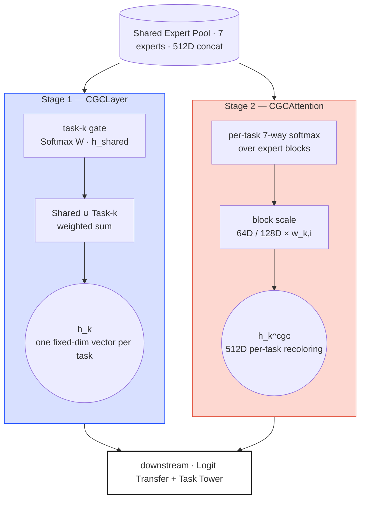
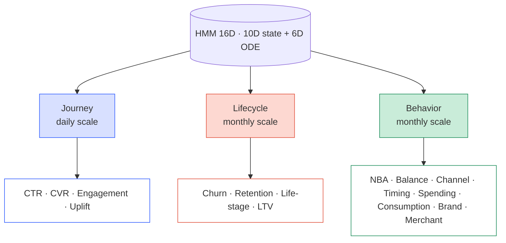

*PLE-4 of the "Study Thread" series — a parallel English/Korean
sub-thread running PLE-1 → PLE-6 that summarizes the papers and math
foundations behind the PLE architecture used in this project. PLE-2
committed to a heterogeneous Shared Expert pool and a softmax gate.
PLE-3 introduced the seven experts. When you actually try to train
this stack, two problems show up at the same time — a *dim-asymmetry
collapse* where the gate leans toward the 128D expert, and the fact
that customers do not live at a single time scale. This fourth post
is the response to both.*

## What PLE-3 left on the table

Seven heterogeneous Shared Experts are in place. The principle — a
CGC gate learns how much each expert to use, per task — has been
established. But actually running training surfaces two problems in
parallel.

**The gate collapses.** The seven experts have heterogeneous output
dims — unified_hgcn is 128D, the other six are 64D. Even with equal
gate weights, the 128D expert's L2 contribution is twice that of the
64D ones. Once training starts, the bigger block attracts more
gradient, the smaller ones stall — a subtler version of MMoE's Expert
Collapse, but the same positive feedback loop. On top of that, random
initialization carries zero prior about which expert helps which task
— if randomness lands in a bad spot early, the model converges there.

**Customers live at multiple time scales.** Click behavior is daily,
churn risk is monthly, lifestyle shifts are yearly. One HMM fit to
all activity has daily and yearly signals interfering with each
other. Hoping the gate infers "this task needs daily patterns, that
one needs monthly lifecycle" is unrealistic — the gate picks experts,
it does not pick time scales.

PLE-4 lays two layers of defense against each problem. For the first,
CGC is split into two stages (CGCLayer + CGCAttention), dim-normalize
corrects the geometry, domain-prior bias initializes the direction,
and entropy regularization keeps the distribution spread. For the
second, the HMM is split into three separate HMMs with three separate
projectors, each feeding the task group whose time scale it matches.

## The first problem: the gate collapses onto one expert

### Decision — split CGC into two stages

The paper's CGCLayer combines Shared + Task experts on a concat axis
via weighted sum. That works for a homogeneous pool. Our pool is
heterogeneous. Summing 128D and 64D blocks on one axis biases the
training dynamics toward the larger block.

Three alternatives came up:

- **Homogenize everyone to 128D.** Project the 64D experts up. Simple,
  but wastes capacity — creates forced 64D-of-fluff inside experts
  that naturally want to be 64D.
- **Homogenize everyone to 64D.** Compress unified_hgcn from 128D to
  64D. This gives up the hyperbolic representational room the HGCN
  design was built to exploit.
- **Keep heterogeneity and rescale at attention time.** Each expert
  keeps its natural dim; at the attention point, dim-normalize equalizes
  L2 contributions.

Option three won. Keeping natural dims is better for capacity, and
correcting at one point (attention) minimizes side effects. This
decision is why CGC gets split into two stages.

- **Stage 1, CGCLayer** (paper-exact): Shared + Task Expert softmax
  weighted sum on one axis. One fixed-dim vector per task.
- **Stage 2, CGCAttention**: looks only at the Shared concat (512D)
  and applies per-task block-level scaling. This is where
  dim-normalize lives.

> **The two CGC stages.** Stage 1 CGCLayer preserves the original paper
> (Tang et al. 2020) — a per-task gate mixes Shared + Task-k experts
> on a concat axis via softmax. Stage 2 CGCAttention sits orthogonal to
> that — it looks only at the Shared concat and distributes per-task
> block scaling across expert blocks. Both paths' outputs feed
> downstream together.

### Stage 1 — CGCLayer: the paper-exact Shared + Task weighted sum

The Stage 1 primary gate uses the original paper's CGCLayer as-is.
Task $k$'s gate computes a softmax-weighted sum over an axis that
concatenates *both* the Shared Expert pool and Task-$k$'s experts.

$$\mathbf{h}_k = \sum_{i=1}^{N} g_{k,i} \cdot \mathbf{h}_i^{\text{all}}, \quad \mathbf{h}^{\text{all}} = [\mathbf{h}^{\text{task}}_k \,\|\, \mathbf{h}^{\text{shared}}]$$

$$\mathbf{g}_k = \text{Softmax}(\mathbf{W}_k^{gate} \cdot \mathbf{h}_{shared}) \in \mathbb{R}^{N}, \quad N = |\text{shared}| + |\text{task}_k|$$

Because the Shared and Task pools sit on the same softmax axis, each
task can express a natural mixture like "Shared-A 60%, Shared-B 15%,
Task-k-specific 25%". The output is one fixed-dim vector per task.

### Stage 2 — CGCAttention: per-task block attention over the Shared concat

Stage 2 attaches orthogonally. The job here is to let *the same 512D
vector flow downstream while each task gets a different mixture of
contributions from each expert*.

$$\mathbf{w}_k = \text{Softmax}(\mathbf{W}_k \cdot \mathbf{h}_{shared} + \mathbf{b}_k) \in \mathbb{R}^7$$

$$\tilde{\mathbf{h}}_{k,i} = w_{k,i} \cdot \mathbf{h}_i^{expert} \quad \text{for } i = 1, \ldots, 7$$

$$\mathbf{h}_k^{cgc} = [\tilde{\mathbf{h}}_{k,1} \,\|\, \ldots \,\|\, \tilde{\mathbf{h}}_{k,7}] \in \mathbb{R}^{512}$$

Here $\mathbf{W}_k \in \mathbb{R}^{7 \times 512}$ is task $k$'s gate
weight, $\mathbf{h}_i^{expert}$ is the $i$-th expert's output block
(64D or 128D), and $w_{k,i}$ is the scalar scale applied to that block.
The same 512D vector flows out, but every task gets a different mixture
of contributions from each expert.

> **Dimension-preserving design.** Block scaling preserves shape (512D
> → 512D) and, because the weights sum to 1 (softmax), the output
> scale is preserved too. Backward-compatible with the rest of the
> pipeline.

### Heterogeneous dimension correction — Dim Normalize

But softmax-normalizing the attention weights does not fully eliminate
the dim-asymmetry problem. Even at perfectly uniform
$w_{k,i} \approx 1/7$, the 128D expert's L2 contribution is still
twice the 64D experts'. Without correction, gradient biases toward
the bigger block.

$$\text{scale}_i = \sqrt{\frac{\text{mean\_dim}}{\text{dim}_i}}, \quad \text{mean\_dim} = \frac{128 + 64 \times 6}{7} \approx 73.14$$

- unified_hgcn (128D): scale $\approx 0.756$ (attenuated)
- others (64D): scale $\approx 1.069$ (amplified)
- same attention ⇒ same L2 contribution

With `dim_normalize=true`, these scales are applied automatically.

> **Intuition.** Shrink large-dim experts and grow small-dim experts
> so that, when attention is uniform at $w_{k,i} \approx 1/7$, every
> expert actually contributes the same. This is the geometric first
> line of defense against dim-asymmetry turning into collapse.

### Domain-prior bias initialization — the second line

Dim-normalize is a geometric correction, but it carries no prior
about which expert is useful for which task. Random init can tilt the
gate toward the wrong expert in the first few dozen steps and lock
in. So we inject domain knowledge directly into the initial bias.

Each task's `domain_experts` config field is read. Weights stay at 0;
preferred experts get `bias_high = 1.0`, the rest get
`bias_low = -1.0`. The initial softmax output already lines up with
domain knowledge before a single gradient step.

<svg xmlns="http://www.w3.org/2000/svg" viewBox="0 0 520 560" style="max-width:520px;width:100%;margin:24px auto;display:block;" font-family="JetBrains Mono, SUIT Variable, Pretendard Variable, ui-monospace, sans-serif">
  <defs></defs>
  <g>
    <text class="exp-lbl" transform="translate(231,94) rotate(-35)">DeepFM</text>
    <text class="exp-lbl" transform="translate(253,94) rotate(-35)">LightGCN</text>
    <text class="exp-lbl" transform="translate(275,94) rotate(-35)">UHGCN</text>
    <text class="exp-lbl" transform="translate(297,94) rotate(-35)">Temporal</text>
    <text class="exp-lbl" transform="translate(319,94) rotate(-35)">PersLay</text>
    <text class="exp-lbl" transform="translate(341,94) rotate(-35)">Causal</text>
    <text class="exp-lbl" transform="translate(363,94) rotate(-35)">OT</text>
  </g>
  <g>
    <!-- ROW_0 CTR -->        <rect x="220" y="100" width="18" height="18" class="cell-off"/><rect x="242" y="100" width="18" height="18" class="cell-off"/><rect x="264" y="100" width="18" height="18" class="cell-on"/><rect x="286" y="100" width="18" height="18" class="cell-on"/><rect x="308" y="100" width="18" height="18" class="cell-on"/><rect x="330" y="100" width="18" height="18" class="cell-off"/><rect x="352" y="100" width="18" height="18" class="cell-off"/>
    <!-- ROW_1 CVR -->        <rect x="220" y="122" width="18" height="18" class="cell-off"/><rect x="242" y="122" width="18" height="18" class="cell-off"/><rect x="264" y="122" width="18" height="18" class="cell-on"/><rect x="286" y="122" width="18" height="18" class="cell-on"/><rect x="308" y="122" width="18" height="18" class="cell-on"/><rect x="330" y="122" width="18" height="18" class="cell-off"/><rect x="352" y="122" width="18" height="18" class="cell-off"/>
    <!-- ROW_2 Churn -->      <rect x="220" y="144" width="18" height="18" class="cell-off"/><rect x="242" y="144" width="18" height="18" class="cell-off"/><rect x="264" y="144" width="18" height="18" class="cell-off"/><rect x="286" y="144" width="18" height="18" class="cell-on"/><rect x="308" y="144" width="18" height="18" class="cell-on"/><rect x="330" y="144" width="18" height="18" class="cell-off"/><rect x="352" y="144" width="18" height="18" class="cell-off"/>
    <!-- ROW_3 Retention -->  <rect x="220" y="166" width="18" height="18" class="cell-off"/><rect x="242" y="166" width="18" height="18" class="cell-off"/><rect x="264" y="166" width="18" height="18" class="cell-off"/><rect x="286" y="166" width="18" height="18" class="cell-on"/><rect x="308" y="166" width="18" height="18" class="cell-on"/><rect x="330" y="166" width="18" height="18" class="cell-off"/><rect x="352" y="166" width="18" height="18" class="cell-off"/>
    <!-- ROW_4 NBA -->        <rect x="220" y="188" width="18" height="18" class="cell-off"/><rect x="242" y="188" width="18" height="18" class="cell-on"/><rect x="264" y="188" width="18" height="18" class="cell-on"/><rect x="286" y="188" width="18" height="18" class="cell-off"/><rect x="308" y="188" width="18" height="18" class="cell-on"/><rect x="330" y="188" width="18" height="18" class="cell-off"/><rect x="352" y="188" width="18" height="18" class="cell-off"/>
    <!-- ROW_5 Life-stage --> <rect x="220" y="210" width="18" height="18" class="cell-off"/><rect x="242" y="210" width="18" height="18" class="cell-off"/><rect x="264" y="210" width="18" height="18" class="cell-off"/><rect x="286" y="210" width="18" height="18" class="cell-on"/><rect x="308" y="210" width="18" height="18" class="cell-on"/><rect x="330" y="210" width="18" height="18" class="cell-off"/><rect x="352" y="210" width="18" height="18" class="cell-off"/>
    <!-- ROW_6 Balance -->    <rect x="220" y="232" width="18" height="18" class="cell-off"/><rect x="242" y="232" width="18" height="18" class="cell-off"/><rect x="264" y="232" width="18" height="18" class="cell-off"/><rect x="286" y="232" width="18" height="18" class="cell-on"/><rect x="308" y="232" width="18" height="18" class="cell-off"/><rect x="330" y="232" width="18" height="18" class="cell-off"/><rect x="352" y="232" width="18" height="18" class="cell-off"/>
    <!-- ROW_7 Engagement --> <rect x="220" y="254" width="18" height="18" class="cell-off"/><rect x="242" y="254" width="18" height="18" class="cell-off"/><rect x="264" y="254" width="18" height="18" class="cell-off"/><rect x="286" y="254" width="18" height="18" class="cell-on"/><rect x="308" y="254" width="18" height="18" class="cell-off"/><rect x="330" y="254" width="18" height="18" class="cell-off"/><rect x="352" y="254" width="18" height="18" class="cell-off"/>
    <!-- ROW_8 LTV -->        <rect x="220" y="276" width="18" height="18" class="cell-on"/><rect x="242" y="276" width="18" height="18" class="cell-off"/><rect x="264" y="276" width="18" height="18" class="cell-off"/><rect x="286" y="276" width="18" height="18" class="cell-on"/><rect x="308" y="276" width="18" height="18" class="cell-off"/><rect x="330" y="276" width="18" height="18" class="cell-off"/><rect x="352" y="276" width="18" height="18" class="cell-off"/>
    <!-- ROW_9 Channel -->    <rect x="220" y="298" width="18" height="18" class="cell-off"/><rect x="242" y="298" width="18" height="18" class="cell-off"/><rect x="264" y="298" width="18" height="18" class="cell-off"/><rect x="286" y="298" width="18" height="18" class="cell-on"/><rect x="308" y="298" width="18" height="18" class="cell-off"/><rect x="330" y="298" width="18" height="18" class="cell-off"/><rect x="352" y="298" width="18" height="18" class="cell-off"/>
    <!-- ROW_10 Timing -->    <rect x="220" y="320" width="18" height="18" class="cell-off"/><rect x="242" y="320" width="18" height="18" class="cell-off"/><rect x="264" y="320" width="18" height="18" class="cell-off"/><rect x="286" y="320" width="18" height="18" class="cell-on"/><rect x="308" y="320" width="18" height="18" class="cell-off"/><rect x="330" y="320" width="18" height="18" class="cell-off"/><rect x="352" y="320" width="18" height="18" class="cell-off"/>
    <!-- ROW_11 Spending_category --><rect x="220" y="342" width="18" height="18" class="cell-off"/><rect x="242" y="342" width="18" height="18" class="cell-off"/><rect x="264" y="342" width="18" height="18" class="cell-on"/><rect x="286" y="342" width="18" height="18" class="cell-off"/><rect x="308" y="342" width="18" height="18" class="cell-on"/><rect x="330" y="342" width="18" height="18" class="cell-off"/><rect x="352" y="342" width="18" height="18" class="cell-off"/>
    <!-- ROW_12 Consumption_cycle --><rect x="220" y="364" width="18" height="18" class="cell-off"/><rect x="242" y="364" width="18" height="18" class="cell-off"/><rect x="264" y="364" width="18" height="18" class="cell-off"/><rect x="286" y="364" width="18" height="18" class="cell-on"/><rect x="308" y="364" width="18" height="18" class="cell-off"/><rect x="330" y="364" width="18" height="18" class="cell-off"/><rect x="352" y="364" width="18" height="18" class="cell-off"/>
    <!-- ROW_13 Spending_bucket --><rect x="220" y="386" width="18" height="18" class="cell-on"/><rect x="242" y="386" width="18" height="18" class="cell-off"/><rect x="264" y="386" width="18" height="18" class="cell-off"/><rect x="286" y="386" width="18" height="18" class="cell-off"/><rect x="308" y="386" width="18" height="18" class="cell-off"/><rect x="330" y="386" width="18" height="18" class="cell-off"/><rect x="352" y="386" width="18" height="18" class="cell-off"/>
    <!-- ROW_14 Brand_prediction --><rect x="220" y="408" width="18" height="18" class="cell-off"/><rect x="242" y="408" width="18" height="18" class="cell-off"/><rect x="264" y="408" width="18" height="18" class="cell-on"/><rect x="286" y="408" width="18" height="18" class="cell-off"/><rect x="308" y="408" width="18" height="18" class="cell-off"/><rect x="330" y="408" width="18" height="18" class="cell-off"/><rect x="352" y="408" width="18" height="18" class="cell-off"/>
    <!-- ROW_15 Merchant_affinity --><rect x="220" y="430" width="18" height="18" class="cell-off"/><rect x="242" y="430" width="18" height="18" class="cell-off"/><rect x="264" y="430" width="18" height="18" class="cell-on"/><rect x="286" y="430" width="18" height="18" class="cell-on"/><rect x="308" y="430" width="18" height="18" class="cell-off"/><rect x="330" y="430" width="18" height="18" class="cell-off"/><rect x="352" y="430" width="18" height="18" class="cell-off"/>
  </g>
  <g>
    <text class="task-lbl" x="210" y="113">CTR</text>
    <text class="task-lbl" x="210" y="135">CVR</text>
    <text class="task-lbl" x="210" y="157">Churn</text>
    <text class="task-lbl" x="210" y="179">Retention</text>
    <text class="task-lbl" x="210" y="201">NBA</text>
    <text class="task-lbl" x="210" y="223">Life-stage</text>
    <text class="task-lbl" x="210" y="245">Balance_util</text>
    <text class="task-lbl" x="210" y="267">Engagement</text>
    <text class="task-lbl" x="210" y="289">LTV</text>
    <text class="task-lbl" x="210" y="311">Channel</text>
    <text class="task-lbl" x="210" y="333">Timing</text>
    <text class="task-lbl" x="210" y="355">Spending_category</text>
    <text class="task-lbl" x="210" y="377">Consumption_cycle</text>
    <text class="task-lbl" x="210" y="399">Spending_bucket</text>
    <text class="task-lbl" x="210" y="421">Brand_prediction</text>
    <text class="task-lbl" x="210" y="443">Merchant_affinity</text>
  </g>
  <g transform="translate(80,470)">
    <rect x="0" y="0" width="18" height="18" class="cell-on"/>
    <text class="legend" x="26" y="14">preferred (bias_high = 1.0)</text>
    <rect x="0" y="26" width="18" height="18" class="cell-off"/>
    <text class="legend" x="26" y="40">not preferred (bias_low = -1.0)</text>
  </g>
  <g transform="translate(80,530)">
    <text class="legend" x="0" y="0" font-style="italic" fill="#6B7280">* Causal · OT: no initial prior — gate explores freely during training</text>
  </g>
</svg>

> **Domain prior matrix.** The initial bias encodes each task's
> "natural expert preference" — e.g. time-series-heavy churn/retention
> → PersLay + Temporal, merchant-hierarchy-dependent brand_prediction
> → Unified HGCN alone. Since the weights all start at zero, this
> prior is *only the bias at the start of training*, and the gate is
> free to move anywhere from real data.

### The third line — entropy regularization

Dim-normalize removes geometric bias, and the domain prior sets a
useful starting point, but randomness still plays a role. If attention
accidentally concentrates on one expert, the gradient grows there,
attention increases further, and a positive feedback loop kicks in.
The structural cure is entropy regularization: penalize concentrated
distributions.

$$\mathcal{L}_{entropy} = \lambda_{ent} \cdot \left( -\frac{1}{|\mathcal{T}|} \right) \sum_{k \in \mathcal{T}} H(\mathbf{w}_k), \quad H(\mathbf{w}_k) = -\sum_{i=1}^{7} w_{k,i} \log w_{k,i}$$

Minimizing negative entropy is the same as maximizing $H$, which
spreads the distribution out. $\lambda_{ent}$ is the tuning knob — 0
gives collapse, 0.1 gives uniform distributions and kills
specialization. Stable range 0.005–0.02; default 0.01.

<svg xmlns="http://www.w3.org/2000/svg" viewBox="0 0 260 120" style="max-width:520px;width:100%;margin:24px auto;display:block;" font-family="JetBrains Mono, SUIT Variable, Pretendard Variable, ui-monospace, sans-serif">
  <g font-size="10" fill="#141414">
    <text x="50" y="14" text-anchor="middle">Expert Collapse</text>
    <text x="50" y="110" text-anchor="middle" fill="#E14F3A">H ≈ 0</text>
    <g fill="#E14F3A" fill-opacity="0.85">
      <rect x="14" y="24" width="8" height="72"/>
      <rect x="24" y="94" width="8" height="2"/>
      <rect x="34" y="94" width="8" height="2"/>
      <rect x="44" y="94" width="8" height="2"/>
      <rect x="54" y="94" width="8" height="2"/>
      <rect x="64" y="94" width="8" height="2"/>
      <rect x="74" y="94" width="8" height="2"/>
    </g>
  </g>
  <g font-size="10" fill="#141414">
    <text x="200" y="14" text-anchor="middle">Healthy (uniform)</text>
    <text x="200" y="110" text-anchor="middle" fill="#2E5BFF">H ≈ log 7 ≈ 1.95</text>
    <g fill="#2E5BFF" fill-opacity="0.85">
      <rect x="164" y="76" width="8" height="20"/>
      <rect x="174" y="74" width="8" height="22"/>
      <rect x="184" y="78" width="8" height="18"/>
      <rect x="194" y="72" width="8" height="24"/>
      <rect x="204" y="76" width="8" height="20"/>
      <rect x="214" y="74" width="8" height="22"/>
      <rect x="224" y="78" width="8" height="18"/>
    </g>
  </g>
</svg>

> **Equation intuition.** Entropy $H$ — the unique function Shannon
> (1948) derived from three axioms (continuity, maximality,
> combinability) — measures "how evenly spread" a distribution is. For
> a 7-way softmax $H \in [0, \log 7]$: zero when one expert monopolizes,
> maximum $\log 7 \approx 1.95$ when fully uniform. This term pushes
> the distribution toward the right panel.

Dim-normalize + domain prior + entropy, stacked, structurally block
the failure mode where one of the seven experts eats the training.
Each layer is weak alone; the three reinforce one another.

### CGC freeze synchronization

If adaTT freezes its transfer weights while CGC keeps training, the
two mechanisms can drift in conflicting directions. When `on_epoch_end`
hits the adaTT `freeze_epoch`, the CGC attention parameters are
flipped to `requires_grad=False` along with it — the late phase of
training stays stable. A small safety bolt against late-epoch drift.

## The second problem: customers live at multiple time scales

### Decision — three HMMs, not one

Shared Experts look at the customer's "current state" from multiple
angles. But the customer's *hidden state transitions* — journey stage,
lifecycle stage, behavior regime — play out at different time scales.

Fitting one HMM to all activity lets daily and yearly signals interfere
with each other. Whether a customer opens the app today (journey) and
whether their life stage shifted this month (lifecycle) demand
fundamentally different state dynamics — if one HMM's shared emission
matrix has to learn both, it cannot pick a direction.

So we run three HMMs — journey (daily), lifecycle (monthly), behavior
(monthly behavior regime) — and inject each HMM's state only into
the task group whose scale it matches. A 16D HMM vector (10D state
probability + 6D ODE dynamics bridge) is lifted to 32D by an
independent per-mode projector. Samples without HMM data get a
learnable default embedding.

> **Three time-scales, three task groups.** The same 16D HMM state
> vector passes through three independent projectors and splits into
> Journey (daily) / Lifecycle (monthly) / Behavior (monthly) modes —
> and each mode is injected only into the task group whose time-scale
> it matches. Samples without data use a learnable default embedding.

> **History — Baum & Petrie (1966) formalized HMMs; Rabiner & Juang
> popularized them for speech recognition in the 1970s.** The ODE
> dynamics bridge is inspired by *Neural ODE (Chen et al., NeurIPS
> 2018)* — it extends the discrete HMM states into continuous time via
> interpolation.

### HMM projector

Each mode consists of a 10D base state probability plus a 6D ODE
dynamics bridge (16D total), which a mode-specific projector lifts to
32D.

$$\mathbf{h}_{hmm}^m = \text{SiLU}(\text{LayerNorm}(\text{Linear}_{16 \to 32}(\mathbf{x}_{hmm}^m))), \quad m \in \{\text{journey}, \text{lifecycle}, \text{behavior}\}$$

Linear expands the dimension, LayerNorm stabilizes the scale, SiLU
adds nonlinearity. Crucially, each of the three modes has its *own*
projector, so "daily journey patterns" and "monthly lifecycle
patterns" learn different transforms — this is the whole point. A
shared projector would collapse back to a single HMM in effect.

> **SiLU.** $\text{SiLU}(x) = x \cdot \sigma(x)$. Stacking only linear
> maps collapses: $\mathbf{W}_2 \mathbf{W}_1 \mathbf{x}$ is equivalent
> to a single linear map, so a nonlinearity between layers is what
> makes a stack expressive. SiLU compromises between ReLU's "dying
> neurons" and GELU's compute cost — a smooth, cheap nonlinearity.

### Learnable default embedding

For samples with no HMM features (an all-zero row), using the zero
vector directly creates a dead signal — the model reads "no data" as
"all state probabilities are zero." So for each mode we keep an
`nn.Parameter(torch.zeros(32))`, and a per-sample mask projects only
valid rows and substitutes the default for invalid ones. The default
itself is trainable, so it learns "the average time-scale representation
of customers whose HMM data is missing." A small design move that lets
the model distinguish missingness from state.

## Where this leads

PLE-4 amounts to two routing decisions on top of the shared expert
pool. CGC two-stage + the three-layer defense (dim-normalize, domain
prior, entropy) stabilizes expert selection; HMM Triple-Mode routes
time-scale signals to the right task group. Both paths run on top of
a *shared* expert pool.

The next post, **PLE-5**, moves in the opposite direction — it looks
at how the model builds *dedicated expert baskets per task* via
GroupTaskExpertBasket (GroupEncoder + ClusterEmbedding), explicit
cross-task information flow through the three modes of Logit
Transfer, and the Task Tower that turns all of this into final
predictions. Three new decisions fall out there: how to cut parameters
by 88% through group sharing, how to pass sequential task dependencies
explicitly, and how to auto-balance 16 task weights with Uncertainty
Weighting.
