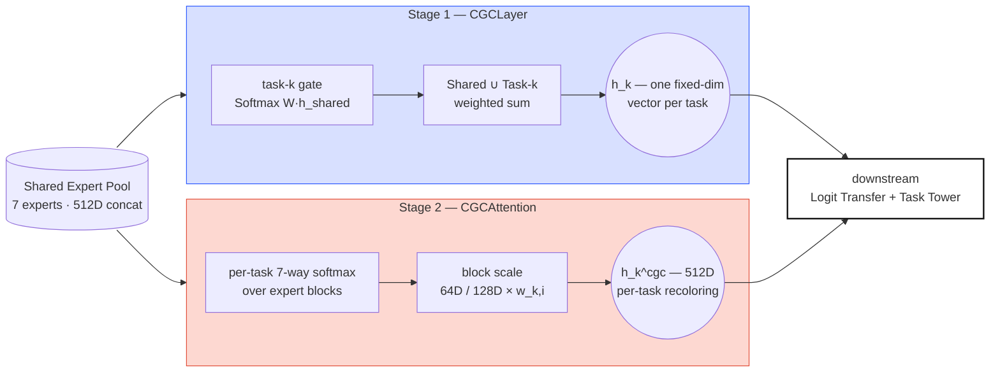
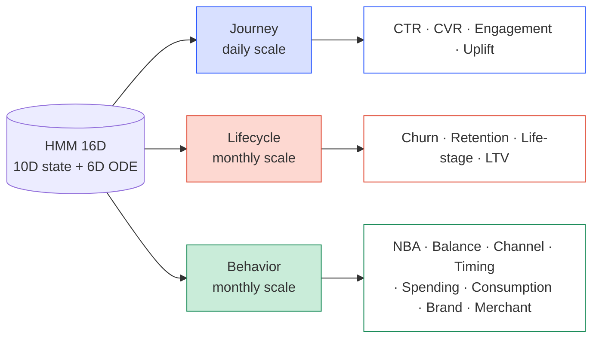

*PLE-4 of the "Study Thread" series — a parallel English/Korean
sub-thread running PLE-1 → PLE-6 that summarizes the papers and math
foundations behind the PLE architecture used in this project. This
fourth post covers the heart of PLE as a two-stage gate — Stage 1: the
paper's CGCLayer mixing Shared and Task experts together via a weighted
sum, and Stage 2: CGCAttention layered on top, applying per-task block
scaling to the Shared Expert concat — along with the regularization
that keeps Expert Collapse away, and the HMM-based Triple-Mode routing
that sits beside the gate.*

## CGC — Per-Task Expert Gating

CGC is the PLE paper's (Tang et al., RecSys 2020) extension of MMoE's
gating (Ma et al., KDD 2018): a per-task independent gate separates
Shared Experts from Task-specific Experts and learns affinity. This
implementation splits that idea into two stages — **CGCLayer** follows
the paper and mixes Shared ∪ Task experts on a single weighted-sum
axis, and **CGCAttention** lays per-task block scaling over the Shared
concat.

> **The two CGC stages.** Stage 1 CGCLayer preserves the original paper
> (Tang et al. 2020) — a per-task gate mixes Shared + Task-k experts
> on a concat axis via softmax. Stage 2 CGCAttention sits orthogonal to
> that — it looks only at the Shared concat and distributes per-task
> block scaling across expert blocks. Both paths' outputs feed
> downstream together.

### Stage 1 — CGCLayer: the paper-exact Shared + Task weighted sum

The Stage 1 primary gate uses the original paper's CGCLayer as-is.
Task $k$'s gate computes a softmax-weighted sum over an axis that
concatenates *both* the Shared Expert pool and Task-$k$'s experts.

$$\mathbf{h}_k = \sum_{i=1}^{N} g_{k,i} \cdot \mathbf{h}_i^{\text{all}}, \quad \mathbf{h}^{\text{all}} = [\mathbf{h}^{\text{task}}_k \,\|\, \mathbf{h}^{\text{shared}}]$$

$$\mathbf{g}_k = \text{Softmax}(\mathbf{W}_k^{gate} \cdot \mathbf{h}_{shared}) \in \mathbb{R}^{N}, \quad N = |\text{shared}| + |\text{task}_k|$$

Because the Shared and Task pools sit on the same softmax axis, each
task can express a natural mixture like "Shared-A 60%, Shared-B 15%,
Task-k-specific 25%". The output is one fixed-dim vector per task.

### Stage 2 — CGCAttention: per-task block attention over the Shared concat

Stage 2 attaches orthogonally. The Shared Expert pool has heterogeneous
output dims (unified_hgcn 128D, the rest 64D), so a separate path is
needed to recolor the already-concatenated Shared representation on a
per-task basis — that is CGCAttention.

$$\mathbf{w}_k = \text{Softmax}(\mathbf{W}_k \cdot \mathbf{h}_{shared} + \mathbf{b}_k) \in \mathbb{R}^7$$

$$\tilde{\mathbf{h}}_{k,i} = w_{k,i} \cdot \mathbf{h}_i^{expert} \quad \text{for } i = 1, \ldots, 7$$

$$\mathbf{h}_k^{cgc} = [\tilde{\mathbf{h}}_{k,1} \,\|\, \ldots \,\|\, \tilde{\mathbf{h}}_{k,7}] \in \mathbb{R}^{512}$$

Here $\mathbf{W}_k \in \mathbb{R}^{7 \times 512}$ is task $k$'s gate
weight, $\mathbf{h}_i^{expert}$ is the $i$-th expert's output block
(64D or 128D), and $w_{k,i}$ is the scalar scale applied to that block.
The same 512D vector flows out, but every task gets a different mixture
of contributions from each expert.

> **Dimension-preserving design.** Block scaling preserves shape (512D
> → 512D) and, because the weights sum to 1 (softmax), the output
> scale is preserved too. Backward-compatible with the rest of the
> pipeline.

### Domain prior initialization — gate bias

Each task's `domain_experts` config field is read to set the initial
bias: weight starts at 0, a task's "preferred" experts get
`bias_high = 1.0`, and the rest get `bias_low = -1.0`. A soft prior
that makes the initial softmax output line up with domain knowledge
before a single gradient step.

<svg xmlns="http://www.w3.org/2000/svg" viewBox="0 0 520 510" style="max-width:520px;width:100%;margin:24px auto;display:block;" font-family="ui-monospace, SFMono-Regular, Menlo, monospace">
  <defs></defs>
  <g>
    <text class="exp-lbl" transform="translate(231,94) rotate(-35)">DeepFM</text>
    <text class="exp-lbl" transform="translate(253,94) rotate(-35)">LightGCN</text>
    <text class="exp-lbl" transform="translate(275,94) rotate(-35)">UHGCN</text>
    <text class="exp-lbl" transform="translate(297,94) rotate(-35)">Temporal</text>
    <text class="exp-lbl" transform="translate(319,94) rotate(-35)">PersLay</text>
    <text class="exp-lbl" transform="translate(341,94) rotate(-35)">Causal</text>
    <text class="exp-lbl" transform="translate(363,94) rotate(-35)">OT</text>
  </g>
  <g>
    <!-- ROW_0 CTR -->        <rect x="220" y="100" width="18" height="18" class="cell-off"/><rect x="242" y="100" width="18" height="18" class="cell-off"/><rect x="264" y="100" width="18" height="18" class="cell-on"/><rect x="286" y="100" width="18" height="18" class="cell-on"/><rect x="308" y="100" width="18" height="18" class="cell-on"/><rect x="330" y="100" width="18" height="18" class="cell-off"/><rect x="352" y="100" width="18" height="18" class="cell-off"/>
    <!-- ROW_1 CVR -->        <rect x="220" y="122" width="18" height="18" class="cell-off"/><rect x="242" y="122" width="18" height="18" class="cell-off"/><rect x="264" y="122" width="18" height="18" class="cell-on"/><rect x="286" y="122" width="18" height="18" class="cell-on"/><rect x="308" y="122" width="18" height="18" class="cell-on"/><rect x="330" y="122" width="18" height="18" class="cell-off"/><rect x="352" y="122" width="18" height="18" class="cell-off"/>
    <!-- ROW_2 Churn -->      <rect x="220" y="144" width="18" height="18" class="cell-off"/><rect x="242" y="144" width="18" height="18" class="cell-off"/><rect x="264" y="144" width="18" height="18" class="cell-off"/><rect x="286" y="144" width="18" height="18" class="cell-on"/><rect x="308" y="144" width="18" height="18" class="cell-on"/><rect x="330" y="144" width="18" height="18" class="cell-off"/><rect x="352" y="144" width="18" height="18" class="cell-off"/>
    <!-- ROW_3 Retention -->  <rect x="220" y="166" width="18" height="18" class="cell-off"/><rect x="242" y="166" width="18" height="18" class="cell-off"/><rect x="264" y="166" width="18" height="18" class="cell-off"/><rect x="286" y="166" width="18" height="18" class="cell-on"/><rect x="308" y="166" width="18" height="18" class="cell-on"/><rect x="330" y="166" width="18" height="18" class="cell-off"/><rect x="352" y="166" width="18" height="18" class="cell-off"/>
    <!-- ROW_4 NBA -->        <rect x="220" y="188" width="18" height="18" class="cell-off"/><rect x="242" y="188" width="18" height="18" class="cell-on"/><rect x="264" y="188" width="18" height="18" class="cell-on"/><rect x="286" y="188" width="18" height="18" class="cell-off"/><rect x="308" y="188" width="18" height="18" class="cell-on"/><rect x="330" y="188" width="18" height="18" class="cell-off"/><rect x="352" y="188" width="18" height="18" class="cell-off"/>
    <!-- ROW_5 Life-stage --> <rect x="220" y="210" width="18" height="18" class="cell-off"/><rect x="242" y="210" width="18" height="18" class="cell-off"/><rect x="264" y="210" width="18" height="18" class="cell-off"/><rect x="286" y="210" width="18" height="18" class="cell-on"/><rect x="308" y="210" width="18" height="18" class="cell-on"/><rect x="330" y="210" width="18" height="18" class="cell-off"/><rect x="352" y="210" width="18" height="18" class="cell-off"/>
    <!-- ROW_6 Balance -->    <rect x="220" y="232" width="18" height="18" class="cell-off"/><rect x="242" y="232" width="18" height="18" class="cell-off"/><rect x="264" y="232" width="18" height="18" class="cell-off"/><rect x="286" y="232" width="18" height="18" class="cell-on"/><rect x="308" y="232" width="18" height="18" class="cell-off"/><rect x="330" y="232" width="18" height="18" class="cell-off"/><rect x="352" y="232" width="18" height="18" class="cell-off"/>
    <!-- ROW_7 Engagement --> <rect x="220" y="254" width="18" height="18" class="cell-off"/><rect x="242" y="254" width="18" height="18" class="cell-off"/><rect x="264" y="254" width="18" height="18" class="cell-off"/><rect x="286" y="254" width="18" height="18" class="cell-on"/><rect x="308" y="254" width="18" height="18" class="cell-off"/><rect x="330" y="254" width="18" height="18" class="cell-off"/><rect x="352" y="254" width="18" height="18" class="cell-off"/>
    <!-- ROW_8 LTV -->        <rect x="220" y="276" width="18" height="18" class="cell-on"/><rect x="242" y="276" width="18" height="18" class="cell-off"/><rect x="264" y="276" width="18" height="18" class="cell-off"/><rect x="286" y="276" width="18" height="18" class="cell-on"/><rect x="308" y="276" width="18" height="18" class="cell-off"/><rect x="330" y="276" width="18" height="18" class="cell-off"/><rect x="352" y="276" width="18" height="18" class="cell-off"/>
    <!-- ROW_9 Channel -->    <rect x="220" y="298" width="18" height="18" class="cell-off"/><rect x="242" y="298" width="18" height="18" class="cell-off"/><rect x="264" y="298" width="18" height="18" class="cell-off"/><rect x="286" y="298" width="18" height="18" class="cell-on"/><rect x="308" y="298" width="18" height="18" class="cell-off"/><rect x="330" y="298" width="18" height="18" class="cell-off"/><rect x="352" y="298" width="18" height="18" class="cell-off"/>
    <!-- ROW_10 Timing -->    <rect x="220" y="320" width="18" height="18" class="cell-off"/><rect x="242" y="320" width="18" height="18" class="cell-off"/><rect x="264" y="320" width="18" height="18" class="cell-off"/><rect x="286" y="320" width="18" height="18" class="cell-on"/><rect x="308" y="320" width="18" height="18" class="cell-off"/><rect x="330" y="320" width="18" height="18" class="cell-off"/><rect x="352" y="320" width="18" height="18" class="cell-off"/>
    <!-- ROW_11 Spending_category --><rect x="220" y="342" width="18" height="18" class="cell-off"/><rect x="242" y="342" width="18" height="18" class="cell-off"/><rect x="264" y="342" width="18" height="18" class="cell-on"/><rect x="286" y="342" width="18" height="18" class="cell-off"/><rect x="308" y="342" width="18" height="18" class="cell-on"/><rect x="330" y="342" width="18" height="18" class="cell-off"/><rect x="352" y="342" width="18" height="18" class="cell-off"/>
    <!-- ROW_12 Consumption_cycle --><rect x="220" y="364" width="18" height="18" class="cell-off"/><rect x="242" y="364" width="18" height="18" class="cell-off"/><rect x="264" y="364" width="18" height="18" class="cell-off"/><rect x="286" y="364" width="18" height="18" class="cell-on"/><rect x="308" y="364" width="18" height="18" class="cell-off"/><rect x="330" y="364" width="18" height="18" class="cell-off"/><rect x="352" y="364" width="18" height="18" class="cell-off"/>
    <!-- ROW_13 Spending_bucket --><rect x="220" y="386" width="18" height="18" class="cell-on"/><rect x="242" y="386" width="18" height="18" class="cell-off"/><rect x="264" y="386" width="18" height="18" class="cell-off"/><rect x="286" y="386" width="18" height="18" class="cell-off"/><rect x="308" y="386" width="18" height="18" class="cell-off"/><rect x="330" y="386" width="18" height="18" class="cell-off"/><rect x="352" y="386" width="18" height="18" class="cell-off"/>
    <!-- ROW_14 Brand_prediction --><rect x="220" y="408" width="18" height="18" class="cell-off"/><rect x="242" y="408" width="18" height="18" class="cell-off"/><rect x="264" y="408" width="18" height="18" class="cell-on"/><rect x="286" y="408" width="18" height="18" class="cell-off"/><rect x="308" y="408" width="18" height="18" class="cell-off"/><rect x="330" y="408" width="18" height="18" class="cell-off"/><rect x="352" y="408" width="18" height="18" class="cell-off"/>
    <!-- ROW_15 Merchant_affinity --><rect x="220" y="430" width="18" height="18" class="cell-off"/><rect x="242" y="430" width="18" height="18" class="cell-off"/><rect x="264" y="430" width="18" height="18" class="cell-on"/><rect x="286" y="430" width="18" height="18" class="cell-on"/><rect x="308" y="430" width="18" height="18" class="cell-off"/><rect x="330" y="430" width="18" height="18" class="cell-off"/><rect x="352" y="430" width="18" height="18" class="cell-off"/>
  </g>
  <g>
    <text class="task-lbl" x="210" y="113">CTR</text>
    <text class="task-lbl" x="210" y="135">CVR</text>
    <text class="task-lbl" x="210" y="157">Churn</text>
    <text class="task-lbl" x="210" y="179">Retention</text>
    <text class="task-lbl" x="210" y="201">NBA</text>
    <text class="task-lbl" x="210" y="223">Life-stage</text>
    <text class="task-lbl" x="210" y="245">Balance_util</text>
    <text class="task-lbl" x="210" y="267">Engagement</text>
    <text class="task-lbl" x="210" y="289">LTV</text>
    <text class="task-lbl" x="210" y="311">Channel</text>
    <text class="task-lbl" x="210" y="333">Timing</text>
    <text class="task-lbl" x="210" y="355">Spending_category</text>
    <text class="task-lbl" x="210" y="377">Consumption_cycle</text>
    <text class="task-lbl" x="210" y="399">Spending_bucket</text>
    <text class="task-lbl" x="210" y="421">Brand_prediction</text>
    <text class="task-lbl" x="210" y="443">Merchant_affinity</text>
  </g>
  <g transform="translate(220,470)">
    <rect x="0" y="0" width="18" height="18" class="cell-on"/>
    <text class="legend" x="26" y="14">preferred (bias_high=1.0)</text>
    <rect x="180" y="0" width="18" height="18" class="cell-off"/>
    <text class="legend" x="206" y="14">not preferred (bias_low=-1.0)</text>
  </g>
</svg>

> **Domain prior matrix.** The initial bias encodes each task's
> "natural expert preference" — e.g. time-series-heavy churn/retention
> → PersLay + Temporal, merchant-hierarchy-dependent brand_prediction
> → Unified HGCN alone. Since the weights all start at zero, this
> prior is *only the bias at the start of training*, and the gate is
> free to move anywhere from real data.

### Preventing Expert Collapse — entropy regularization

If attention concentrates on one expert (typically the 128D
unified_hgcn), the gradients for the others vanish — *Expert Collapse*.
To prevent that, we maximize the entropy of the CGC attention
distribution.

$$\mathcal{L}_{entropy} = \lambda_{ent} \cdot \left( -\frac{1}{|\mathcal{T}|} \right) \sum_{k \in \mathcal{T}} H(\mathbf{w}_k), \quad H(\mathbf{w}_k) = -\sum_{i=1}^{7} w_{k,i} \log w_{k,i}$$

Minimizing negative entropy is the same as maximizing $H$, which
spreads the distribution out. Default $\lambda_{ent} = 0.01$; stable
range 0.005–0.02.

<svg xmlns="http://www.w3.org/2000/svg" viewBox="0 0 260 120" style="max-width:520px;width:100%;margin:24px auto;display:block;" font-family="ui-monospace, SFMono-Regular, Menlo, monospace">
  <g font-size="10" fill="#141414">
    <text x="50" y="14" text-anchor="middle">Expert Collapse</text>
    <text x="50" y="110" text-anchor="middle" fill="#E14F3A">H ≈ 0</text>
    <g fill="#E14F3A" fill-opacity="0.85">
      <rect x="14" y="24" width="8" height="72"/>
      <rect x="24" y="94" width="8" height="2"/>
      <rect x="34" y="94" width="8" height="2"/>
      <rect x="44" y="94" width="8" height="2"/>
      <rect x="54" y="94" width="8" height="2"/>
      <rect x="64" y="94" width="8" height="2"/>
      <rect x="74" y="94" width="8" height="2"/>
    </g>
  </g>
  <g font-size="10" fill="#141414">
    <text x="200" y="14" text-anchor="middle">Healthy (uniform)</text>
    <text x="200" y="110" text-anchor="middle" fill="#2E5BFF">H ≈ log 7 ≈ 1.95</text>
    <g fill="#2E5BFF" fill-opacity="0.85">
      <rect x="164" y="76" width="8" height="20"/>
      <rect x="174" y="74" width="8" height="22"/>
      <rect x="184" y="78" width="8" height="18"/>
      <rect x="194" y="72" width="8" height="24"/>
      <rect x="204" y="76" width="8" height="20"/>
      <rect x="214" y="74" width="8" height="22"/>
      <rect x="224" y="78" width="8" height="18"/>
    </g>
  </g>
</svg>

> **Equation intuition.** Entropy $H$ — the unique function Shannon
> (1948) derived from three axioms (continuity, maximality,
> combinability) — measures "how evenly spread" a distribution is. For
> a 7-way softmax $H \in [0, \log 7]$: zero when one expert monopolizes,
> maximum $\log 7 \approx 1.95$ when fully uniform. This term pushes
> the distribution toward the right panel.

### Heterogeneous dimension correction — Dim Normalize

Because expert output dims differ (unified_hgcn 128D, others 64D), the
same attention weight yields an L2 contribution that is 2× larger for
the bigger expert. With `dim_normalize=true`, a scale factor corrects
this.

$$\text{scale}_i = \sqrt{\frac{\text{mean\_dim}}{\text{dim}_i}}, \quad \text{mean\_dim} = \frac{128 + 64 \times 6}{7} \approx 73.14$$

- unified_hgcn (128D): scale $\approx 0.756$ (attenuated)
- others (64D): scale $\approx 1.069$ (amplified)
- same attention ⇒ same L2 contribution

> **Intuition.** Shrink large-dim experts and grow small-dim experts
> so that, when attention is uniform at $w_{k,i} \approx 1/7$, every
> expert actually contributes the same.

### CGC freeze synchronization

If adaTT freezes its transfer weights while CGC keeps training, the
two mechanisms can drift in conflicting directions. When `on_epoch_end`
hits the adaTT `freeze_epoch`, the CGC attention parameters are
flipped to `requires_grad=False` along with it — the late phase of
training stays stable.

## HMM Triple-Mode Routing

The HMM was formalized by *Baum & Petrie (1966)* for statistical
language modeling and popularized in the 1970s by *Rabiner & Juang* in
speech recognition. Here, we estimate hidden journey / lifecycle /
behavior states behind customers' observable actions (transactions,
logins) and inject the state at the most appropriate time-scale into
each task. The ODE dynamics bridge is inspired by *Neural ODE (Chen
et al., NeurIPS 2018)* — it extends the discrete HMM states into
continuous time via interpolation.

> **Three time-scales, three task groups.** The same 16D HMM state
> vector passes through three independent projectors and splits into
> Journey (daily) / Lifecycle (monthly) / Behavior (monthly) modes —
> and each mode is injected only into the task group whose time-scale
> it matches. Samples without data use a learnable default embedding.

### HMM projector

Each mode consists of a 10D base state probability plus a 6D ODE
dynamics bridge (16D total), which a mode-specific projector lifts to
32D.

$$\mathbf{h}_{hmm}^m = \text{SiLU}(\text{LayerNorm}(\text{Linear}_{16 \to 32}(\mathbf{x}_{hmm}^m))), \quad m \in \{\text{journey}, \text{lifecycle}, \text{behavior}\}$$

Linear expands the dimension, LayerNorm stabilizes the scale, and SiLU
adds nonlinearity. Because each of the three modes gets its own
projector, "daily journey patterns" and "monthly lifecycle patterns"
end up learning distinct transforms.

> **SiLU.** $\text{SiLU}(x) = x \cdot \sigma(x)$. Stacking only linear
> maps collapses: $\mathbf{W}_2 \mathbf{W}_1 \mathbf{x}$ is equivalent
> to a single linear map, so a nonlinearity between layers is what
> makes a stack expressive. SiLU compromises between ReLU's "dying
> neurons" and GELU's compute cost — a smooth, cheap nonlinearity.

### Learnable default embedding

For samples with no HMM features (an all-zero row), the model uses a
*learnable default embedding* instead of a zero vector. One
`nn.Parameter(torch.zeros(32))` per mode; a per-sample mask projects
only valid rows and substitutes this default for invalid ones.

## Where this leads

CGCAttention is the mechanism that "pulls a different mixture out of a
shared representation for every task," and HMM Triple-Mode is the
mechanism that "routes behavioral signals of different time-scales to
the right task group." Both run on top of a *shared expert pool*. The
next post, **PLE-5**, moves in the opposite direction — it looks at
how the model builds *dedicated expert baskets per task* via
GroupTaskExpertBasket v3.2 (GroupEncoder + ClusterEmbedding), explicit
cross-task information flow through the three modes of Logit Transfer,
and the Task Tower that turns all of this into final predictions.
