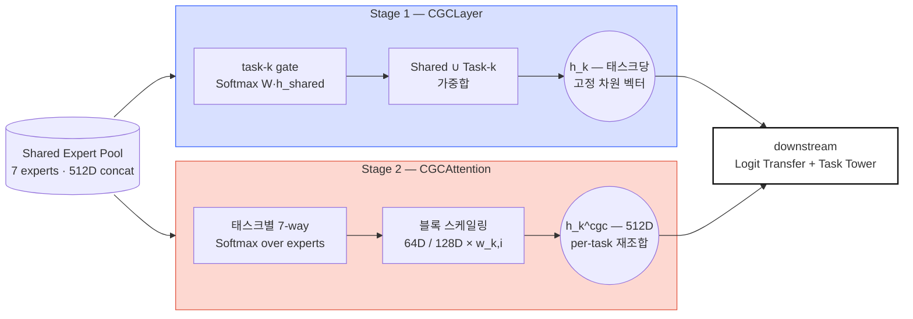
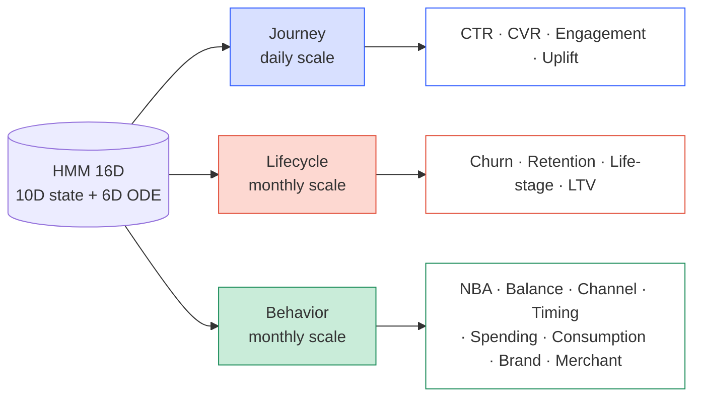

*"Study Thread" 시리즈의 PLE 서브스레드 4편. PLE-1 → PLE-6 에 걸쳐 본
프로젝트의 PLE 아키텍처 뒤에 있는 논문과 수학 기초를 정리한다. 이번
4편은 PLE 의 심장인 CGC 게이트를 두 단계로 구성한다 — 1단계: 원본
논문의 CGCLayer 가 Shared + Task Expert 를 함께 가중합으로 섞고, 2단계:
CGCAttention 이 그 뒤 Shared Expert concat 에 태스크별 블록 스케일링을
얹는다 — 의 수식과 Expert Collapse 를 막는 정규화, 그리고 HMM 기반
Triple-Mode 라우팅을 다룬다.*

## CGC — 태스크별 Expert 게이팅

CGC 는 MMoE(Ma et al., KDD 2018)의 게이팅을 PLE 논문(Tang et al.,
RecSys 2020)이 확장한 것으로, 태스크별 독립 gate 가 Shared Expert 와
Task-specific Expert 를 구분하여 친화도를 학습한다. 본 구현은 이
아이디어를 두 단계로 나눈다 — **CGCLayer** 가 논문 원형대로 Shared ∪
Task Expert 를 한 축 위에서 가중합하고, **CGCAttention** 이 Shared
concat 에 태스크별 블록 스케일링을 얹는다.

> **CGC 두 단계.** 1단계 CGCLayer 는 원 논문(Tang et al. 2020) 원형을
> 유지 — 태스크별 gate 가 Shared+Task Expert 를 concat 축에서 Softmax
> 로 섞는다. 2단계 CGCAttention 은 여기에 직교하게 얹혀 — Shared
> concat 만 따로 보고 Expert 블록별 스케일링을 태스크별로 배분한다. 두
> 경로의 출력이 downstream 에서 함께 쓰인다.

### 1단계 — CGCLayer: 논문 원형의 Shared + Task 가중합

1단계 primary gate 는 원본 논문의 CGCLayer 를 그대로 사용한다. 태스크
$k$ 의 gate 는 Shared Expert 와 태스크 $k$ 전용 Expert 를 *함께* concat
한 축 위에서 Softmax 가중합을 계산한다.

$$\mathbf{h}_k = \sum_{i=1}^{N} g_{k,i} \cdot \mathbf{h}_i^{\text{all}}, \quad \mathbf{h}^{\text{all}} = [\mathbf{h}^{\text{task}}_k \,\|\, \mathbf{h}^{\text{shared}}]$$

$$\mathbf{g}_k = \text{Softmax}(\mathbf{W}_k^{gate} \cdot \mathbf{h}_{shared}) \in \mathbb{R}^{N}, \quad N = |\text{shared}| + |\text{task}_k|$$

Shared 와 Task 풀이 같은 Softmax 축 위에 놓이므로 태스크마다 "A Shared
60%, B Shared 15%, Task-k 전용 25%" 같은 자연스러운 혼합이 가능하다.
출력은 태스크당 단일 고정 차원 벡터.

### 2단계 — CGCAttention: Shared concat 위의 per-task 블록 어텐션

2단계는 1단계와 직교적으로 붙는다. Shared Expert 풀은 출력 차원이
이종(unified_hgcn 128D, 나머지 64D)이어서 이미 concat 된 Shared 표현을
태스크별로 다르게 재조합하는 별도 경로가 필요하다 — 이게
CGCAttention 이다.

$$\mathbf{w}_k = \text{Softmax}(\mathbf{W}_k \cdot \mathbf{h}_{shared} + \mathbf{b}_k) \in \mathbb{R}^7$$

$$\tilde{\mathbf{h}}_{k,i} = w_{k,i} \cdot \mathbf{h}_i^{expert} \quad \text{for } i = 1, \ldots, 7$$

$$\mathbf{h}_k^{cgc} = [\tilde{\mathbf{h}}_{k,1} \,\|\, \ldots \,\|\, \tilde{\mathbf{h}}_{k,7}] \in \mathbb{R}^{512}$$

여기서 $\mathbf{W}_k \in \mathbb{R}^{7 \times 512}$ 는 태스크 $k$ 의
gate 가중치, $\mathbf{h}_i^{expert}$ 는 $i$ 번째 Expert 출력 블록(64D
또는 128D), $w_{k,i}$ 는 그 블록에 부여되는 스칼라 스케일이다. 같은
512D 벡터가 흘러나가지만 태스크마다 Expert 별 기여 비중이 다르게
조합된다.

> **차원 유지 설계.** 블록 스케일링이라 512D → 512D 로 shape 가
> 보존되고, 가중치 합이 1(Softmax)이라 출력 스케일도 보존된다. 기존
> 파이프라인과 하위 호환.

### Domain prior 로 gate bias 초기화

각 태스크의 config `domain_experts` 를 읽어 초기 bias 를 설정한다.
weight 는 0 으로 두고, 태스크가 "선호"하는 Expert 에는
`bias_high = 1.0`, 나머지에는 `bias_low = -1.0`. 학습 초기 Softmax
출력이 도메인 지식에 부합하는 분포에서 출발하게 만드는 소프트 프라이어다.

<svg xmlns="http://www.w3.org/2000/svg" viewBox="0 0 520 510" style="max-width:520px;width:100%;margin:24px auto;display:block;" font-family="ui-monospace, SFMono-Regular, Menlo, monospace">
  <defs></defs>
  <g>
    <text class="exp-lbl" transform="translate(231,94) rotate(-35)">DeepFM</text>
    <text class="exp-lbl" transform="translate(253,94) rotate(-35)">LightGCN</text>
    <text class="exp-lbl" transform="translate(275,94) rotate(-35)">UHGCN</text>
    <text class="exp-lbl" transform="translate(297,94) rotate(-35)">Temporal</text>
    <text class="exp-lbl" transform="translate(319,94) rotate(-35)">PersLay</text>
    <text class="exp-lbl" transform="translate(341,94) rotate(-35)">Causal</text>
    <text class="exp-lbl" transform="translate(363,94) rotate(-35)">OT</text>
  </g>
  <g>
    <!-- ROW_0 CTR -->        <rect x="220" y="100" width="18" height="18" class="cell-off"/><rect x="242" y="100" width="18" height="18" class="cell-off"/><rect x="264" y="100" width="18" height="18" class="cell-on"/><rect x="286" y="100" width="18" height="18" class="cell-on"/><rect x="308" y="100" width="18" height="18" class="cell-on"/><rect x="330" y="100" width="18" height="18" class="cell-off"/><rect x="352" y="100" width="18" height="18" class="cell-off"/>
    <!-- ROW_1 CVR -->        <rect x="220" y="122" width="18" height="18" class="cell-off"/><rect x="242" y="122" width="18" height="18" class="cell-off"/><rect x="264" y="122" width="18" height="18" class="cell-on"/><rect x="286" y="122" width="18" height="18" class="cell-on"/><rect x="308" y="122" width="18" height="18" class="cell-on"/><rect x="330" y="122" width="18" height="18" class="cell-off"/><rect x="352" y="122" width="18" height="18" class="cell-off"/>
    <!-- ROW_2 Churn -->      <rect x="220" y="144" width="18" height="18" class="cell-off"/><rect x="242" y="144" width="18" height="18" class="cell-off"/><rect x="264" y="144" width="18" height="18" class="cell-off"/><rect x="286" y="144" width="18" height="18" class="cell-on"/><rect x="308" y="144" width="18" height="18" class="cell-on"/><rect x="330" y="144" width="18" height="18" class="cell-off"/><rect x="352" y="144" width="18" height="18" class="cell-off"/>
    <!-- ROW_3 Retention -->  <rect x="220" y="166" width="18" height="18" class="cell-off"/><rect x="242" y="166" width="18" height="18" class="cell-off"/><rect x="264" y="166" width="18" height="18" class="cell-off"/><rect x="286" y="166" width="18" height="18" class="cell-on"/><rect x="308" y="166" width="18" height="18" class="cell-on"/><rect x="330" y="166" width="18" height="18" class="cell-off"/><rect x="352" y="166" width="18" height="18" class="cell-off"/>
    <!-- ROW_4 NBA -->        <rect x="220" y="188" width="18" height="18" class="cell-off"/><rect x="242" y="188" width="18" height="18" class="cell-on"/><rect x="264" y="188" width="18" height="18" class="cell-on"/><rect x="286" y="188" width="18" height="18" class="cell-off"/><rect x="308" y="188" width="18" height="18" class="cell-on"/><rect x="330" y="188" width="18" height="18" class="cell-off"/><rect x="352" y="188" width="18" height="18" class="cell-off"/>
    <!-- ROW_5 Life-stage --> <rect x="220" y="210" width="18" height="18" class="cell-off"/><rect x="242" y="210" width="18" height="18" class="cell-off"/><rect x="264" y="210" width="18" height="18" class="cell-off"/><rect x="286" y="210" width="18" height="18" class="cell-on"/><rect x="308" y="210" width="18" height="18" class="cell-on"/><rect x="330" y="210" width="18" height="18" class="cell-off"/><rect x="352" y="210" width="18" height="18" class="cell-off"/>
    <!-- ROW_6 Balance -->    <rect x="220" y="232" width="18" height="18" class="cell-off"/><rect x="242" y="232" width="18" height="18" class="cell-off"/><rect x="264" y="232" width="18" height="18" class="cell-off"/><rect x="286" y="232" width="18" height="18" class="cell-on"/><rect x="308" y="232" width="18" height="18" class="cell-off"/><rect x="330" y="232" width="18" height="18" class="cell-off"/><rect x="352" y="232" width="18" height="18" class="cell-off"/>
    <!-- ROW_7 Engagement --> <rect x="220" y="254" width="18" height="18" class="cell-off"/><rect x="242" y="254" width="18" height="18" class="cell-off"/><rect x="264" y="254" width="18" height="18" class="cell-off"/><rect x="286" y="254" width="18" height="18" class="cell-on"/><rect x="308" y="254" width="18" height="18" class="cell-off"/><rect x="330" y="254" width="18" height="18" class="cell-off"/><rect x="352" y="254" width="18" height="18" class="cell-off"/>
    <!-- ROW_8 LTV -->        <rect x="220" y="276" width="18" height="18" class="cell-on"/><rect x="242" y="276" width="18" height="18" class="cell-off"/><rect x="264" y="276" width="18" height="18" class="cell-off"/><rect x="286" y="276" width="18" height="18" class="cell-on"/><rect x="308" y="276" width="18" height="18" class="cell-off"/><rect x="330" y="276" width="18" height="18" class="cell-off"/><rect x="352" y="276" width="18" height="18" class="cell-off"/>
    <!-- ROW_9 Channel -->    <rect x="220" y="298" width="18" height="18" class="cell-off"/><rect x="242" y="298" width="18" height="18" class="cell-off"/><rect x="264" y="298" width="18" height="18" class="cell-off"/><rect x="286" y="298" width="18" height="18" class="cell-on"/><rect x="308" y="298" width="18" height="18" class="cell-off"/><rect x="330" y="298" width="18" height="18" class="cell-off"/><rect x="352" y="298" width="18" height="18" class="cell-off"/>
    <!-- ROW_10 Timing -->    <rect x="220" y="320" width="18" height="18" class="cell-off"/><rect x="242" y="320" width="18" height="18" class="cell-off"/><rect x="264" y="320" width="18" height="18" class="cell-off"/><rect x="286" y="320" width="18" height="18" class="cell-on"/><rect x="308" y="320" width="18" height="18" class="cell-off"/><rect x="330" y="320" width="18" height="18" class="cell-off"/><rect x="352" y="320" width="18" height="18" class="cell-off"/>
    <!-- ROW_11 Spending_category --><rect x="220" y="342" width="18" height="18" class="cell-off"/><rect x="242" y="342" width="18" height="18" class="cell-off"/><rect x="264" y="342" width="18" height="18" class="cell-on"/><rect x="286" y="342" width="18" height="18" class="cell-off"/><rect x="308" y="342" width="18" height="18" class="cell-on"/><rect x="330" y="342" width="18" height="18" class="cell-off"/><rect x="352" y="342" width="18" height="18" class="cell-off"/>
    <!-- ROW_12 Consumption_cycle --><rect x="220" y="364" width="18" height="18" class="cell-off"/><rect x="242" y="364" width="18" height="18" class="cell-off"/><rect x="264" y="364" width="18" height="18" class="cell-off"/><rect x="286" y="364" width="18" height="18" class="cell-on"/><rect x="308" y="364" width="18" height="18" class="cell-off"/><rect x="330" y="364" width="18" height="18" class="cell-off"/><rect x="352" y="364" width="18" height="18" class="cell-off"/>
    <!-- ROW_13 Spending_bucket --><rect x="220" y="386" width="18" height="18" class="cell-on"/><rect x="242" y="386" width="18" height="18" class="cell-off"/><rect x="264" y="386" width="18" height="18" class="cell-off"/><rect x="286" y="386" width="18" height="18" class="cell-off"/><rect x="308" y="386" width="18" height="18" class="cell-off"/><rect x="330" y="386" width="18" height="18" class="cell-off"/><rect x="352" y="386" width="18" height="18" class="cell-off"/>
    <!-- ROW_14 Brand_prediction --><rect x="220" y="408" width="18" height="18" class="cell-off"/><rect x="242" y="408" width="18" height="18" class="cell-off"/><rect x="264" y="408" width="18" height="18" class="cell-on"/><rect x="286" y="408" width="18" height="18" class="cell-off"/><rect x="308" y="408" width="18" height="18" class="cell-off"/><rect x="330" y="408" width="18" height="18" class="cell-off"/><rect x="352" y="408" width="18" height="18" class="cell-off"/>
    <!-- ROW_15 Merchant_affinity --><rect x="220" y="430" width="18" height="18" class="cell-off"/><rect x="242" y="430" width="18" height="18" class="cell-off"/><rect x="264" y="430" width="18" height="18" class="cell-on"/><rect x="286" y="430" width="18" height="18" class="cell-on"/><rect x="308" y="430" width="18" height="18" class="cell-off"/><rect x="330" y="430" width="18" height="18" class="cell-off"/><rect x="352" y="430" width="18" height="18" class="cell-off"/>
  </g>
  <g>
    <text class="task-lbl" x="210" y="113">CTR</text>
    <text class="task-lbl" x="210" y="135">CVR</text>
    <text class="task-lbl" x="210" y="157">Churn</text>
    <text class="task-lbl" x="210" y="179">Retention</text>
    <text class="task-lbl" x="210" y="201">NBA</text>
    <text class="task-lbl" x="210" y="223">Life-stage</text>
    <text class="task-lbl" x="210" y="245">Balance_util</text>
    <text class="task-lbl" x="210" y="267">Engagement</text>
    <text class="task-lbl" x="210" y="289">LTV</text>
    <text class="task-lbl" x="210" y="311">Channel</text>
    <text class="task-lbl" x="210" y="333">Timing</text>
    <text class="task-lbl" x="210" y="355">Spending_category</text>
    <text class="task-lbl" x="210" y="377">Consumption_cycle</text>
    <text class="task-lbl" x="210" y="399">Spending_bucket</text>
    <text class="task-lbl" x="210" y="421">Brand_prediction</text>
    <text class="task-lbl" x="210" y="443">Merchant_affinity</text>
  </g>
  <g transform="translate(220,470)">
    <rect x="0" y="0" width="18" height="18" class="cell-on"/>
    <text class="legend" x="26" y="14">선호 (bias_high=1.0)</text>
    <rect x="180" y="0" width="18" height="18" class="cell-off"/>
    <text class="legend" x="206" y="14">비선호 (bias_low=-1.0)</text>
  </g>
</svg>

> **도메인 prior 매트릭스.** 학습 초기 bias 는 각 태스크의 "자연스러운
> Expert 선호도" — 예: 시계열성 강한 churn/retention → PersLay+Temporal,
> 가맹점 계층 의존 brand_prediction → Unified HGCN 단독. weight 는 모두
> 0 에서 출발하므로 이 prior 는 *학습이 시작될 때의 편향* 이고, gate 는
> 실 데이터를 보며 얼마든 자유롭게 이동할 수 있다.

### Expert Collapse 방지 — Entropy 정규화

특정 Expert(특히 128D unified_hgcn)에 attention 이 쏠리면 나머지
Expert 의 gradient 가 말라붙는 *Expert Collapse* 가 발생한다. 이를 막기
위해 CGC attention 분포의 엔트로피를 최대화한다.

$$\mathcal{L}_{entropy} = \lambda_{ent} \cdot \left( -\frac{1}{|\mathcal{T}|} \right) \sum_{k \in \mathcal{T}} H(\mathbf{w}_k), \quad H(\mathbf{w}_k) = -\sum_{i=1}^{7} w_{k,i} \log w_{k,i}$$

음의 엔트로피를 *최소화* 하면 엔트로피가 *증가* 하여 분산이 유도된다.
$\lambda_{ent} = 0.01$ 이 기본, 안정 범위 0.005~0.02.

<svg xmlns="http://www.w3.org/2000/svg" viewBox="0 0 260 120" style="max-width:520px;width:100%;margin:24px auto;display:block;" font-family="ui-monospace, SFMono-Regular, Menlo, monospace">
  <g font-size="10" fill="#141414">
    <text x="50" y="14" text-anchor="middle">Expert Collapse</text>
    <text x="50" y="110" text-anchor="middle" fill="#E14F3A">H ≈ 0</text>
    <g fill="#E14F3A" fill-opacity="0.85">
      <rect x="14" y="24" width="8" height="72"/>
      <rect x="24" y="94" width="8" height="2"/>
      <rect x="34" y="94" width="8" height="2"/>
      <rect x="44" y="94" width="8" height="2"/>
      <rect x="54" y="94" width="8" height="2"/>
      <rect x="64" y="94" width="8" height="2"/>
      <rect x="74" y="94" width="8" height="2"/>
    </g>
  </g>
  <g font-size="10" fill="#141414">
    <text x="200" y="14" text-anchor="middle">Healthy (uniform)</text>
    <text x="200" y="110" text-anchor="middle" fill="#2E5BFF">H ≈ log 7 ≈ 1.95</text>
    <g fill="#2E5BFF" fill-opacity="0.85">
      <rect x="164" y="76" width="8" height="20"/>
      <rect x="174" y="74" width="8" height="22"/>
      <rect x="184" y="78" width="8" height="18"/>
      <rect x="194" y="72" width="8" height="24"/>
      <rect x="204" y="76" width="8" height="20"/>
      <rect x="214" y="74" width="8" height="22"/>
      <rect x="224" y="78" width="8" height="18"/>
    </g>
  </g>
</svg>

> **수식 직관.** 엔트로피 $H$ 는 Shannon(1948) 이 세 공리(연속성 · 최대성
> · 결합)로 유도한 "고른 정도"의 측도다. 7-way Softmax 에서는
> $H \in [0, \log 7]$ — 한 Expert 독점이면 0, 완전 균등이면 최대
> $\log 7 \approx 1.95$. 이 항은 분포를 오른쪽 그림 쪽으로 민다.

### 이종 차원 보정 — Dim Normalize

Expert 출력 차원이 이종(unified_hgcn 128D, 나머지 64D)이면 동일
attention 에서도 L2 기여가 2배 차이 난다. `dim_normalize=true` 일 때
스케일링으로 보정한다.

$$\text{scale}_i = \sqrt{\frac{\text{mean\_dim}}{\text{dim}_i}}, \quad \text{mean\_dim} = \frac{128 + 64 \times 6}{7} \approx 73.14$$

- unified_hgcn (128D): scale $\approx 0.756$ (감쇠)
- 나머지 (64D): scale $\approx 1.069$ (증폭)
- 동일 attention ⇒ 동일 L2 기여

> **직관.** 차원이 큰 Expert 는 줄이고 작은 Expert 는 키워서
> $w_{k,i} \approx 1/7$ 일 때 모든 Expert 의 실질 기여가 동등하도록
> 보정한다.

### CGC Freeze 동기화

adaTT 가 전이 가중치를 고정한 뒤에도 CGC 가 계속 학습하면, 두
메커니즘이 상충 방향으로 진화할 수 있다. `on_epoch_end()` 에서
adaTT `freeze_epoch` 에 도달하면 CGC attention 파라미터도 함께
`requires_grad=False` 로 내려, 학습 후반부의 안정성을 보장한다.

## HMM Triple-Mode 라우팅

HMM(Hidden Markov Model)은 *Baum & Petrie (1966)* 이 통계적 언어
모델링을 위해 정식화하였고, 1970년대 *Rabiner & Juang* 이 음성 인식에
적용하며 대중화되었다. 본 시스템은 고객의 관측 가능한 행동(거래,
로그인) 뒤에 숨겨진 여정/생애주기/행동 상태를 HMM 으로 추정하고, 각
태스크에 가장 적합한 시간 스케일의 상태 정보를 주입한다. ODE dynamics
bridge 는 *Neural ODE (Chen et al., NeurIPS 2018)* 에서 영감을 받아
이산 HMM 상태를 연속 시간으로 보간하는 확장이다.

> **세 시간 스케일, 세 태스크 그룹.** 같은 16D HMM 상태 벡터가 세 개의
> 독립 프로젝터를 거쳐 일별(Journey) / 월별(Lifecycle) / 월별
> 행동(Behavior) 세 모드로 나뉘고, 각 모드가 그 시간 스케일이 잘 맞는
> 태스크 그룹에만 주입된다. 데이터 없는 샘플에는 학습 가능한 default
> embedding 을 사용한다.

### HMM 프로젝터

각 모드는 10D base 상태 확률 + 6D ODE dynamics bridge 로 구성된
16D 상태 벡터를, 모드별 독립 프로젝터로 32D 로 올린다.

$$\mathbf{h}_{hmm}^m = \text{SiLU}(\text{LayerNorm}(\text{Linear}_{16 \to 32}(\mathbf{x}_{hmm}^m))), \quad m \in \{\text{journey}, \text{lifecycle}, \text{behavior}\}$$

Linear 로 차원을 키운 뒤, LayerNorm 으로 스케일을 안정화하고, SiLU 로
비선형성을 부여한다. 세 모드가 독립 프로젝터를 가지므로 "일별 여정
패턴"과 "월별 생애주기 패턴"이 서로 다른 변환을 학습한다.

> **SiLU.** $\text{SiLU}(x) = x \cdot \sigma(x)$. Linear 만 쌓으면
> $\mathbf{W}_2 \mathbf{W}_1 \mathbf{x}$ 로 하나의 Linear 와 동치라,
> 레이어를 쌓으려면 사이에 비선형 함수가 필요하다. SiLU 는 ReLU 의
> "죽은 뉴런" 문제와 GELU 의 계산 비용을 절충한 부드러운 활성화.

### 학습 가능한 Default Embedding

HMM 피처가 없는 샘플(all-zero row)에는 zero 대신 *학습 가능한 default
embedding* 을 사용한다. 모드별로 `nn.Parameter(torch.zeros(32))` 을
하나씩 두고, 샘플별 마스킹으로 유효 샘플만 프로젝션하고 무효 샘플은
이 default 로 대체한다.

## 다음 단계

CGCAttention 은 "공유 표현에서 태스크별로 다른 혼합을 뽑는" 장치이고,
HMM Triple-Mode 는 "시간 스케일이 다른 행동 신호를 태스크 그룹별로
라우팅"하는 장치다. 두 경로 모두 *공유된 Expert 풀* 위에서 움직인다.
다음 **PLE-5** 에서는 반대 방향 — 태스크별로 아예 *전용 Expert 바구니*
를 만드는 GroupTaskExpertBasket v3.2(GroupEncoder + ClusterEmbedding),
그리고 태스크 타워들 사이에서 정보를 명시적으로 흘려주는 Logit Transfer
의 3가지 모드, 마지막 Task Tower 구조를 다룬다.
