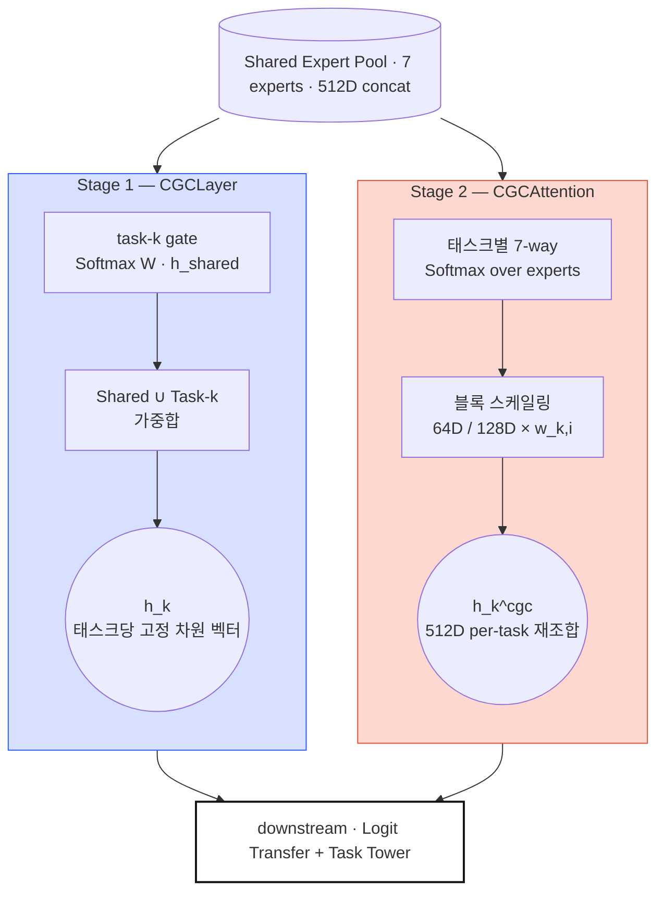
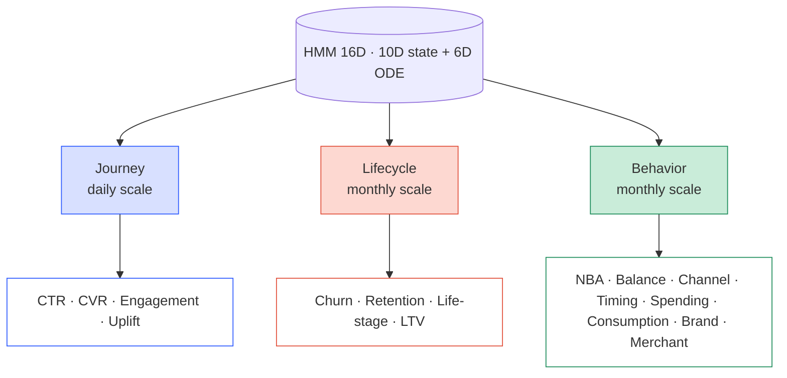

*"Study Thread" 시리즈의 PLE 서브스레드 4편. PLE-1 → PLE-6 에 걸쳐 본
프로젝트의 PLE 아키텍처 뒤에 있는 논문과 수학 기초를 정리한다. PLE-2
에서 이종 Shared Expert pool 과 Softmax gate 를 결정했고, PLE-3 에서
7명의 전문가를 하나씩 소개했다. 이제 그들을 실제로 작동시키려 하면
두 가지 문제가 동시에 고개를 든다 — 게이트가 128D 전문가에게 쏠리는
*dim-asymmetry collapse*, 그리고 고객이 한 시간 스케일에서 살지 않는다는
것. 이번 4편은 그 두 문제에 대한 응답이다.*

## PLE-3 이 남긴 두 문제

7개 이종 Shared Expert 를 배치했다. CGC 게이트가 태스크별로 Expert 를
얼마나 쓸지 학습한다는 원칙도 세웠다. 그런데 실제로 학습을 돌려보면
두 가지가 동시에 터진다.

**첫째, 게이트가 무너진다.** 7개 Expert 의 출력 차원이 동일하지 않다 —
unified_hgcn 은 128D, 나머지 6개는 64D 다. 이 비대칭이 있는 상태에서는
gate 가중치가 모두 균등해도 큰 Expert 의 L2 기여가 2배다. 학습이 시작되면
gradient 가 큰 Expert 쪽으로 쏠리고, 작은 Expert 들은 학습이 정체된다.
MMoE 의 Expert Collapse 보다 미묘하지만 같은 양의 피드백 루프다. 게다가
랜덤 초기화는 "어느 Expert 가 어느 태스크에 유용한지" 에 대한 사전 지식이
전혀 없다 — 잘못된 방향으로 자리가 잡히면 그대로 굳어버린다.

**둘째, 고객 시간은 여러 속도로 흐른다.** 클릭 패턴은 일 단위, 이탈
위험은 월 단위, 라이프스타일 변화는 연 단위. 하나의 HMM 을 전체
활동에 맞추면 일일 신호와 연간 신호가 서로 간섭한다. "어떤 태스크는
일별 여정이 중요하고, 어떤 태스크는 월별 생애주기가 중요하다" 는 것을
gate 가 알아서 학습하기를 바라는 것도 비현실적이다 — gate 는 Expert 를
선택하지 시간 스케일을 선택하지 못한다.

PLE-4 는 이 두 문제에 각각 두 층의 방어선을 친다. 첫 문제에는 CGC 를
두 단계로 쪼개고 (CGCLayer + CGCAttention), dim-normalize 를 얹고, 도메인
prior 로 초기화하고, entropy 정규화로 묶는다. 두 번째 문제에는 시간
스케일별로 별도 HMM 3개와 프로젝터 3개를 둔다.

## 첫 번째 문제: 게이트가 한 전문가로 쏠린다

### 결정 — CGC 를 두 단계로 나눈다

원 PLE 논문의 CGCLayer 는 Shared + Task Expert 를 concat 축 위에서
가중합한다. 이 방식은 homogeneous pool 에서는 잘 작동하지만, 우리 pool
은 이종 차원이다. 단일 축에서 128D 와 64D 를 합치면, 학습 동역학이 큰
블록 쪽으로 편향된다.

어떻게 할 것인가 — 세 가지 대안을 놓고 고민했다.

- **모두 128D 로 맞춘다.** 64D Expert 에 Projection 을 붙여 128D 로
  올린다. 단순하지만 capacity 낭비 — 64D 가 자연스러운 Expert 에 강제로
  64D 의 잉여를 만든다.
- **모두 64D 로 맞춘다.** unified_hgcn 을 128D → 64D 로 압축한다. 쌍곡
  공간의 표현 여유를 포기하는 것이라 HGCN 의 설계 의도가 깨진다.
- **이종을 유지하고 attention 에서 scale 한다.** 각 Expert 는 자연 차원을
  유지한 채, attention 시점에 dim-normalize 로 L2 기여를 균등화한다.

세 번째를 골랐다. 자연 차원을 유지하는 게 capacity 관점에서 이득이고,
attention 한 점에서 보정하는 것이 다른 부작용이 적다. 이 결정이 CGC 를
두 단계로 쪼개는 이유다.

- **1단계 CGCLayer** (논문 원형): Shared + Task Expert 를 한 축에서 Softmax 가중합. 태스크당 고정 차원 벡터 출력.
- **2단계 CGCAttention**: Shared concat (512D) 만 따로 보고, Expert 블록별로 태스크별 스케일링. 이 자리가 dim-normalize 를 포함한다.

> **CGC 두 단계.** 1단계 CGCLayer 는 원 논문(Tang et al. 2020) 원형을
> 유지 — 태스크별 gate 가 Shared+Task Expert 를 concat 축에서 Softmax
> 로 섞는다. 2단계 CGCAttention 은 여기에 직교하게 얹혀 — Shared
> concat 만 따로 보고 Expert 블록별 스케일링을 태스크별로 배분한다. 두
> 경로의 출력이 downstream 에서 함께 쓰인다.

### 1단계 — CGCLayer: 논문 원형의 Shared + Task 가중합

1단계 primary gate 는 원본 논문의 CGCLayer 를 그대로 사용한다. 태스크
$k$ 의 gate 는 Shared Expert 와 태스크 $k$ 전용 Expert 를 *함께* concat
한 축 위에서 Softmax 가중합을 계산한다.

$$\mathbf{h}_k = \sum_{i=1}^{N} g_{k,i} \cdot \mathbf{h}_i^{\text{all}}, \quad \mathbf{h}^{\text{all}} = [\mathbf{h}^{\text{task}}_k \,\|\, \mathbf{h}^{\text{shared}}]$$

$$\mathbf{g}_k = \text{Softmax}(\mathbf{W}_k^{gate} \cdot \mathbf{h}_{shared}) \in \mathbb{R}^{N}, \quad N = |\text{shared}| + |\text{task}_k|$$

Shared 와 Task 풀이 같은 Softmax 축 위에 놓이므로 태스크마다 "A Shared
60%, B Shared 15%, Task-k 전용 25%" 같은 자연스러운 혼합이 가능하다.
출력은 태스크당 단일 고정 차원 벡터.

### 2단계 — CGCAttention: Shared concat 위의 per-task 블록 어텐션

2단계는 1단계와 직교적으로 붙는다. 이 자리의 임무는 *같은 512D 벡터가
흘러가면서도 태스크마다 Expert 별 기여 비중이 다르게 재조합되게* 하는
것이다.

$$\mathbf{w}_k = \text{Softmax}(\mathbf{W}_k \cdot \mathbf{h}_{shared} + \mathbf{b}_k) \in \mathbb{R}^7$$

$$\tilde{\mathbf{h}}_{k,i} = w_{k,i} \cdot \mathbf{h}_i^{expert} \quad \text{for } i = 1, \ldots, 7$$

$$\mathbf{h}_k^{cgc} = [\tilde{\mathbf{h}}_{k,1} \,\|\, \ldots \,\|\, \tilde{\mathbf{h}}_{k,7}] \in \mathbb{R}^{512}$$

여기서 $\mathbf{W}_k \in \mathbb{R}^{7 \times 512}$ 는 태스크 $k$ 의
gate 가중치, $\mathbf{h}_i^{expert}$ 는 $i$ 번째 Expert 출력 블록(64D
또는 128D), $w_{k,i}$ 는 그 블록에 부여되는 스칼라 스케일이다. 같은
512D 벡터가 흘러나가지만 태스크마다 Expert 별 기여 비중이 다르게
조합된다.

> **차원 유지 설계.** 블록 스케일링이라 512D → 512D 로 shape 가
> 보존되고, 가중치 합이 1(Softmax)이라 출력 스케일도 보존된다. 기존
> 파이프라인과 하위 호환.

### 이종 차원 보정 — Dim Normalize

그런데 attention 가중치만 Softmax 로 정리해도 이종 차원 문제는 완전히
사라지지 않는다. $w_{k,i} \approx 1/7$ 로 완전히 균등해도 128D Expert
의 L2 기여는 여전히 64D Expert 의 2배다. 이걸 보정하지 않으면 gradient
가 큰 블록으로 편향된다.

$$\text{scale}_i = \sqrt{\frac{\text{mean\_dim}}{\text{dim}_i}}, \quad \text{mean\_dim} = \frac{128 + 64 \times 6}{7} \approx 73.14$$

- unified_hgcn (128D): scale $\approx 0.756$ (감쇠)
- 나머지 (64D): scale $\approx 1.069$ (증폭)
- 동일 attention ⇒ 동일 L2 기여

`dim_normalize=true` 일 때 이 스케일이 자동 적용된다.

> **직관.** 차원이 큰 Expert 는 줄이고 작은 Expert 는 키워서
> $w_{k,i} \approx 1/7$ 일 때 모든 Expert 의 실질 기여가 동등하도록
> 보정한다. dim asymmetry 가 collapse 로 이어지지 않게 하는 기하학적
> 1차 방어선이다.

### Domain prior 로 gate bias 초기화 — 2차 방어선

dim-normalize 는 기하적 보정이지만, "어느 Expert 가 어느 태스크에 도움이
되는가" 에 대한 사전 지식은 담지 못한다. 랜덤 초기화에서 gate 가 우연히
잘못된 Expert 로 가면 수십 스텝 안에 그쪽으로 수렴할 수 있다. 그래서
도메인 지식을 bias 초기값에 직접 집어넣는다.

각 태스크의 config `domain_experts` 를 읽는다. Weight 는 0 으로 두고,
태스크가 "선호" 하는 Expert 에는 `bias_high = 1.0`, 나머지에는
`bias_low = -1.0`. 학습 초기 Softmax 출력이 이미 도메인 지식에 부합하는
분포에서 출발한다.

<svg xmlns="http://www.w3.org/2000/svg" viewBox="0 0 520 560" style="max-width:520px;width:100%;margin:24px auto;display:block;" font-family="JetBrains Mono, SUIT Variable, Pretendard Variable, ui-monospace, sans-serif">
  <defs></defs>
  <g>
    <text class="exp-lbl" transform="translate(231,94) rotate(-35)">DeepFM</text>
    <text class="exp-lbl" transform="translate(253,94) rotate(-35)">LightGCN</text>
    <text class="exp-lbl" transform="translate(275,94) rotate(-35)">UHGCN</text>
    <text class="exp-lbl" transform="translate(297,94) rotate(-35)">Temporal</text>
    <text class="exp-lbl" transform="translate(319,94) rotate(-35)">PersLay</text>
    <text class="exp-lbl" transform="translate(341,94) rotate(-35)">Causal</text>
    <text class="exp-lbl" transform="translate(363,94) rotate(-35)">OT</text>
  </g>
  <g>
    <!-- ROW_0 CTR -->        <rect x="220" y="100" width="18" height="18" class="cell-off"/><rect x="242" y="100" width="18" height="18" class="cell-off"/><rect x="264" y="100" width="18" height="18" class="cell-on"/><rect x="286" y="100" width="18" height="18" class="cell-on"/><rect x="308" y="100" width="18" height="18" class="cell-on"/><rect x="330" y="100" width="18" height="18" class="cell-off"/><rect x="352" y="100" width="18" height="18" class="cell-off"/>
    <!-- ROW_1 CVR -->        <rect x="220" y="122" width="18" height="18" class="cell-off"/><rect x="242" y="122" width="18" height="18" class="cell-off"/><rect x="264" y="122" width="18" height="18" class="cell-on"/><rect x="286" y="122" width="18" height="18" class="cell-on"/><rect x="308" y="122" width="18" height="18" class="cell-on"/><rect x="330" y="122" width="18" height="18" class="cell-off"/><rect x="352" y="122" width="18" height="18" class="cell-off"/>
    <!-- ROW_2 Churn -->      <rect x="220" y="144" width="18" height="18" class="cell-off"/><rect x="242" y="144" width="18" height="18" class="cell-off"/><rect x="264" y="144" width="18" height="18" class="cell-off"/><rect x="286" y="144" width="18" height="18" class="cell-on"/><rect x="308" y="144" width="18" height="18" class="cell-on"/><rect x="330" y="144" width="18" height="18" class="cell-off"/><rect x="352" y="144" width="18" height="18" class="cell-off"/>
    <!-- ROW_3 Retention -->  <rect x="220" y="166" width="18" height="18" class="cell-off"/><rect x="242" y="166" width="18" height="18" class="cell-off"/><rect x="264" y="166" width="18" height="18" class="cell-off"/><rect x="286" y="166" width="18" height="18" class="cell-on"/><rect x="308" y="166" width="18" height="18" class="cell-on"/><rect x="330" y="166" width="18" height="18" class="cell-off"/><rect x="352" y="166" width="18" height="18" class="cell-off"/>
    <!-- ROW_4 NBA -->        <rect x="220" y="188" width="18" height="18" class="cell-off"/><rect x="242" y="188" width="18" height="18" class="cell-on"/><rect x="264" y="188" width="18" height="18" class="cell-on"/><rect x="286" y="188" width="18" height="18" class="cell-off"/><rect x="308" y="188" width="18" height="18" class="cell-on"/><rect x="330" y="188" width="18" height="18" class="cell-off"/><rect x="352" y="188" width="18" height="18" class="cell-off"/>
    <!-- ROW_5 Life-stage --> <rect x="220" y="210" width="18" height="18" class="cell-off"/><rect x="242" y="210" width="18" height="18" class="cell-off"/><rect x="264" y="210" width="18" height="18" class="cell-off"/><rect x="286" y="210" width="18" height="18" class="cell-on"/><rect x="308" y="210" width="18" height="18" class="cell-on"/><rect x="330" y="210" width="18" height="18" class="cell-off"/><rect x="352" y="210" width="18" height="18" class="cell-off"/>
    <!-- ROW_6 Balance -->    <rect x="220" y="232" width="18" height="18" class="cell-off"/><rect x="242" y="232" width="18" height="18" class="cell-off"/><rect x="264" y="232" width="18" height="18" class="cell-off"/><rect x="286" y="232" width="18" height="18" class="cell-on"/><rect x="308" y="232" width="18" height="18" class="cell-off"/><rect x="330" y="232" width="18" height="18" class="cell-off"/><rect x="352" y="232" width="18" height="18" class="cell-off"/>
    <!-- ROW_7 Engagement --> <rect x="220" y="254" width="18" height="18" class="cell-off"/><rect x="242" y="254" width="18" height="18" class="cell-off"/><rect x="264" y="254" width="18" height="18" class="cell-off"/><rect x="286" y="254" width="18" height="18" class="cell-on"/><rect x="308" y="254" width="18" height="18" class="cell-off"/><rect x="330" y="254" width="18" height="18" class="cell-off"/><rect x="352" y="254" width="18" height="18" class="cell-off"/>
    <!-- ROW_8 LTV -->        <rect x="220" y="276" width="18" height="18" class="cell-on"/><rect x="242" y="276" width="18" height="18" class="cell-off"/><rect x="264" y="276" width="18" height="18" class="cell-off"/><rect x="286" y="276" width="18" height="18" class="cell-on"/><rect x="308" y="276" width="18" height="18" class="cell-off"/><rect x="330" y="276" width="18" height="18" class="cell-off"/><rect x="352" y="276" width="18" height="18" class="cell-off"/>
    <!-- ROW_9 Channel -->    <rect x="220" y="298" width="18" height="18" class="cell-off"/><rect x="242" y="298" width="18" height="18" class="cell-off"/><rect x="264" y="298" width="18" height="18" class="cell-off"/><rect x="286" y="298" width="18" height="18" class="cell-on"/><rect x="308" y="298" width="18" height="18" class="cell-off"/><rect x="330" y="298" width="18" height="18" class="cell-off"/><rect x="352" y="298" width="18" height="18" class="cell-off"/>
    <!-- ROW_10 Timing -->    <rect x="220" y="320" width="18" height="18" class="cell-off"/><rect x="242" y="320" width="18" height="18" class="cell-off"/><rect x="264" y="320" width="18" height="18" class="cell-off"/><rect x="286" y="320" width="18" height="18" class="cell-on"/><rect x="308" y="320" width="18" height="18" class="cell-off"/><rect x="330" y="320" width="18" height="18" class="cell-off"/><rect x="352" y="320" width="18" height="18" class="cell-off"/>
    <!-- ROW_11 Spending_category --><rect x="220" y="342" width="18" height="18" class="cell-off"/><rect x="242" y="342" width="18" height="18" class="cell-off"/><rect x="264" y="342" width="18" height="18" class="cell-on"/><rect x="286" y="342" width="18" height="18" class="cell-off"/><rect x="308" y="342" width="18" height="18" class="cell-on"/><rect x="330" y="342" width="18" height="18" class="cell-off"/><rect x="352" y="342" width="18" height="18" class="cell-off"/>
    <!-- ROW_12 Consumption_cycle --><rect x="220" y="364" width="18" height="18" class="cell-off"/><rect x="242" y="364" width="18" height="18" class="cell-off"/><rect x="264" y="364" width="18" height="18" class="cell-off"/><rect x="286" y="364" width="18" height="18" class="cell-on"/><rect x="308" y="364" width="18" height="18" class="cell-off"/><rect x="330" y="364" width="18" height="18" class="cell-off"/><rect x="352" y="364" width="18" height="18" class="cell-off"/>
    <!-- ROW_13 Spending_bucket --><rect x="220" y="386" width="18" height="18" class="cell-on"/><rect x="242" y="386" width="18" height="18" class="cell-off"/><rect x="264" y="386" width="18" height="18" class="cell-off"/><rect x="286" y="386" width="18" height="18" class="cell-off"/><rect x="308" y="386" width="18" height="18" class="cell-off"/><rect x="330" y="386" width="18" height="18" class="cell-off"/><rect x="352" y="386" width="18" height="18" class="cell-off"/>
    <!-- ROW_14 Brand_prediction --><rect x="220" y="408" width="18" height="18" class="cell-off"/><rect x="242" y="408" width="18" height="18" class="cell-off"/><rect x="264" y="408" width="18" height="18" class="cell-on"/><rect x="286" y="408" width="18" height="18" class="cell-off"/><rect x="308" y="408" width="18" height="18" class="cell-off"/><rect x="330" y="408" width="18" height="18" class="cell-off"/><rect x="352" y="408" width="18" height="18" class="cell-off"/>
    <!-- ROW_15 Merchant_affinity --><rect x="220" y="430" width="18" height="18" class="cell-off"/><rect x="242" y="430" width="18" height="18" class="cell-off"/><rect x="264" y="430" width="18" height="18" class="cell-on"/><rect x="286" y="430" width="18" height="18" class="cell-on"/><rect x="308" y="430" width="18" height="18" class="cell-off"/><rect x="330" y="430" width="18" height="18" class="cell-off"/><rect x="352" y="430" width="18" height="18" class="cell-off"/>
  </g>
  <g>
    <text class="task-lbl" x="210" y="113">CTR</text>
    <text class="task-lbl" x="210" y="135">CVR</text>
    <text class="task-lbl" x="210" y="157">Churn</text>
    <text class="task-lbl" x="210" y="179">Retention</text>
    <text class="task-lbl" x="210" y="201">NBA</text>
    <text class="task-lbl" x="210" y="223">Life-stage</text>
    <text class="task-lbl" x="210" y="245">Balance_util</text>
    <text class="task-lbl" x="210" y="267">Engagement</text>
    <text class="task-lbl" x="210" y="289">LTV</text>
    <text class="task-lbl" x="210" y="311">Channel</text>
    <text class="task-lbl" x="210" y="333">Timing</text>
    <text class="task-lbl" x="210" y="355">Spending_category</text>
    <text class="task-lbl" x="210" y="377">Consumption_cycle</text>
    <text class="task-lbl" x="210" y="399">Spending_bucket</text>
    <text class="task-lbl" x="210" y="421">Brand_prediction</text>
    <text class="task-lbl" x="210" y="443">Merchant_affinity</text>
  </g>
  <g transform="translate(80,470)">
    <rect x="0" y="0" width="18" height="18" class="cell-on"/>
    <text class="legend" x="26" y="14">선호 (bias_high = 1.0)</text>
    <rect x="0" y="26" width="18" height="18" class="cell-off"/>
    <text class="legend" x="26" y="40">비선호 (bias_low = -1.0)</text>
  </g>
  <g transform="translate(80,530)">
    <text class="legend" x="0" y="0" font-style="italic" fill="#6B7280">* Causal · OT: 초기 prior 없음 — gate 가 학습 중 자유 탐색</text>
  </g>
</svg>

> **도메인 prior 매트릭스.** 학습 초기 bias 는 각 태스크의 "자연스러운
> Expert 선호도" — 예: 시계열성 강한 churn/retention → PersLay+Temporal,
> 가맹점 계층 의존 brand_prediction → Unified HGCN 단독. weight 는 모두
> 0 에서 출발하므로 이 prior 는 *학습이 시작될 때의 편향* 이고, gate 는
> 실 데이터를 보며 얼마든 자유롭게 이동할 수 있다.

### 3차 방어선 — Entropy 정규화

dim-normalize 로 기하적 편향을 없애고 domain prior 로 시작점을 잡아도
아직 랜덤의 장난이 남는다. 특정 Expert 에 attention 이 쏠리는 순간
gradient 가 커지고 더 쏠리는 positive feedback 이 생긴다. 이걸 구조적으로
막는 게 entropy 정규화 — 분포가 한 Expert 에 집중되면 손실을 주는 거다.

$$\mathcal{L}_{entropy} = \lambda_{ent} \cdot \left( -\frac{1}{|\mathcal{T}|} \right) \sum_{k \in \mathcal{T}} H(\mathbf{w}_k), \quad H(\mathbf{w}_k) = -\sum_{i=1}^{7} w_{k,i} \log w_{k,i}$$

음의 엔트로피를 *최소화* 하면 엔트로피가 *증가* 하여 분산이 유도된다.
$\lambda_{ent}$ 는 튜닝 포인트다 — 0 으로 두면 collapse, 0.1 이면 모든
태스크가 완전 균등해져 특화 자체가 사라진다. 안정 범위는 0.005–0.02,
기본값 0.01.

<svg xmlns="http://www.w3.org/2000/svg" viewBox="0 0 260 120" style="max-width:520px;width:100%;margin:24px auto;display:block;" font-family="JetBrains Mono, SUIT Variable, Pretendard Variable, ui-monospace, sans-serif">
  <g font-size="10" fill="#141414">
    <text x="50" y="14" text-anchor="middle">Expert Collapse</text>
    <text x="50" y="110" text-anchor="middle" fill="#E14F3A">H ≈ 0</text>
    <g fill="#E14F3A" fill-opacity="0.85">
      <rect x="14" y="24" width="8" height="72"/>
      <rect x="24" y="94" width="8" height="2"/>
      <rect x="34" y="94" width="8" height="2"/>
      <rect x="44" y="94" width="8" height="2"/>
      <rect x="54" y="94" width="8" height="2"/>
      <rect x="64" y="94" width="8" height="2"/>
      <rect x="74" y="94" width="8" height="2"/>
    </g>
  </g>
  <g font-size="10" fill="#141414">
    <text x="200" y="14" text-anchor="middle">Healthy (uniform)</text>
    <text x="200" y="110" text-anchor="middle" fill="#2E5BFF">H ≈ log 7 ≈ 1.95</text>
    <g fill="#2E5BFF" fill-opacity="0.85">
      <rect x="164" y="76" width="8" height="20"/>
      <rect x="174" y="74" width="8" height="22"/>
      <rect x="184" y="78" width="8" height="18"/>
      <rect x="194" y="72" width="8" height="24"/>
      <rect x="204" y="76" width="8" height="20"/>
      <rect x="214" y="74" width="8" height="22"/>
      <rect x="224" y="78" width="8" height="18"/>
    </g>
  </g>
</svg>

> **수식 직관.** 엔트로피 $H$ 는 Shannon(1948) 이 세 공리(연속성 · 최대성
> · 결합)로 유도한 "고른 정도"의 측도다. 7-way Softmax 에서는
> $H \in [0, \log 7]$ — 한 Expert 독점이면 0, 완전 균등이면 최대
> $\log 7 \approx 1.95$. 이 항은 분포를 오른쪽 그림 쪽으로 민다.

dim-normalize + domain prior + entropy 세 층이 모이면, 7명 중 한 명에게
학습이 쏠리는 상황이 구조적으로 막힌다. 각각 혼자로는 약하지만
세 층이 서로를 보완한다.

### CGC Freeze 동기화

adaTT 가 전이 가중치를 고정한 뒤에도 CGC 가 계속 학습하면, 두
메커니즘이 서로 반대 방향으로 진화할 수 있다. `on_epoch_end()` 에서
adaTT `freeze_epoch` 에 도달하면 CGC attention 파라미터도 함께
`requires_grad=False` 로 내려, 학습 후반부의 안정성을 확보한다. 후반부
재학습으로 인한 드리프트를 막는 작은 안전장치다.

## 두 번째 문제: 고객 시간이 여러 속도로 흐른다

### 결정 — HMM 하나가 아니라 셋을 둔다

Shared Expert 는 고객의 "현재 상태" 를 여러 관점으로 본다. 하지만 고객의
*숨겨진 상태 전이* — 여정 단계, 생애주기 단계, 소비 행동 체제 — 는 시간
스케일이 서로 다르다.

단일 HMM 하나로 모든 신호를 처리하려 하면 일별 신호와 연간 신호가
서로 간섭한다. 고객이 오늘 앱을 연 횟수 (journey) 와 고객이 이번 달에
생애주기 단계를 바꿨는지 (lifecycle) 는 본질적으로 다른 state dynamics
를 요구한다 — 같은 HMM 이 두 스케일을 동시에 학습하려면 공유 emission
matrix 가 두 신호 사이에서 갈피를 잡지 못한다.

그래서 시간 스케일별로 HMM 을 3개 — journey (일별), lifecycle (월별),
behavior (월별 행동) — 돌리고, 각 HMM 의 상태를 해당 스케일이 잘 맞는
태스크 그룹에만 주입한다. 16D HMM 상태 (10D state probability + 6D ODE
dynamics bridge) 를 모드별 독립 프로젝터로 32D 로 올려, HMM 데이터가
없는 샘플에는 학습 가능한 default embedding 을 사용한다.

> **세 시간 스케일, 세 태스크 그룹.** 같은 16D HMM 상태 벡터가 세 개의
> 독립 프로젝터를 거쳐 일별(Journey) / 월별(Lifecycle) / 월별
> 행동(Behavior) 세 모드로 나뉘고, 각 모드가 그 시간 스케일이 잘 맞는
> 태스크 그룹에만 주입된다. 데이터 없는 샘플에는 학습 가능한 default
> embedding 을 사용한다.

> **역사 — Baum & Petrie (1966) 이 HMM 을 정식화했고, 1970년대 Rabiner &
> Juang 이 음성 인식에 적용하며 대중화.** ODE dynamics bridge 는 *Neural
> ODE (Chen et al., NeurIPS 2018)* 에서 영감을 받아 이산 HMM 상태를
> 연속 시간으로 보간하는 확장.

### HMM 프로젝터

각 모드는 10D base 상태 확률 + 6D ODE dynamics bridge 로 구성된
16D 상태 벡터를, 모드별 독립 프로젝터로 32D 로 올린다.

$$\mathbf{h}_{hmm}^m = \text{SiLU}(\text{LayerNorm}(\text{Linear}_{16 \to 32}(\mathbf{x}_{hmm}^m))), \quad m \in \{\text{journey}, \text{lifecycle}, \text{behavior}\}$$

Linear 로 차원을 키운 뒤, LayerNorm 으로 스케일을 안정화하고, SiLU 로
비선형성을 부여한다. 세 모드가 독립 프로젝터를 가지므로 "일별 여정
패턴" 과 "월별 생애주기 패턴" 이 서로 다른 변환을 학습한다 — 이게 핵심이다.
공유 프로젝터를 쓰면 결국 단일 HMM 으로 돌아가는 것과 같다.

> **SiLU.** $\text{SiLU}(x) = x \cdot \sigma(x)$. Linear 만 쌓으면
> $\mathbf{W}_2 \mathbf{W}_1 \mathbf{x}$ 로 하나의 Linear 와 동치라,
> 레이어를 쌓으려면 사이에 비선형 함수가 필요하다. SiLU 는 ReLU 의
> "죽은 뉴런" 문제와 GELU 의 계산 비용을 절충한 부드러운 활성화.

### 학습 가능한 Default Embedding

HMM 피처가 없는 샘플 (all-zero row) 에 대해 zero 를 그대로 쓰면, 그
샘플은 프로젝션을 지나 dead signal 을 만든다. 모델이 "데이터 없음" 을
"모든 상태 확률 0" 으로 잘못 해석한다. 그래서 모드별로
`nn.Parameter(torch.zeros(32))` 하나씩을 두고, 샘플별 마스킹으로 유효
샘플만 프로젝션하고 무효 샘플은 이 default 로 대체한다. default 는
학습되므로 "HMM 데이터가 없는 고객의 평균적 시간 스케일 표현" 을
학습한다. 결측과 상태를 모델이 구별할 수 있게 해주는 작은 설계.

## 다음 단계

PLE-4 는 Shared Expert pool 위의 두 가지 라우팅 문제를 정리했다. CGC
두 단계 + 3중 방어선 (dim-normalize, domain prior, entropy) 으로 expert
간 선택을 안정화하고, HMM Triple-Mode 로 시간 스케일별 신호를 올바른
태스크 그룹에 주입한다. 두 경로 모두 *공유된* Expert 풀 위에서 움직인다.

다음 **PLE-5** 에서는 반대 방향 — 태스크별로 아예 *전용 Expert 바구니*
를 만드는 GroupTaskExpertBasket, 태스크 타워 사이에서 정보를 명시적으로
흘려주는 Logit Transfer, 그리고 마지막 Task Tower 구조 — 를 다룬다.
거기서 또 세 가지 새로운 결정이 나온다: 파라미터 88% 줄이는 Group 공유
방법, 순차적 태스크 의존성을 명시적으로 전달하는 방법, 그리고 16개
태스크 가중치를 자동 균형하는 Uncertainty Weighting.
