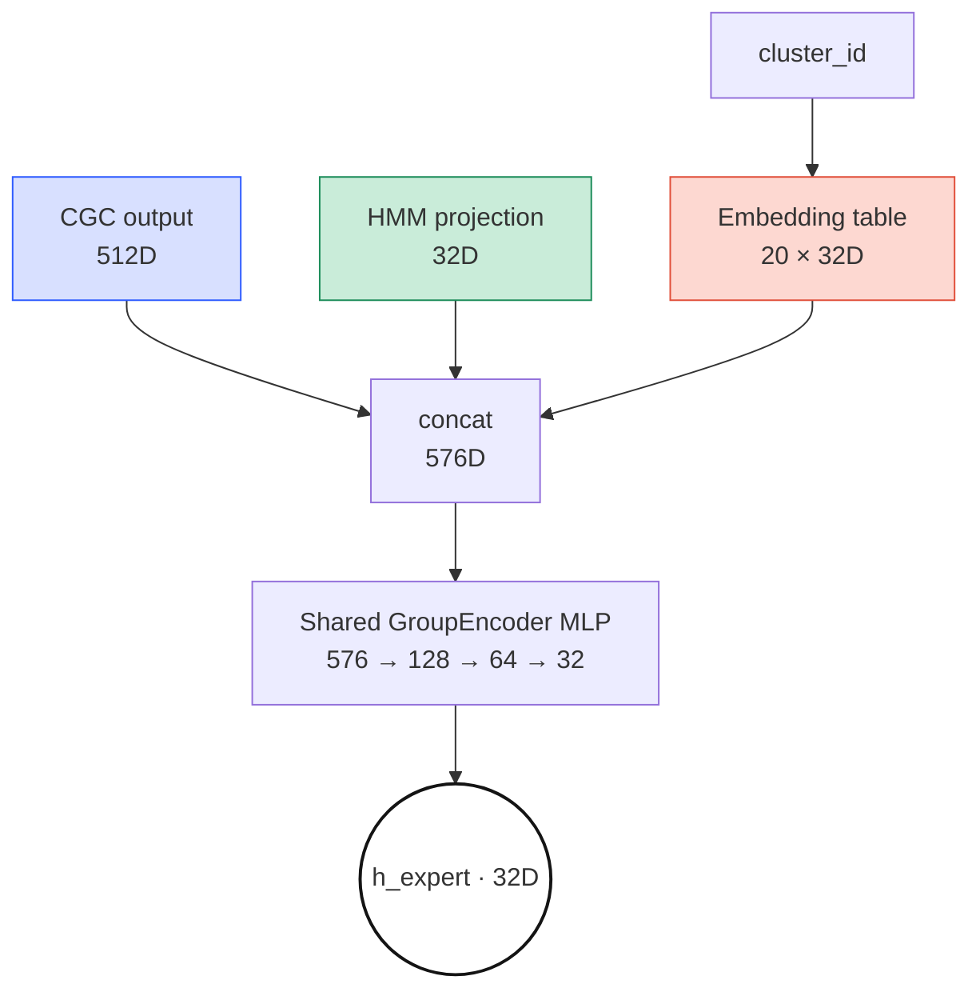
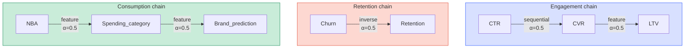

*PLE-5 of the "Study Thread" series — a parallel English/Korean
sub-thread running PLE-1 → PLE-6 that summarizes the papers and math
foundations behind the PLE architecture used in this project. Source:
the on-prem `기술참조서/PLE_기술_참조서` document. This fifth post cuts
through the back half of the PLE data flow — GroupTaskExpertBasket v3.2
(group-scoped expert encoders with cluster-conditioned embeddings),
Logit Transfer (explicit predictions passed between tasks along a DAG),
and the Task Tower that produces the final output.*

## GroupTaskExpertBasket — GroupEncoder + ClusterEmbedding (v3.2)

In v3.2, setting `use_group_encoder=true` (the default) switches to
`GroupTaskExpertBasket`, which achieves an *88% parameter reduction*
(~362K) over the legacy `ClusterTaskExpertBasket` (independent MLP per
task × cluster, ~3.0M parameters). Tasks inside the same group share
the GroupEncoder; groups themselves remain independent.

### Soft routing

For samples that sit on a cluster boundary (where `cluster_probs` are
spread across multiple clusters), *soft routing* uses a weighted
average of several cluster embeddings.

$$\mathbf{e}_{cluster} = \sum_{c=0}^{19} p_c \cdot \mathbf{E}_c \in \mathbb{R}^{32}$$

$$\mathbf{h}_{expert} = \text{TaskHead}([\text{GroupEncoder}(\mathbf{x}) \,\|\, \mathbf{e}_{cluster}])$$

$p_c$ is the posterior probability of GMM cluster $c$, and
$\mathbf{E}_c$ is the trainable embedding vector (32D) for cluster $c$.
In implementation this is a single matrix product
`cluster_probs @ embedding.weight` ($[B, 20] \times [20, 32] = [B, 32]$).

> **Intuition.** A boundary customer that belongs to cluster 3 with
> 60% and cluster 7 with 30% gets the embeddings of those clusters
> mixed in those proportions. Unlike hard routing — which force-assigns
> each customer to a single cluster — predictions for boundary
> customers stay insensitive to fluctuations in cluster assignment.

> **Embedding.** $\text{Embedding}(c) = \mathbf{E}[c, :] \in \mathbb{R}^{32}$
> is a trainable lookup table, mathematically equivalent to one-hot
> $\mathbf{v}_c^T \mathbf{E}$. Direct indexing is faster than a sparse
> matmul.

> **GMM posterior.** $p_c = P(c | \mathbf{x}) = \pi_c \mathcal{N}(\mathbf{x} | \boldsymbol{\mu}_c, \boldsymbol{\Sigma}_c) \big/ \sum_j \pi_j \mathcal{N}(\mathbf{x} | \boldsymbol{\mu}_j, \boldsymbol{\Sigma}_j)$.
> Parameters $\pi_c, \boldsymbol{\mu}_c, \boldsymbol{\Sigma}_c$ are
> precomputed offline with EM.

## Logit Transfer — Explicit Information Passing Between Tasks

> **Three independent DAGs.** Kahn's algorithm (1962 — in-degree 0 →
> queue, $O(V+E)$, free cycle detection) derives the execution order
> automatically: CTR → CVR → LTV, Churn → Retention, NBA →
> Spending_category → Brand_prediction. Adding a new transfer to
> `task_relationships` config picks up the order automatically.

### Transfer mechanism

The upstream task's prediction is added as a residual to the downstream
task's input.

$$\mathbf{h}_{tower}^t = \mathbf{h}_{expert}^t + \alpha \cdot \text{SiLU}(\text{LayerNorm}(\text{Linear}(\text{pred}^s)))$$

$\alpha = 0.5$ (`transfer_strength`); `Linear` projects source
output_dim → 32D. Because the transfer is a residual, when the source
information is not useful the projection weights converge to 0 — a
natural *safe default* (He et al., ResNet, CVPR 2016).

> **Intuition.** When the CTR model outputs "this customer has a high
> click probability," that signal passes through the projection and is
> added to the CVR tower's input. $\alpha = 0.5$ controls the relative
> magnitude of the transfer signal vs. the original Expert output.

> **⚠ Logit Transfer vs adaTT — two complementary transfer
> mechanisms.** This system performs cross-task knowledge transfer at
> *two different levels* simultaneously.
>
> | Property | Logit Transfer | adaTT |
> | --- | --- | --- |
> | Layer of operation | Feature/logit level (during forward pass) | Loss level (before backward pass) |
> | What is passed | Source task's prediction / hidden representation | Pairwise gradient affinity |
> | Directionality | Directed DAG (CTR→CVR→LTV) | Full matrix (all task pairs) |
> | Learnability | Fixed structure (hand-designed) | Adaptive (affinity learned via EMA) |
> | Purpose | Explicit propagation of sequential dependencies | Automatic mitigation of Negative Transfer |
>
> Logit Transfer passes predictions directly between tasks whose
> business logic is sequential (e.g. CTR→CVR), while adaTT adaptively
> modulates pairwise influence at the gradient level for every task
> pair. They are complementary and operate at the same time. See the
> separate *adaTT tech reference* for the full mechanism.

## Task Tower — Final Prediction

`TaskTower` uses a common shallow MLP across all tasks.

$$\mathbf{y} = \text{Linear}_{32 \to out} \circ \text{Block}_{64 \to 32} \circ \text{Block}_{32 \to 64}(\mathbf{h}_{expert})$$

$$\text{Block}_{a \to b}(\mathbf{x}) = \text{Dropout}(\text{SiLU}(\text{LayerNorm}(\text{Linear}_{a \to b}(\mathbf{x}))))$$

Input is 32D, hidden_dims are [64, 32], dropout 0.2. Regression tasks
use activation=None, binary uses sigmoid, multiclass uses softmax.

> **Intuition.** Expand 32→64 to enlarge capacity, compress 64→32, and
> finally project to the output dimension. Inserting LayerNorm + SiLU +
> Dropout between layers keeps even this shallow MLP stable.

> **LayerNorm.** $\text{LN}(\mathbf{x}) = \gamma \cdot (\mathbf{x} - \mu) / \sqrt{\sigma^2 + \epsilon} + \beta$
> normalizes over all neurons *within a sample* (BatchNorm normalizes
> the same neuron *across the batch* — batch-size dependent).
> LayerNorm is more stable in serving environments where batch size
> varies.

### Per-task loss types

<svg xmlns="http://www.w3.org/2000/svg" viewBox="0 0 520 410" style="max-width:520px;width:100%;margin:24px auto;display:block;" font-family="JetBrains Mono, SUIT Variable, Pretendard Variable, ui-monospace, sans-serif">
  <defs></defs>

  <!-- Binary + Focal group -->
  <g transform="translate(20,20)">
    <text class="grp-lbl" x="0" y="14">Binary · Focal Loss</text>
    <text class="grp-meta" x="0" y="32">γ=2.0, α per-task (0.20 – 0.60)</text>
    <g transform="translate(0,42)">
      <rect class="bin" x="0" y="0" width="115" height="28" rx="4"/>
      <text class="task-chip" x="57.5" y="18" text-anchor="middle">CTR</text>
      <rect class="bin" x="125" y="0" width="115" height="28" rx="4"/>
      <text class="task-chip" x="182.5" y="18" text-anchor="middle">CVR  1.5w</text>
      <rect class="bin" x="250" y="0" width="115" height="28" rx="4"/>
      <text class="task-chip" x="307.5" y="18" text-anchor="middle">Churn  1.2w</text>
      <rect class="bin" x="375" y="0" width="115" height="28" rx="4"/>
      <text class="task-chip" x="432.5" y="18" text-anchor="middle">Retention</text>
    </g>
  </g>

  <!-- Multiclass + NLL group -->
  <g transform="translate(20,120)">
    <text class="grp-lbl" x="0" y="14">Multiclass · NLL</text>
    <text class="grp-meta" x="0" y="32">Softmax outputs (3 – 28 classes)</text>
    <g transform="translate(0,42)">
      <rect class="multi" x="0" y="0" width="115" height="28" rx="4"/>
      <text class="task-chip" x="57.5" y="18" text-anchor="middle">NBA (12)  2.0w</text>
      <rect class="multi" x="125" y="0" width="115" height="28" rx="4"/>
      <text class="task-chip" x="182.5" y="18" text-anchor="middle">Life-stage (6)</text>
      <rect class="multi" x="250" y="0" width="115" height="28" rx="4"/>
      <text class="task-chip" x="307.5" y="18" text-anchor="middle">Channel (3)</text>
      <rect class="multi" x="375" y="0" width="115" height="28" rx="4"/>
      <text class="task-chip" x="432.5" y="18" text-anchor="middle">Timing (28)</text>
    </g>
    <g transform="translate(0,78)">
      <rect class="multi" x="0" y="0" width="240" height="28" rx="4"/>
      <text class="task-chip" x="120" y="18" text-anchor="middle">Spending_category (12)  1.2w</text>
      <rect class="multi" x="250" y="0" width="240" height="28" rx="4"/>
      <text class="task-chip" x="370" y="18" text-anchor="middle">Consumption_cycle (7)</text>
    </g>
  </g>

  <!-- Regression group -->
  <g transform="translate(20,250)">
    <text class="grp-lbl" x="0" y="14">Regression · Huber (δ=1.0) / MSE</text>
    <text class="grp-meta" x="0" y="32">Robust to outliers — LTV outliers, etc.</text>
    <g transform="translate(0,42)">
      <rect class="reg" x="0" y="0" width="115" height="28" rx="4"/>
      <text class="task-chip" x="57.5" y="18" text-anchor="middle">Balance_util</text>
      <rect class="reg" x="125" y="0" width="115" height="28" rx="4"/>
      <text class="task-chip" x="182.5" y="18" text-anchor="middle">Engagement (MSE)</text>
      <rect class="reg" x="250" y="0" width="115" height="28" rx="4"/>
      <text class="task-chip" x="307.5" y="18" text-anchor="middle">LTV  1.5w</text>
      <rect class="reg" x="375" y="0" width="115" height="28" rx="4"/>
      <text class="task-chip" x="432.5" y="18" text-anchor="middle">Spending_bucket</text>
    </g>
    <g transform="translate(0,78)">
      <rect class="reg" x="0" y="0" width="240" height="28" rx="4"/>
      <text class="task-chip" x="120" y="18" text-anchor="middle">Merchant_affinity</text>
    </g>
  </g>

  <!-- Contrastive -->
  <g transform="translate(20,376)">
    <text class="grp-lbl" x="0" y="14">Contrastive · InfoNCE (τ=0.07)</text>
    <g transform="translate(0,22)">
      <rect class="contra" x="0" y="0" width="240" height="14" rx="4"/>
      <text class="task-chip" x="120" y="11" text-anchor="middle">Brand_prediction (128)  2.0w</text>
    </g>
  </g>
</svg>

> **16 tasks split across 4 loss types.** Items with an explicit weight
> (`Nw`) are further auto-balanced by uncertainty weighting (below).
> Anything without an explicit weight defaults to 1.0.

> **Huber Loss.** $\mathcal{L}_{\text{Huber}} = \frac{1}{2}(y - \hat{y})^2$
> when $|y - \hat{y}| \le \delta$, otherwise $\delta(|y - \hat{y}| - \delta/2)$.
> $\delta = 1.0$ picks L2 inside (precise tracking), L1 outside
> (outlier defense). Suitable for regressions like LTV that contain
> extreme high-value customers (Huber, 1964).

> **InfoNCE.** $\mathcal{L} = -\log \exp(\mathbf{q} \cdot \mathbf{k}_+ / \tau) / \sum_i \exp(\mathbf{q} \cdot \mathbf{k}_i / \tau)$
> (Oord et al., 2018) — contrastive loss that places similar brands
> close together and dissimilar brands far apart in embedding space.
> Scales and generalizes better than directly classifying thousands of
> brands.

### Focal Loss implementation

Because the TaskTower has already applied sigmoid, the Focal Loss is
implemented in probability space rather than logit space to *avoid
double sigmoid*.

$$\text{FL}(p_t) = -\alpha_t \cdot (1 - p_t)^\gamma \cdot \log(p_t)$$

$$p_t = \begin{cases} p & \text{if } y = 1 \\ 1 - p & \text{if } y = 0 \end{cases}, \quad \alpha_t = \begin{cases} \alpha & \text{if } y = 1 \\ 1 - \alpha & \text{if } y = 0 \end{cases}$$

$\gamma = 2.0$ is the focusing parameter (how aggressively easy
examples are down-weighted); $\alpha$ is the per-task positive-class
weight.

> **Intuition.** Cross-Entropy multiplied by a $(1 - p_t)^\gamma$
> weight. Easy examples (large $p_t$) have their weight collapse;
> hard examples (small $p_t$) keep theirs — a "stop redoing easy
> problems, focus on the hard ones" training strategy encoded as a
> loss. $\alpha_t$ is the class-imbalance correction (Lin et al.,
> RetinaNet, ICCV 2017).

> **⚠ Focal alpha design criteria.** `focal_alpha` is determined by
> two factors: the *positive-class ratio* and the *business cost of a
> false negative*.
> - CTR (positive 3–8%, moderate FN cost): $\alpha = 0.25$ (standard)
> - CVR (positive 0.5–3%, high FN cost): $\alpha = 0.20$ (boost learning on the negative boundary)
> - Churn (positive 5–15%, very high FN cost): $\alpha = 0.60$ (avoid missing churners, maximize recall)
> - Retention (positive 85–95%, moderate FN cost): $\alpha = 0.20$ (detect the minority early-churn signal)

### Uncertainty Weighting (Kendall et al.)

When `loss_weighting.strategy: "uncertainty"` is set, each task's
*homoscedastic uncertainty* is modeled with a trainable log-variance.

$$\mathcal{L}_k^{\text{uw}} = w_k \cdot (\exp(-s_k) \cdot \mathcal{L}_k + s_k)$$

$s_k = \log(\sigma_k^2)$ is the trainable log-variance
(`task_log_vars[k]`); $\exp(-s_k)$ is the precision (higher uncertainty
⇒ smaller weight); the $s_k$ term is a regularizer that keeps
uncertainty from growing without bound. $s_k$ is clamped to
$[-4.0, 4.0]$.

> **Intuition.** A task that is intrinsically hard to predict gets its
> weight automatically lowered so its loss does not dominate training.
> The $+s_k$ term prevents the model from "declaring every task
> uncertain" to drive the loss to 0. Instead of hand-tuning 16 task
> weights, the model finds the balance on its own.

> **Theoretical basis.** Kendall, Gal & Cipolla (CVPR 2018) — assuming
> each task's likelihood is Gaussian, the MLE of homoscedastic
> uncertainty naturally yields the form
> $\exp(-s_k) \cdot \mathcal{L}_k + s_k$.

### Aggregating the total loss

Inside `forward()`, the following losses are summed.

1. **Task losses**: the sum of adaTT-enhanced losses (or a simple sum)
2. **CGC entropy regularization**: $\lambda_{\text{ent}} \times \mathcal{L}_{\text{entropy}}$ (during training, when CGC is not frozen)
3. **Causal Expert DAG regularization**: acyclicity + sparsity
4. **SAE loss**: reconstruction + L1 sparsity (weight = 0.01, detached)

## Where this leaves us

GroupTaskExpertBasket v3.2 replaces the per-cluster × per-task
independent MLP with a shared GroupEncoder + ClusterEmbedding, cutting
parameters by 88% while preserving cluster-level specialization; soft
routing uses GMM posteriors to handle boundary customers smoothly.
Logit Transfer declares business-order sequences like CTR→CVR→LTV as
a DAG, derives the execution order automatically via Kahn's
algorithm, and — because it adds a residual projection — lets the
transfer naturally converge to 0 when the source information is not
useful. The Task Tower produces predictions through a shared
32→64→32→out MLP while applying per-task-type losses (Focal, Huber,
NLL, InfoNCE) differentially, and Uncertainty Weighting balances 16
task weights automatically through trainable log-variances. The next
post, **PLE-6**, closes out the series with Sparse Autoencoder
interpretability, Evidential Deep Learning uncertainty, and the full
18-task spec — accompanied by a downloadable PDF of the complete PLE
tech reference.
