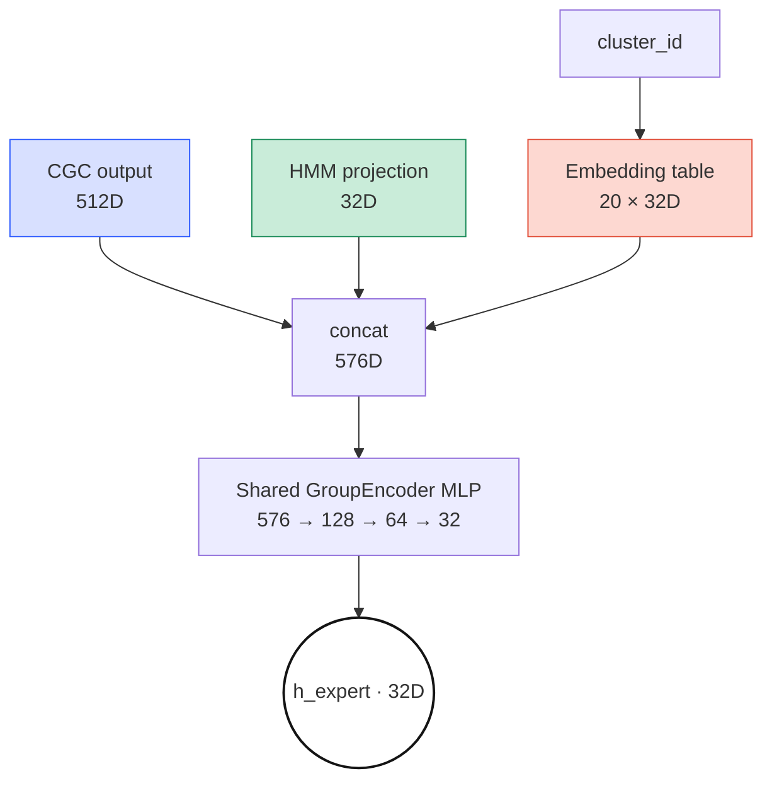
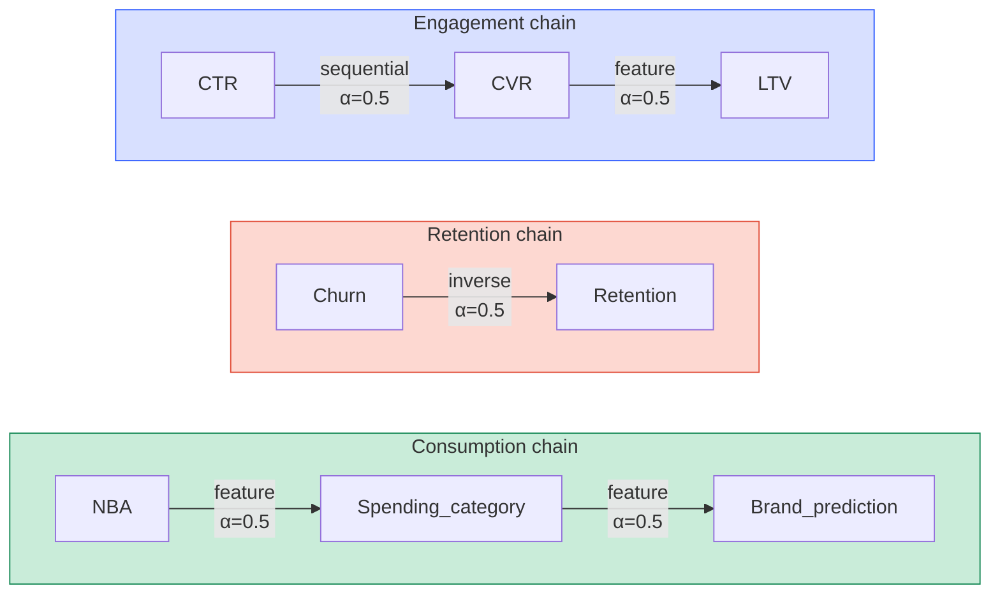

*"Study Thread" 시리즈의 PLE 서브스레드 5편. 영문/국문 병렬로 PLE-1 →
PLE-6 에 걸쳐 본 프로젝트의 PLE 아키텍처 뒤에 있는 논문과 수학 기초를
정리한다. 출처는 온프렘 프로젝트 `기술참조서/PLE_기술_참조서` 이다.
이번 5편은 태스크 그룹 단위로 전용 Expert 를 만드는 GroupTaskExpertBasket,
태스크 간 명시적 정보 전달을 수행하는 Logit Transfer, 그리고
최종 예측을 만드는 Task Tower — PLE 데이터 흐름의 후반부를 관통한다.*

## GroupTaskExpertBasket — GroupEncoder + ClusterEmbedding

`use_group_encoder=true` (기본값) 설정 시 `GroupTaskExpertBasket` 을
사용하며, 레거시 `ClusterTaskExpertBasket`
(태스크×클러스터 독립 MLP, ~3.0M 파라미터) 대비 *88% 파라미터 감소*
(~362K) 를 달성한다. 같은 그룹 내 태스크는 GroupEncoder 를 공유하고,
그룹 간은 독립이다.

### Soft Routing

클러스터 경계에 위치한 샘플(cluster_probs 가 분산된 경우) 에 대해
*soft routing* 으로 여러 클러스터 임베딩의 가중 평균을 사용한다.

$$\mathbf{e}_{cluster} = \sum_{c=0}^{19} p_c \cdot \mathbf{E}_c \in \mathbb{R}^{32}$$

$$\mathbf{h}_{expert} = \text{TaskHead}([\text{GroupEncoder}(\mathbf{x}) \,\|\, \mathbf{e}_{cluster}])$$

$p_c$ 는 GMM 클러스터 $c$ 의 사후 확률, $\mathbf{E}_c$ 는 클러스터 $c$
의 학습 가능 임베딩 벡터(32D) 다. 구현은 `cluster_probs @ embedding.weight`
($[B, 20] \times [20, 32] = [B, 32]$) 한 번의 행렬곱으로 끝난다.

> **수식 직관.** 클러스터 3 에 60%, 7 에 30% 식으로 소속된 경계 고객은
> 각 클러스터 임베딩이 그 비율대로 혼합되어 부드럽게 들어간다. 하나의
> 클러스터에 강제 배정하는 hard routing 과 달리 경계 고객 예측이 클러스터
> 할당 변동에 민감하지 않다.

> **Embedding.** $\text{Embedding}(c) = \mathbf{E}[c, :] \in \mathbb{R}^{32}$
> 는 one-hot $\mathbf{v}_c^T \mathbf{E}$ 와 수학적으로 동치인 학습 가능한
> 룩업 테이블이다. 인덱싱이 sparse 행렬곱보다 빠르다.

> **GMM 사후 확률.** $p_c = P(c | \mathbf{x}) = \pi_c \mathcal{N}(\mathbf{x} | \boldsymbol{\mu}_c, \boldsymbol{\Sigma}_c) \big/ \sum_j \pi_j \mathcal{N}(\mathbf{x} | \boldsymbol{\mu}_j, \boldsymbol{\Sigma}_j)$.
> $\pi_c, \boldsymbol{\mu}_c, \boldsymbol{\Sigma}_c$ 는 EM 으로 오프라인
> 사전 계산된다.

## Logit Transfer — 태스크 간 명시적 정보 전달

> **세 개의 독립 DAG.** Kahn's algorithm (1962, 진입 차수 0 → 큐, $O(V+E)$,
> 사이클 자동 감지) 이 위상 정렬로 실행 순서를 자동 도출한다 — CTR → CVR
> → LTV, Churn → Retention, NBA → Spending_category → Brand_prediction.
> 새 전이를 `task_relationships` config 에 등록하면 순서가 자동 갱신된다.

### 전이 메커니즘

선행 태스크의 예측을 후행 태스크 입력에 잔차로 더한다.

$$\mathbf{h}_{tower}^t = \mathbf{h}_{expert}^t + \alpha \cdot \text{SiLU}(\text{LayerNorm}(\text{Linear}(\text{pred}^s)))$$

$\alpha = 0.5$ (`transfer_strength`), `Linear` 는 source output_dim → 32D
projection 이다. 잔차 형태이므로 source 정보가 유용하지 않으면 프로젝션
가중치가 0 으로 수렴해 자연스러운 *safe default* (He et al., ResNet,
CVPR 2016) 가 된다.

> **수식 직관.** CTR 모델이 "이 고객 클릭 확률이 높다"를 출력하면 그
> 신호가 projection 을 거쳐 CVR 타워 입력에 더해진다. $\alpha = 0.5$ 는
> 전이 신호 대비 원래 Expert 출력의 상대적 강도를 조절한다.

> **⚠ Logit Transfer vs adaTT — 두 전이 메커니즘의 차이와 보완 관계.**
> 본 시스템은 태스크 간 지식 전달을 *두 가지 서로 다른 수준* 에서
> 동시에 수행한다.
>
> | 특성 | Logit Transfer | adaTT |
> | --- | --- | --- |
> | 작동 계층 | Feature/Logit 수준 (forward pass 중) | Loss 수준 (backward pass 전) |
> | 전달 내용 | 선행 태스크의 예측값/은닉 표현 | 태스크 간 gradient 친화도 |
> | 방향성 | 단방향 DAG (CTR→CVR→LTV) | 전방향 행렬 (모든 태스크 쌍) |
> | 학습 가능성 | 고정 구조 (수동 설계) | 적응적 (EMA 로 친화도 학습) |
> | 목적 | 순차적 의존성 명시적 전달 | Negative Transfer 자동 완화 |
>
> Logit Transfer 는 비즈니스 로직상 순차적인 태스크에 예측값을 직접
> 전달하고, adaTT 는 gradient 수준에서 모든 태스크 쌍의 상호 영향을
> 적응적으로 조절한다. 둘은 상호 보완적이며 동시에 작동한다. 상세
> adaTT 메커니즘은 *adaTT 기술 참조서* 를 참조한다.

## Task Tower — 최종 예측

`TaskTower` 는 모든 태스크에 공통된 얕은 MLP 다.

$$\mathbf{y} = \text{Linear}_{32 \to out} \circ \text{Block}_{64 \to 32} \circ \text{Block}_{32 \to 64}(\mathbf{h}_{expert})$$

$$\text{Block}_{a \to b}(\mathbf{x}) = \text{Dropout}(\text{SiLU}(\text{LayerNorm}(\text{Linear}_{a \to b}(\mathbf{x}))))$$

입력은 32D, hidden_dims 는 [64, 32], dropout 0.2. Regression 은
activation=None, Binary 는 sigmoid, Multiclass 는 softmax.

> **수식 직관.** 32→64 로 표현력을 키운 뒤 64→32 로 압축, 마지막에 출력
> 차원으로 사영. 각 층 사이의 LayerNorm + SiLU + Dropout 이 얕은 MLP
> 에서도 안정적 학습을 보장한다.

> **LayerNorm.** $\text{LN}(\mathbf{x}) = \gamma \cdot (\mathbf{x} - \mu) / \sqrt{\sigma^2 + \epsilon} + \beta$
> 로 한 *샘플 내* 모든 뉴런의 평균/분산으로 정규화한다 (BatchNorm 은
> *배치 내* 같은 뉴런으로 정규화 — 배치 크기 의존). 추론 시 배치 크기가
> 가변인 환경에서 LayerNorm 이 더 안정적이다.

### 태스크별 손실 유형

<svg xmlns="http://www.w3.org/2000/svg" viewBox="0 0 520 450" style="max-width:520px;width:100%;margin:24px auto;display:block;" font-family="JetBrains Mono, SUIT Variable, Pretendard Variable, ui-monospace, sans-serif">
  <defs></defs>

  <!-- Binary + Focal group -->
  <g transform="translate(20,20)">
    <text class="grp-lbl" x="0" y="14">Binary · Focal Loss</text>
    <text class="grp-meta" x="0" y="32">γ=2.0, α per-task (0.20 – 0.60)</text>
    <g transform="translate(0,42)">
      <rect class="bin" x="0" y="0" width="115" height="28" rx="4"/>
      <text class="task-chip" x="57.5" y="18" text-anchor="middle">CTR</text>
      <rect class="bin" x="125" y="0" width="115" height="28" rx="4"/>
      <text class="task-chip" x="182.5" y="18" text-anchor="middle">CVR  1.5w</text>
      <rect class="bin" x="250" y="0" width="115" height="28" rx="4"/>
      <text class="task-chip" x="307.5" y="18" text-anchor="middle">Churn  1.2w</text>
      <rect class="bin" x="375" y="0" width="115" height="28" rx="4"/>
      <text class="task-chip" x="432.5" y="18" text-anchor="middle">Retention</text>
    </g>
  </g>

  <!-- Multiclass + NLL group -->
  <g transform="translate(20,120)">
    <text class="grp-lbl" x="0" y="14">Multiclass · NLL</text>
    <text class="grp-meta" x="0" y="32">Softmax outputs (3 – 28 classes)</text>
    <g transform="translate(0,42)">
      <rect class="multi" x="0" y="0" width="115" height="28" rx="4"/>
      <text class="task-chip" x="57.5" y="18" text-anchor="middle">NBA (12)  2.0w</text>
      <rect class="multi" x="125" y="0" width="115" height="28" rx="4"/>
      <text class="task-chip" x="182.5" y="18" text-anchor="middle">Life-stage (6)</text>
      <rect class="multi" x="250" y="0" width="115" height="28" rx="4"/>
      <text class="task-chip" x="307.5" y="18" text-anchor="middle">Channel (3)</text>
      <rect class="multi" x="375" y="0" width="115" height="28" rx="4"/>
      <text class="task-chip" x="432.5" y="18" text-anchor="middle">Timing (28)</text>
    </g>
    <g transform="translate(0,78)">
      <rect class="multi" x="0" y="0" width="240" height="28" rx="4"/>
      <text class="task-chip" x="120" y="18" text-anchor="middle">Spending_category (12)  1.2w</text>
      <rect class="multi" x="250" y="0" width="240" height="28" rx="4"/>
      <text class="task-chip" x="370" y="18" text-anchor="middle">Consumption_cycle (7)</text>
    </g>
  </g>

  <!-- Regression group -->
  <g transform="translate(20,250)">
    <text class="grp-lbl" x="0" y="14">Regression · Huber (δ=1.0) / MSE</text>
    <text class="grp-meta" x="0" y="32">Robust to outliers — LTV outliers, etc.</text>
    <g transform="translate(0,42)">
      <rect class="reg" x="0" y="0" width="115" height="28" rx="4"/>
      <text class="task-chip" x="57.5" y="18" text-anchor="middle">Balance_util</text>
      <rect class="reg" x="125" y="0" width="115" height="28" rx="4"/>
      <text class="task-chip" x="182.5" y="18" text-anchor="middle">Engagement (MSE)</text>
      <rect class="reg" x="250" y="0" width="115" height="28" rx="4"/>
      <text class="task-chip" x="307.5" y="18" text-anchor="middle">LTV  1.5w</text>
      <rect class="reg" x="375" y="0" width="115" height="28" rx="4"/>
      <text class="task-chip" x="432.5" y="18" text-anchor="middle">Spending_bucket</text>
    </g>
    <g transform="translate(0,78)">
      <rect class="reg" x="0" y="0" width="240" height="28" rx="4"/>
      <text class="task-chip" x="120" y="18" text-anchor="middle">Merchant_affinity</text>
    </g>
  </g>

  <!-- Contrastive -->
  <g transform="translate(20,376)">
    <text class="grp-lbl" x="0" y="14">Contrastive · InfoNCE (τ=0.07)</text>
    <g transform="translate(0,28)">
      <rect class="contra" x="0" y="0" width="240" height="28" rx="4"/>
      <text class="task-chip" x="120" y="18" text-anchor="middle">Brand_prediction (128)  2.0w</text>
    </g>
  </g>
</svg>

> **태스크 16 개, 4 개 손실 유형으로 분화.** 가중치(`Nw`) 가 명시된
> 항목은 uncertainty weighting (아래) 이 추가로 자동 조정한다. 명시 없는
> 항목은 1.0 이 기본.

> **Huber Loss.** $\mathcal{L}_{\text{Huber}} = \frac{1}{2}(y - \hat{y})^2$
> ($|y - \hat{y}| \le \delta$), 그 밖은 $\delta(|y - \hat{y}| - \delta/2)$.
> $\delta = 1.0$ 은 오차 1 이내는 L2 (정밀 추적), 밖은 L1 (이상치 방어).
> LTV 처럼 극단값이 있는 회귀에 적합 (Huber, 1964).

> **InfoNCE.** $\mathcal{L} = -\log \exp(\mathbf{q} \cdot \mathbf{k}_+ / \tau) / \sum_i \exp(\mathbf{q} \cdot \mathbf{k}_i / \tau)$
> (Oord et al., 2018) — 대조 학습 손실. 유사 브랜드는 임베딩 공간에서
> 가깝게, 비유사 브랜드는 멀리 배치한다. 수천 개 브랜드를 직접 분류하지
> 않고 임베딩 공간에서 유사도를 학습하는 편이 확장성·일반화에 유리하다.

### Focal Loss 구현

TaskTower 가 이미 sigmoid 를 적용하므로 *이중 sigmoid 방지* 를 위해
확률값 기반으로 구현한다.

$$\text{FL}(p_t) = -\alpha_t \cdot (1 - p_t)^\gamma \cdot \log(p_t)$$

$$p_t = \begin{cases} p & \text{if } y = 1 \\ 1 - p & \text{if } y = 0 \end{cases}, \quad \alpha_t = \begin{cases} \alpha & \text{if } y = 1 \\ 1 - \alpha & \text{if } y = 0 \end{cases}$$

$\gamma = 2.0$ 은 focusing parameter (쉬운 예제 감쇠 강도), $\alpha$ 는
양성 클래스 가중치 (태스크별 차별화).

> **수식 직관.** Cross-Entropy 에 $(1 - p_t)^\gamma$ 가중치를 곱한다.
> 잘 맞히는 예제 ($p_t$ 큼) 에는 가중치가 급격히 줄고, 틀리는 예제
> ($p_t$ 작음) 에는 유지된다 — "쉬운 문제 그만 풀고 어려운 문제에
> 집중하라"의 손실 함수 버전. $\alpha_t$ 는 클래스 불균형을 보정한다
> (Lin et al., RetinaNet, ICCV 2017).

> **⚠ Focal Alpha 설계 기준.** `focal_alpha` 는 *양성 비율* 과 *비즈니스
> FN 비용* 의 두 요인으로 결정된다.
> - CTR (양성 3~8%, FN 비용 중간): $\alpha = 0.25$ (표준)
> - CVR (양성 0.5~3%, FN 비용 높음): $\alpha = 0.20$ (음성 경계 학습 강화)
> - Churn (양성 5~15%, FN 비용 매우 높음): $\alpha = 0.60$ (이탈 놓침 방지, recall 극대화)
> - Retention (양성 85~95%, FN 비용 중간): $\alpha = 0.20$ (소수 이탈 전조 탐지)

### Uncertainty Weighting (Kendall et al.)

`loss_weighting.strategy: "uncertainty"` 설정 시 태스크별 학습 가능한
log variance 로 *homoscedastic uncertainty* 를 모델링한다.

$$\mathcal{L}_k^{\text{uw}} = w_k \cdot (\exp(-s_k) \cdot \mathcal{L}_k + s_k)$$

$s_k = \log(\sigma_k^2)$ 는 학습 가능한 log variance (`task_log_vars[k]`),
$\exp(-s_k)$ 는 precision (불확실성 높으면 가중치 낮춤), $s_k$ 항은
불확실성을 무한히 키우는 것을 방지하는 정규화 항이다. $s_k$ 는
$[-4.0, 4.0]$ 으로 clamp.

> **수식 직관.** 태스크가 본질적으로 어렵면 그 손실이 전체 학습을
> 지배하지 않도록 자동으로 가중치를 낮춘다. $+s_k$ 항이 "모든 태스크를
> 불확실하다고 선언해 손실을 0 으로" 만드는 편법을 막는다. 16 개 태스크
> 가중치를 수동 튜닝하지 않고 모델이 균형을 찾는다.

> **이론적 기반.** Kendall, Gal & Cipolla (CVPR 2018) — 태스크별
> likelihood 를 Gaussian 으로 가정하면 homoscedastic uncertainty 의
> MLE 로부터 $\exp(-s_k) \cdot \mathcal{L}_k + s_k$ 형태가 자연스럽게
> 유도된다.

### 총 손실 집계

`forward()` 에서 다음 손실들이 합산된다.

1. **태스크 손실**: adaTT 적용 후 enhanced losses 합계 (또는 단순 합계)
2. **CGC Entropy 정규화**: $\lambda_{\text{ent}} \times \mathcal{L}_{\text{entropy}}$ (학습 시, CGC 미고정 시)
3. **Causal Expert DAG 정규화**: acyclicity + sparsity
4. **SAE 손실**: reconstruction + L1 sparsity (weight=0.01, detached)

## 정리하자면

GroupTaskExpertBasket 은 클러스터×태스크 독립 MLP 를 GroupEncoder
공유 + ClusterEmbedding 구조로 치환하여 88% 파라미터를 줄이면서도
클러스터별 특성화를 유지한다. soft routing 은 GMM 사후 확률로 경계
고객을 부드럽게 다룬다. Logit Transfer 는 CTR→CVR→LTV 같은 비즈니스
순서를 DAG 로 선언하고 Kahn's algorithm 으로 실행 순서를 자동
도출하며, 잔차 형태 프로젝션으로 source 정보가 유용하지 않을 때
자연스럽게 0 으로 수렴한다. Task Tower 는 32→64→32→out 의 공통 MLP
로 예측을 만들되, 태스크 유형별로 Focal / Huber / NLL / InfoNCE 손실을
차등 적용하고, Uncertainty Weighting 으로 16 개 태스크의 가중치를
학습 가능한 log variance 로 자동 균형한다. 다음 편인 **PLE-6** 에서는
Sparse Autoencoder 해석성, Evidential Deep Learning 불확실성, 18 개
태스크 전체 사양을 정리하며 기술 참조서 PDF 로 시리즈를 마무리한다.
