*Part 2 of the adaTT sub-thread in the "Study Thread" series. Across
ADATT-1 → ADATT-4, in parallel Korean and English, I unpack the adaTT
mechanism behind this project. The source is the on-prem reference
`기술참조서/adaTT_기술_참조서`. ADATT-1 promised three stages —
"Measure, Select, Regulate" — and this post walks through how the
*Measure* stage turns into an actual engine.*

## What ADATT-1 Left — "How Do You Mean, Measure?"

We decided, in the last post, that task relationships must be
*measured*. What exactly are we measuring, and how? We need a principled
way to quantify whether "two tasks want to push the shared parameters
in the same direction."

That question breaks into four smaller decisions. I answer them one at
a time.

## Decision 1 — Why Gradients (and Not Feature Similarity)

The first natural candidate is feature similarity — if two tasks use
similar input columns, call them related. The problem is that *this
answers the wrong question*. Even with the same inputs, the model may
want to push parameters in *totally different directions* for each
task. What we need to know is not "do the tasks share inputs?" but "do
the tasks want the *same update*?"

Gradients answer that. $\mathbf{g}_i = \nabla_\theta \mathcal{L}_i$
directly encodes "in what direction does the model want to move
$\theta$ to reduce task $i$'s loss?" When two tasks' gradients point
the same way, one update improves both; when they point opposite ways,
improving one hurts the other. That is exactly the signal adaTT cares
about.

## Decision 2 — Why Cosine (and Not Euclidean)

Once gradients are chosen, we need a similarity metric. Euclidean
distance fails here. Loss scales across tasks can be extreme — CTR
losses on the order of $10^{-2}$ and LTV losses on the order of $10^3$
are common. Two gradients can point in *exactly the same direction*
and still have magnitudes differing by tens of thousands, so Euclidean
distance labels them "far apart."

What we want is *direction agreement*, so magnitude must be normalised
away. Cosine similarity does exactly that.

$$\cos(\theta_{i,j}) = \frac{\mathbf{g}_i \cdot \mathbf{g}_j}{\|\mathbf{g}_i\| \cdot \|\mathbf{g}_j\|}$$

- $\mathbf{g}_i \in \mathbb{R}^d$: task $i$'s flattened gradient vector.
- $d$: total number of Shared Expert parameters.
- $\|\cdot\|$: L2 norm.

Three practical bonuses come with this choice. (1) The output is
normalised to $[-1, 1]$, giving a *directly interpretable* signal:
"aligned = positive transfer, opposite = negative transfer." (2) This
makes the later negative-transfer threshold ($\tau_{neg} = -0.1$)
meaningful — in Euclidean space there is no notion of a "negative
distance." (3) Every task pair can be computed in a single matrix
multiplication, giving $O(n^2 d)$ overall.

> **Undergrad math — one line.** Cosine strips away magnitude and
> keeps only direction. Euclidean mixes them together. adaTT only
> wants the direction.

## Decision 3 — Why EMA (and Not the Raw Per-Step Value)

Cosine gives us a single-batch affinity, but that number is noisy. Each
SGD batch is a partial estimate of the full distribution, and the
gradient jitters accordingly. One step might yield $\cos = 0.3$ and
the next $\cos = -0.1$. Plug that directly into transfer weights and
the learning signal flips every step.

We use an Exponential Moving Average (EMA).

$$\mathbf{A}_t = \alpha \cdot \mathbf{A}_{t-1} + (1 - \alpha) \cdot \cos(\theta_t), \quad \alpha = 0.9$$

- $\alpha = 0.9$ → effective window $\approx 1/(1-\alpha) = 10$,
  roughly a weighted average over the last ten observations.
- $\mathbf{A}_0$ — initialised with the first observation directly.

A sliding-window average is the alternative, but it needs careful
window bookkeeping and $O(W)$ memory. EMA achieves the same effect with
a single scalar $\alpha$ and $O(1)$ memory.

$\alpha = 0.9$ is chosen to avoid both extremes. Too small and the EMA
is as noisy as the raw value; too large and task relationships drifting
across epochs are never tracked. A 10-step window is the middle ground
that "absorbs batch noise but follows epoch-scale drift."

> **Equation intuition.** EMA means "keep 90% of the old memory + take
> 10% of the new observation." In signal processing terms, this is
> exactly a first-order IIR low-pass filter — high-frequency noise is
> stripped out, the low-frequency trend passes through.

## Decision 4 — Why torch.compiler.disable

The last decision is an engineering detail we cannot skip. adaTT's
measurement path calls `torch.autograd.grad` per task with
`retain_graph=True`. Two things collide.

- `torch.autograd.grad` has incomplete `requires_grad` tracking inside
  compiled graphs.
- The same graph must be reused later by the Trainer's `loss.backward()`,
  so `retain_graph=True` is *architecturally unremovable*.

Together, the two constraints break gradient extraction on the compiled
path. The fix is to decorate `_extract_task_gradients` with
`@torch.compiler.disable` so it runs outside the compile boundary.
`torch.compile` is currently disabled project-wide, but the decorator
is applied defensively so the path stays safe if compilation is turned
on later.

## The Measurement Pipeline at a Glance

Bringing the four decisions together gives the `TaskAffinityComputer`
engine's measurement pipeline. Every $N$ steps, this flow runs.

```mermaid
flowchart TB
  input[(batch · per-task losses)]
  input --> extract[gradient extraction<br/>torch.autograd.grad<br/>retain_graph=True<br/>@torch.compiler.disable]
  extract --> flatten[per-task flatten<br/>g_i ∈ R^d]
  flatten --> stack[row-wise stack<br/>G ∈ R^&#123;n×d&#125;]
  stack --> normalize[L2 normalise<br/>Ĝ = G / ‖G‖ · clamp 1e-8]
  normalize --> matmul[cosine matrix<br/>ĜĜᵀ ∈ R^&#123;n×n&#125;]
  matmul --> ema[EMA update<br/>A_t = 0.9·A_&#123;t-1&#125; + 0.1·C_t]
  ema --> clamp[clamp -1, 1<br/>float-error guard]
  clamp --> buffer[(affinity_matrix<br/>register_buffer)]
  style input fill:#FFFFFF,stroke:#141414,stroke-width:2px
  style buffer fill:#D8E0FF,stroke:#2E5BFF
  style extract fill:#FDD8D1,stroke:#E14F3A
```

The next four sections unpack the math and the safety nets on each
stage.

## The Cosine Matrix in One Matrix Multiplication

Stack the gradients of $n$ tasks row-wise into
$\mathbf{G} \in \mathbb{R}^{n \times d}$. Divide each row by its L2
norm to get the normalised matrix $\hat{\mathbf{G}}$. Then the $(i, j)$
entry of $\hat{\mathbf{G}} \hat{\mathbf{G}}^\top$ is exactly
$\hat{\mathbf{g}}_i \cdot \hat{\mathbf{g}}_j = \cos \theta_{i,j}$. A
*single matrix multiplication* produces all $n^2$ pairwise similarities
at once.

Before normalisation, we apply `clamp(min=1e-8)` to the L2 norm to
prevent division by zero if some task's gradient happens to be
exactly 0. A double for-loop would scatter the $O(n^2 d)$ work across
$n^2$ Python calls; `torch.mm` instead runs it on GPU CUDA cores for a
speedup of hundreds of times. For 16 tasks, all $16 \times 16 = 256$
similarities are done by a single GEMM kernel.

## The EMA Update and the Clamp

The EMA update is cheap, but one precision trap lurks. Across thousands
of updates, floating-point error accumulates until cosine values drift
slightly outside $[-1, 1]$. Feed that into downstream operations such
as `arccos` and NaN appears. After every EMA update, we apply
`.clamp(-1.0, 1.0)` to close this path (the N-03 FIX).

On the very first observation we skip the blend and initialise
$\mathbf{A}_0 = \mathbf{C}_0$. An `update_count` buffer tracks "is this
the first update?"

## Storage — Why register_buffer

The affinity matrix $\mathbf{A}$ is registered as a buffer, not as an
`nn.Parameter`. Two reasons.

- *Automatic checkpoint handling*: inclusion in `state_dict` makes save
  / restore automatic.
- *Optimiser exclusion*: had it been an `nn.Parameter`, AdamW would
  have swallowed it as a learnable target. Affinity is an *observed
  quantity*, not a learnable parameter.

`.to(device)` moves it to GPU/CPU automatically. `update_count` is
stored the same way, preserving "how many updates have we done?"
across save / restore.

## Reading the Affinity Matrix

$\mathbf{A} \in [-1, 1]^{n \times n}$ is symmetric
($\mathbf{A}_{i,j} = \mathbf{A}_{j,i}$), and the diagonal is always 1
(cosine similarity with self). The off-diagonal entries drive adaTT's
behaviour.

| Range | Meaning | adaTT behaviour |
| --- | --- | --- |
| $\mathbf{A}_{i,j} \approx 1$ | Strong positive affinity | gradients aligned → aggressive transfer |
| $\mathbf{A}_{i,j} \approx 0$ | Neutral | no correlation → weak transfer |
| $\mathbf{A}_{i,j} < -0.1$ | Negative affinity | negative transfer detected → blocked |

Fifty et al. (ICML 2021, *Task Affinity Grouping*) also use gradient
cosine similarity as the standard metric for task-affinity measurement.
adaTT layers EMA smoothing and selective transfer on top of the same
foundation.

## Gradient Extraction — Shared Experts Only

One final detail: *which $\theta$* do we take gradients with respect
to? adaTT computes gradients *only on Shared Expert parameters*.
Gradients on task-specific Experts or Task Towers are meaningless to
compare — each of those exists for exactly one task. The parameters
where conflicts actually happen are the Shared Experts, and adaTT looks
at exactly that surface.

Per task, we call
`torch.autograd.grad(loss, shared_params, retain_graph=True, allow_unused=True)`
to get $\nabla_\theta \mathcal{L}_i$, pad missing parameters
(`g is None`) with zeros, and `torch.cat` them into a flat vector.
That flat vector becomes a row of the $\mathbf{G}$ we saw above.

`retain_graph=True` is *architecturally required*, as noted earlier,
because the Trainer's `loss.backward()` reuses the same graph. Removing
it halts training immediately with "Trying to backward through the
graph a second time." The memory cost — peak memory roughly 2× the
forward pass at 16 tasks — is addressed in ADATT-4.

## Where We Stop

ADATT-2 closes the *Measure* stage. The four decisions — gradients,
cosine, EMA, `torch.compiler.disable` — tie together into a pipeline
that extracts per-task gradients against the Shared Expert parameter
space, computes all pairwise cosine similarities in a single matrix
multiplication, smooths batch noise with EMA, and maintains the
affinity matrix $\mathbf{A}$ clamped to $[-1, 1]$.

But $\mathbf{A}$ is still just an *observation*. How do we actually
*use* it to drive inter-task transfer during training — how much
gradient do we borrow when affinity is positive, how do we sever
transfer when it is negative, and how should unstable early-training
affinity and converged late-training affinity be treated differently?
Those four questions are picked up by **ADATT-3** — Transfer Loss, the
Group Prior, and the 3-Phase Schedule.
