*"Study Thread" 시리즈의 adaTT 서브스레드 2편. 영문/국문 병렬로 ADATT-1
→ ADATT-4 에 걸쳐 본 프로젝트의 adaTT 메커니즘을 정리한다. 출처는 온프렘
프로젝트 `기술참조서/adaTT_기술_참조서` 이다. ADATT-1 에서 "측정 ·
선택 · 조절" 세 단계를 약속했고 — 이번 2편은 그 중 *측정* 단계가 어떻게
실제 엔진이 되는지를 따라간다.*

## ADATT-1 이 남긴 질문 — "어떻게 측정한다는 말인가"

우리는 앞 편에서 태스크 관계를 *측정* 해야 한다고 정했다. 그러면 무엇을
어떻게 측정한다는 말인가. 두 태스크가 "공유 파라미터를 같은 방향으로
바꾸고 싶어 하는가" 를 원칙적으로 정량화할 방법이 필요하다.

이 질문은 네 개의 작은 결정으로 쪼개진다. 각각 하나씩 답해 간다.

## 결정 1 — 왜 gradient 인가 (피처 유사도가 아니라)

첫 번째 후보는 피처 유사도다 — 두 태스크가 비슷한 입력 컬럼을 쓰면
관련 있다고 보자. 문제는 이게 *잘못된 질문에 답한다* 는 것이다. 같은
입력을 받아도 모델이 두 태스크를 위해 *전혀 다른 방향* 으로 파라미터를
밀고 싶을 수 있다. 우리가 알고 싶은 것은 "두 태스크가 입력을 공유하는가"
가 아니라 "두 태스크가 *같은 업데이트* 를 원하는가" 다.

gradient 가 그 답이다. $\mathbf{g}_i = \nabla_\theta \mathcal{L}_i$ 는
"모델이 태스크 $i$ 의 loss 를 줄이기 위해 $\theta$ 를 어느 방향으로
바꾸고 싶은가" 를 그대로 인코딩한다. 두 태스크의 gradient 가 같은
방향을 가리키면 한 번의 업데이트가 양쪽을 동시에 개선하고, 반대 방향을
가리키면 한쪽이 좋아질 때 다른 쪽이 나빠진다. 이게 adaTT 가 알고 싶은
정확한 그 신호다.

## 결정 2 — 왜 코사인 유사도인가 (유클리드가 아니라)

gradient 를 골랐으면 다음은 두 gradient 가 비슷한지 판단하는 지표다.
여기서 유클리드 거리는 실패한다. 태스크별 loss 스케일이 극단적으로 다른
환경을 생각해 보자 — CTR loss 는 $10^{-2}$, LTV loss 는 $10^3$ 수준이
흔하다. 두 gradient 가 *정확히 같은 방향* 이더라도 크기가 수만 배 차이
나므로 유클리드 거리는 "멀다" 고 판정한다.

우리가 알고 싶은 것은 *방향 일치* 이므로, 크기를 정규화해야 한다. 코사인
유사도는 바로 이걸 한다.

$$\cos(\theta_{i,j}) = \frac{\mathbf{g}_i \cdot \mathbf{g}_j}{\|\mathbf{g}_i\| \cdot \|\mathbf{g}_j\|}$$

- $\mathbf{g}_i \in \mathbb{R}^d$: 태스크 $i$ 의 flattened gradient 벡터
- $d$: Shared Expert 전체 파라미터 수
- $\|\cdot\|$: L2 norm

추가로 세 가지 실용적 장점이 붙는다. (1) 출력이 $[-1, 1]$ 범위로
정규화되어 "같은 방향 = positive transfer, 반대 방향 = negative
transfer" 라는 *직접 확인 가능한* 신호가 된다. (2) 이 결정이 뒤편의
negative transfer 임계값 ($\tau_{neg} = -0.1$) 을 의미 있게 만든다.
유클리드 공간에서는 "음수 거리" 자체가 없다. (3) 모든 태스크 쌍을 단
한 번의 행렬 곱으로 계산할 수 있어 $O(n^2 d)$ 에 끝난다.

> **학부 수학 — 한 줄.** 코사인은 크기를 벗기고 방향만 남긴다. 유클리드는
> 크기와 방향을 섞어 본다. adaTT 가 원하는 건 방향뿐이다.

## 결정 3 — 왜 EMA 인가 (매 step 원시값이 아니라)

코사인으로 한 배치의 친화도는 뽑을 수 있지만, 그 값은 노이즈가 크다.
SGD 의 각 배치는 전체 분포의 일부만 본 추정이고, gradient 도 그만큼
출렁거린다. 한 step 에 $\cos = 0.3$ 이 나왔다가 다음 step 에 $\cos = -0.1$
이 나올 수 있다. 이대로 전이 가중치에 꽂으면 학습 신호가 매 step 뒤집힌다.

Exponential Moving Average (EMA) 를 쓴다.

$$\mathbf{A}_t = \alpha \cdot \mathbf{A}_{t-1} + (1 - \alpha) \cdot \cos(\theta_t), \quad \alpha = 0.9$$

- $\alpha = 0.9$ → effective window $\approx 1/(1-\alpha) = 10$.
  최근 10 개 관측의 가중 평균에 근사.
- $\mathbf{A}_0$ — 첫 관측값을 그대로 씀 (EMA 초기화).

대안으로 sliding window 평균이 있지만, 정확한 윈도우 관리가 필요하고
$O(W)$ 메모리를 먹는다. EMA 는 스칼라 하나 ($\alpha$) 로 같은 효과를
$O(1)$ 메모리로 낸다.

$\alpha = 0.9$ 를 고른 이유는 양쪽 극단을 피하려는 것이다. $\alpha$ 가
너무 작으면 EMA 가 원시값만큼 노이지하고, 너무 크면 태스크 관계가
epoch 에 따라 바뀌어도 따라가지 못한다. 10 step 윈도우는 "배치 노이즈는
흡수하되 epoch 스케일 드리프트는 쫓아가는" 중간값이다.

> **수식 직관.** EMA 는 "과거 기억의 90% 유지 + 새 관측의 10% 반영".
> 신호처리로는 1차 IIR 저역통과 필터와 정확히 같은 구조 — 고주파
> 노이즈를 제거하고 저주파 추세만 통과시킨다.

## 결정 4 — 왜 torch.compiler.disable 인가

마지막 결정은 엔지니어링 세부지만 건너뛸 수 없다. adaTT 의 측정 경로는
`torch.autograd.grad` 를 태스크별로 호출하고 `retain_graph=True` 로
computation graph 를 유지한다. 두 가지가 동시에 충돌한다.

- `torch.compile` 된 그래프 내에서 `torch.autograd.grad` 의 `requires_grad`
  추적이 불완전하다.
- 같은 graph 를 이후 Trainer 의 `loss.backward()` 에서 재사용해야 하므로
  `retain_graph=True` 는 *아키텍처상 제거 불가* 하다.

두 제약이 맞물리면 컴파일된 코드 분기에서 gradient 추출이 깨진다. 해결은
`_extract_task_gradients` 메서드에 `@torch.compiler.disable` 을 붙여 컴파일
경계 밖에서 실행하는 것이다. 현재는 `torch.compile` 자체가 비활성화되어
있지만, 향후 활성화 시에도 안전하도록 방어적으로 박아둔다.

## 측정 파이프라인 한 눈에

네 결정을 한데 묶으면 `TaskAffinityComputer` 엔진의 측정 파이프라인이
된다. 매 $N$ step 마다 다음 흐름이 돈다.

```mermaid
flowchart TB
  input[(배치 · 각 태스크의 loss)]
  input --> extract[gradient 추출<br/>torch.autograd.grad<br/>retain_graph=True<br/>@torch.compiler.disable]
  extract --> flatten[per-task flatten<br/>g_i ∈ R^d]
  flatten --> stack[행렬 스택<br/>G ∈ R^&#123;n×d&#125;]
  stack --> normalize[row-wise L2 정규화<br/>Ĝ = G / ‖G‖ · clamp 1e-8]
  normalize --> matmul[코사인 행렬<br/>ĜĜᵀ ∈ R^&#123;n×n&#125;]
  matmul --> ema[EMA 업데이트<br/>A_t = 0.9·A_&#123;t-1&#125; + 0.1·C_t]
  ema --> clamp[clamp -1, 1<br/>부동소수점 오차 방지]
  clamp --> buffer[(affinity_matrix<br/>register_buffer)]
  style input fill:#FFFFFF,stroke:#141414,stroke-width:2px
  style buffer fill:#D8E0FF,stroke:#2E5BFF
  style extract fill:#FDD8D1,stroke:#E14F3A
```

다음 네 절에서 각 단계의 수학과 방어 장치를 뜯어본다.

## 코사인 행렬을 한 번의 행렬 곱으로

$n$ 개 태스크의 gradient 를 행으로 쌓으면 $\mathbf{G} \in \mathbb{R}^{n \times d}$
가 된다. 각 행을 L2 norm 으로 나눈 정규화 행렬 $\hat{\mathbf{G}}$ 를
만들면, $\hat{\mathbf{G}} \hat{\mathbf{G}}^\top$ 의 $(i, j)$ 원소는
정확히 $\hat{\mathbf{g}}_i \cdot \hat{\mathbf{g}}_j = \cos \theta_{i,j}$
가 된다. *단 한 번의 행렬 곱* 으로 $n^2$ 개 쌍별 유사도가 동시에
계산된다.

구현상 정규화 전에 L2 norm 에 `clamp(min=1e-8)` 을 건다. 어떤 태스크의
gradient 가 정확히 0 이면 0-division 이 나기 때문이다. 이중 for 루프로
쌍마다 계산하면 $O(n^2 d)$ 연산이 $n^2$ 번의 Python 호출로 흩어져
느려지지만, `torch.mm` 은 GPU 의 CUDA core 병렬성을 써서 수백 배 빠르다.
16 태스크 기준 $16 \times 16 = 256$ 개 유사도가 단일 GEMM 커널로 끝난다.

## EMA 업데이트와 clamp

EMA 업데이트는 무거운 일이 아니지만 한 가지 정밀도 함정이 있다. EMA 를
수천 번 누적하면 부동소수점 오차가 조금씩 쌓여 코사인 유사도가 $[-1, 1]$
범위를 아주 조금 벗어날 수 있다. 그대로 후속 연산 (`arccos` 등) 에
들어가면 NaN 이 발생한다. 매 EMA 업데이트 후 `.clamp(-1.0, 1.0)` 을
걸어 이 문제를 차단한다 (N-03 FIX).

첫 번째 관측 시에는 EMA 블렌딩을 건너뛰고 $\mathbf{A}_0 = \mathbf{C}_0$
로 초기화한다. `update_count` 버퍼로 첫 업데이트를 판정한다.

## 저장 위치 — 왜 register_buffer 인가

친화도 행렬 $\mathbf{A}$ 는 `nn.Parameter` 가 아니라 `register_buffer`
로 등록된다. 두 가지 이유다.

- *체크포인트 자동 관리*: `state_dict` 에 포함되어 저장/복원이 자동으로 이루어진다.
- *옵티마이저 배제*: `nn.Parameter` 였다면 AdamW 가 이걸 학습 대상으로
  집어 삼켰을 것이다. 친화도는 *관측 결과* 이지 학습 파라미터가 아니다.

`.to(device)` 호출 시에도 자동으로 GPU/CPU 로 이동한다. `update_count`
도 같은 방식으로 buffer 로 관리해 "지금 몇 번째 업데이트인가" 를 보존한다.

## 친화도 행렬 해석

$\mathbf{A} \in [-1, 1]^{n \times n}$ 은 대칭 행렬 ($\mathbf{A}_{i,j} = \mathbf{A}_{j,i}$)
이고 대각 원소는 항상 1 이다 (자기 자신과의 코사인 유사도). 비대각
원소가 adaTT 의 행동을 좌우한다.

| 범위 | 의미 | adaTT 행동 |
| --- | --- | --- |
| $\mathbf{A}_{i,j} \approx 1$ | 강한 양의 친화도 | gradient 같은 방향 → 적극 전이 |
| $\mathbf{A}_{i,j} \approx 0$ | 중립 | 무관 → 약한 전이 |
| $\mathbf{A}_{i,j} < -0.1$ | 음의 친화도 | Negative transfer 감지 → 전이 차단 |

Fifty et al. (ICML 2021, *Task Affinity Grouping*) 도 gradient cosine
similarity 를 태스크 유사도 측정의 표준 지표로 제시한다. adaTT 는 여기에
EMA 평활화와 선택적 전이를 얹은 구조다.

## gradient 추출 경로 — Shared Expert 만

마지막 세부 사항은 "어떤 $\theta$ 에 대한 gradient 를 뽑느냐" 이다.
adaTT 는 *Shared Expert 파라미터에 대해서만* gradient 를 계산한다.
Task-specific Expert 나 Task Tower 에 대한 gradient 는 태스크 간 비교
자체가 의미 없기 때문이다 — 각 tower 는 오직 자기 태스크에만 존재한다.
충돌이 실제로 일어나는 파라미터는 공유되는 Shared Expert 뿐이고, adaTT
는 정확히 그 자리를 본다.

태스크별로 순차적으로 `torch.autograd.grad(loss, shared_params,
retain_graph=True, allow_unused=True)` 를 호출해 해당 태스크의
$\nabla_\theta \mathcal{L}_i$ 를 얻고, 없는 파라미터 ($g$ 가 `None`) 은
zero 로 패딩한 뒤 `torch.cat` 으로 flatten 한다. 이 flattened 벡터가
위에서 본 $\mathbf{G}$ 의 행이 된다.

`retain_graph=True` 는 앞에서 설명한 대로 Trainer 의 `loss.backward()`
가 같은 graph 를 재사용해야 하므로 *아키텍처상 필수* 다. 이걸 빼면
"Trying to backward through the graph a second time" 에러로 학습이 즉시
멈춘다. 메모리 비용 — 16 태스크에서 peak memory 가 forward pass 대비
약 2 배 — 은 ADATT-4 에서 다룬다.

## 여기서 멈추는 이유

ADATT-2 는 *측정* 단계의 완결본이다. 네 결정 — gradient, 코사인,
EMA, `torch.compiler.disable` — 이 한데 묶여 Shared Expert 파라미터
공간에서 태스크별 gradient 를 뽑아내고, 단일 행렬 곱으로 쌍별 코사인
유사도를 구한 뒤, EMA 로 배치 노이즈를 평활하여 $[-1, 1]$ 범위의 친화도
행렬 $\mathbf{A}$ 로 유지한다.

하지만 $\mathbf{A}$ 는 아직 *관측 결과* 일 뿐이다. 이걸 어떻게 *활용* 해서
실제 태스크 간 전이를 일으키는가 — 친화도가 양수면 얼마나 빌려오고,
음수면 어떻게 끊으며, 학습 초기의 불안정한 친화도와 후반의 안정화된
친화도를 어떻게 다르게 다룰 것인가 — 이 네 질문이 **ADATT-3** 에서
이어받는 Transfer Loss, Group Prior, 3-Phase Schedule 의 주제다.
