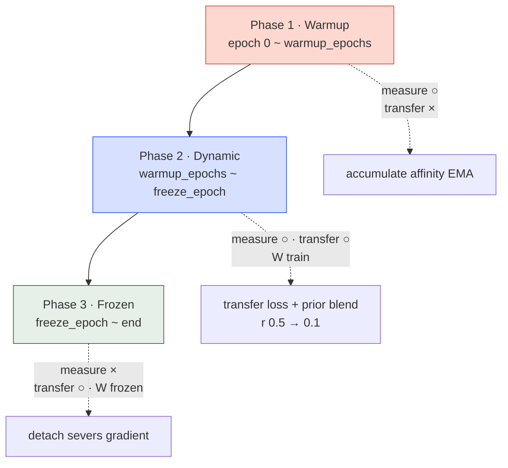

*Part 3 of the adaTT sub-thread in the "Study Thread" series. Across
ADATT-1 → ADATT-4, in parallel Korean and English, I unpack the adaTT
mechanism behind this project. The source is the on-prem reference
`기술참조서/adaTT_기술_참조서`. ADATT-2 closed the *Measure* stage;
this post answers the single question "what do we do with the measured
affinity?" by breaking it into four decisions.*

## What ADATT-2 Left on the Table

We now have a live $[-1, 1]$-valued affinity matrix $\mathbf{A}$
updated in real time. What do we do with it? Four smaller decisions
split the question.

1. How do we turn affinity into a *loss signal* — Transfer Loss.
2. How do we fill the *empty* early-training affinity — Group Prior.
3. How do we modulate transfer strength over training — 3-Phase
   Schedule.
4. How do we treat negative affinity, i.e. *harmful transfer* —
   Negative Transfer blocking.

One at a time.

## Decision 1 — Why Transfer Loss in This Form

Turning affinity into a loss signal has a few natural candidates. Let
us compare three.

- *(a) Weighted-sum distillation.* Add a weighted sum of other tasks'
  losses to the current task. Simple and differentiable.
- *(b) Gradient surgery (PCGrad).* Project conflicting gradients onto
  each other's orthogonal subspace and subtract the conflict
  component. Directly modifies gradients.
- *(c) Transfer Loss (adaTT's choice).* An enhanced (a): combine
  affinity with a learnable weight and apply softmax normalisation.

adaTT picks (c). (b) PCGrad rewrites gradients via projection every
step, which is expensive at 16 tasks and also discards each gradient's
own information. (a) is simple but leaves no room for learnable
weights. (c) keeps standard backprop, and rides the observed affinity
$\mathbf{A}$ together with a learnable $\mathbf{W}$, mixing
"observation + learning" in one term.

The Transfer-Enhanced Loss for each task $i$:

$$\mathcal{L}_i^{\text{adaTT}} = \mathcal{L}_i + \lambda \cdot \sum_{j \neq i} w_{i \rightarrow j} \cdot \mathcal{L}_j$$

- $\mathcal{L}_i$: task $i$'s original loss (focal, huber, MSE, etc.).
- $\lambda = 0.1$ (default, `transfer_lambda`).
- $w_{i \rightarrow j}$: transfer weight from task $j$ into task $i$.

> **Equation intuition.** "Your own loss is the baseline; listen to
> high-affinity peers' losses only at $\lambda$ weight." $\lambda = 0.1$
> is a conservative "10% weight on peer advice."

$w_{i \rightarrow j}$ itself is the softmax-normalised combination of a
learnable weight $\mathbf{W}$, the measured affinity $\mathbf{A}$, and
a domain prior $\mathbf{P}$ — the full construction comes together in
Decision 2.

### G-01 FIX — Transfer Loss Clamp

A ratio cap ensures the transfer loss *does not dominate* the original.
$\lambda = 0.1$ alone is not enough. If a task's original loss
temporarily shrinks (it's training well), the transfer term becomes
disproportionately large and skews the learning direction. The guard:

$$\text{transfer}_i \leftarrow \min(\lambda \cdot \text{transfer}_i,\ \text{max\_ratio} \cdot \mathcal{L}_i.\text{detach}())$$

`max_transfer_ratio = 0.5` — the transfer term cannot exceed 50% of
the original. `.detach()` matters: the clamp boundary must not flow
back as gradient and perturb the original loss.

### Masking Tasks with Missing Targets

Not every batch has targets for every task. Inserting a simple "0.0
loss" does not zero the softmax weight for that task, so some transfer
would still leak into a non-existent target. The fix multiplies the
transfer weights by a `loss_mask_tensor` *after* softmax, *completely
severing* the affected paths. Safe under production-variable target
availability.

## Decision 2 — Why a Bayesian Reading of Group Prior Fits

Consider the very first epoch. The network has learned nothing, the
gradients are effectively random, and affinity $\mathbf{A}$ is a
meaningless number. Used directly as transfer weights, early training
collapses into random transfer.

The Group Prior fills that void with domain knowledge — CTR, CVR,
engagement, uplift belong to the engagement / conversion family, so
they should be strongly connected; churn, retention, life_stage, ltv
form the lifecycle family. Within-group strength is `intra_strength`
(0.6–0.8), across-group is `inter_group_strength` (0.3).

### Building the Prior — One Line

Initialise the matrix at `inter_group_strength`, overwrite same-group
entries with `intra_strength`, zero the diagonal, and row-normalise so
each task's incoming transfer weights sum to 1. Row normalisation
keeps transfer intensity consistent regardless of task count.

| Group | Members | Intra strength | Business meaning |
|---|---|---|---|
| engagement | ctr, cvr, engagement, uplift | 0.8 | Engagement / conversion |
| lifecycle | churn, retention, life_stage, ltv | 0.7 | Customer lifecycle |
| value | balance_util, channel, timing | 0.6 | Value / behaviour patterns |
| consumption | nba, spending_category, consumption_cycle, spending_bucket, merchant_affinity, brand_prediction | 0.7 | Consumption patterns |

### Prior Blend Annealing

How do we mix $\mathbf{A}$ and $\mathbf{P}$? A fixed ratio is not the
answer. Early on $\mathbf{A}$ is noise, but as training progresses
$\mathbf{A}$ becomes real observation and $\mathbf{P}$'s heuristic
becomes a hindrance. The fix is *linear-decay* annealing.

$$r(e) = r_{\text{start}} - (r_{\text{start}} - r_{\text{end}}) \cdot \min\left(\frac{e - e_{\text{warmup}}}{e_{\text{freeze}} - e_{\text{warmup}}}, 1.0\right)$$

$r_{\text{start}} = 0.5$ to $r_{\text{end}} = 0.1$. Prior at 50% early,
10% late. The final blended weight:

$$\mathbf{R} = (\mathbf{W} + \mathbf{A}) \cdot (1 - r) + \mathbf{P} \cdot r$$

> **Equation intuition.** "A new hire half-listens to senior advice
> early, then trusts their own judgement 90% as experience
> accumulates." A pragmatic, lightweight mimic of Bayesian *prior →
> posterior* transition via a single blend ratio $r$ — instead of a
> full Bayesian posterior, an annealing schedule implements "as data
> accumulates, reduce reliance on the prior."

> **Historical context.** Bayesian inference traces to Bayes (1763)
> and Laplace (1812), and was introduced to neural networks by MacKay
> (1992) and Neal (1996). Modern deep learning continues the tradition
> via Dropout-as-Bayesian-inference (Gal & Ghahramani, ICML 2016) and
> Bayes by Backprop (Blundell et al., ICML 2015). adaTT compresses this
> to a single-scalar blend.

## Decision 3 — Why Three Phases in the Schedule

The *timing* of transfer also has to be decided. Is every-step
transfer the right answer? No. Depending on training state, transfer
plays *opposite roles*.

*Phase 1 — Warmup (measure only, no transfer).* At the start of
training the network's gradients are meaningless. Accumulate the
affinity matrix but do *not* add the transfer term to the loss. Skip
this phase and jump straight into transfer, and random transfer wrecks
early training.

*Phase 2 — Dynamic (observe + transfer together).* After warmup,
update affinity every step and apply the transfer loss simultaneously.
The prior blend ratio $r$ decays linearly from 0.5 to 0.1, and the
learnable $\mathbf{W}$ is updated inside this window as well.

*Phase 3 — Frozen (weights fixed).* After `freeze_epoch`, fix the
transfer weights and stop computing gradients for them.
`transfer_w[i].detach()` severs the gradient path and stabilises
training. Late training also freezes CGC gating together (covered in
ADATT-4), cleaning up convergence dynamics.

Initialization validates `freeze_epoch > warmup_epochs` (the H-6
check). A fully-skipped Phase 2 means no learned affinity is ever
reflected in transfer, so running adaTT would be pointless.

> **Historical context.** Staged training was systematised by Bengio
> et al. (2009, *Curriculum Learning*) as "easy-to-hard." The same
> tradition appears in Pre-training + Fine-tuning (Erhan et al., 2010),
> Layer-wise Training (Hinton et al., 2006), and Warmup-then-Decay LR
> schedules (Goyal et al., 2017). adaTT's 3-Phase applies this
> tradition to *inter-task transfer*.

## Decision 4 — Why a Threshold, Not a Blanket Block

Finally, what do we do with task pairs whose affinity is negative?

The simplest choice — "block every negative value" ($\tau_{neg} = 0$)
— is too aggressive. SGD's stochastic noise means task pairs whose
true affinity is near zero can still show weak negatives like
$\cos \approx -0.05$ batch-to-batch. Blocking the entire noise band
closes most of adaTT's transfer paths and its effect disappears.

The other extreme — "do not block at all" — lets task pairs with
obvious conflict inflate each other's losses and destabilises training.

The answer is a middle ground that blocks only *clear* negatives.
$\tau_{neg} = -0.1$ is the sweet spot: tolerate noise margin, block
real gradient conflict.

$$\mathbf{R}_{i,j} \leftarrow 0 \quad \text{if } \mathbf{A}_{i,j} < \tau_{\text{neg}}, \quad \tau_{\text{neg}} = -0.1$$

This is looser than PCGrad (Yu et al., 2020), which uses $\cos < 0$ as
the conflict criterion — adaTT takes a more conservative stance: it
does not *project* and thus *modify* gradients; it simply zeroes the
harmful task's loss contribution. The original gradients stay intact.

### Detection API

Blocking is not the only output; *diagnostics* are also exposed.
`detect_negative_transfer()` returns a
$\{$task $i$: list of $j$ with affinity below $\tau_{neg}\}$ dict, so
MLflow logging or offline analysis can show "which pairs are actually
in conflict?" Example: `{"churn": ["ctr", "engagement"], "ltv": ["brand_prediction"]}`.

| Setting | Effect |
|---|---|
| Blocking disabled | Conflicting pairs inflate each other's loss → unstable training |
| Over-blocking ($\tau_{neg} = 0$) | Most transfer paths blocked → adaTT effectively disabled |
| Proper blocking ($\tau_{neg} = -0.1$) | Only clear conflicts blocked, neutral / positive transfers preserved |

## The Transfer-Weight Pipeline — Where the Four Decisions Meet

All four decisions meet in one computation. The transfer weight
$w_{i \to j}$ is produced by ① **Decision 2**'s Prior Blend combining
learned weights and measured affinity into $\mathbf{R}$, ② masking the
entries where $\mathbf{A}_{i,j} < \tau_{\text{neg}}$ to zero per
**Decision 4**, ③ zeroing the diagonal to exclude self-transfer, and
④ passing through the softmax normalisation mentioned in ADATT-1 at
temperature $T = 1.0$. $T < 0.5$ concentrates transfer on too few
tasks; $T > 2.0$ is too uniform and fails to suppress negative
transfer sufficiently.

In Phase 1 the whole pipeline is inactive — only affinity accumulates
(Decision 3). In Phase 2 the whole thing runs every step, and in
Phase 3 training of $\mathbf{W}$ halts while weights stay fixed.

## Where We Stop

Transfer Loss, Group Prior, the 3-Phase Schedule, and Negative
Transfer blocking — the four decisions interlock. The Prior fills the
initially-empty affinity space with domain knowledge, the phase
schedule enforces the "observe → transfer → freeze" curriculum, and
negative-transfer blocking severs harmful paths when measured affinity
dips into the negative regime. The G-01 FIX Clamp caps the whole thing
so the transfer term never overwhelms the original loss.

But this structure does not run alone. The actual training loop
includes 2-Phase Training (Shared Pretrain → Cluster Finetune), 16-task
Uncertainty Weighting, AdamW + SequentialLR, and CGC's gate dynamics.
How adaTT's 3-Phase affinity schedule interlocks with the Trainer's
2-Phase training loop, and why it must synchronise with CGC's gate
freeze — that engineering contract is the subject of **ADATT-4**.
