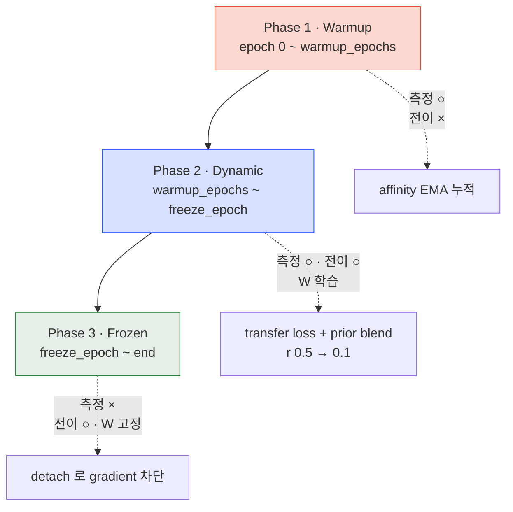

*"Study Thread" 시리즈의 adaTT 서브스레드 3편. 영문/국문 병렬로 ADATT-1
→ ADATT-4 에 걸쳐 본 프로젝트의 adaTT 메커니즘을 정리한다. 출처는 온프렘
프로젝트 `기술참조서/adaTT_기술_참조서` 이다. ADATT-2 가 *측정* 을
마쳤고 — 이번 3편은 "측정된 친화도를 어떻게 쓸 것인가" 라는 한 질문을
네 개의 결정으로 쪼개 답한다.*

## ADATT-2 가 남긴 질문

실시간으로 업데이트되는 $[-1, 1]$ 범위의 친화도 행렬 $\mathbf{A}$ 가
있다. 이걸로 무엇을 할 것인가. 이 질문은 네 개의 작은 결정으로 풀린다.

1. 친화도를 *loss 신호* 로 어떻게 바꾸는가 — Transfer Loss
2. 학습 초기의 *비어 있는* 친화도를 어떻게 채우는가 — Group Prior
3. 학습 단계에 따라 전이 강도를 어떻게 조절하는가 — 3-Phase Schedule
4. 음의 친화도, 즉 *해로운 전이* 를 어떻게 다루는가 — Negative Transfer 차단

각각 순서대로 답한다.

## 결정 1 — Transfer Loss, 왜 이 형태인가

친화도를 loss 신호로 바꾸는 방법은 여러 가지다. 세 후보를 놓고 비교해
보자.

- *(a) 가중 합산 증류* — 다른 태스크의 loss 를 친화도로 가중 합산해
  현재 태스크에 가산. 단순하고 미분 가능.
- *(b) Gradient surgery (PCGrad)* — 충돌하는 gradient 를 다른 태스크
  gradient 공간으로 사영하여 성분을 제거. gradient 를 직접 변형.
- *(c) Transfer Loss (adaTT 선택)* — (a) 의 개선판. 친화도를 학습 가능한
  가중치와 결합하고 softmax 정규화.

adaTT 는 (c) 를 택한다. (b) PCGrad 는 매 step gradient 를 사영해 rewrite
해야 하는데, 16 태스크 환경에서 사영 계산 비용이 무겁고 원본 gradient 의
자기 정보도 잃는다. (a) 는 단순하지만 가중치 학습 여지가 없다. (c) 는
표준 backprop 을 그대로 쓰고, 친화도 관측값 $\mathbf{A}$ 와 학습 가능한
$\mathbf{W}$ 를 동시에 태워 "관측 + 학습" 을 합친다.

각 태스크 $i$ 에 대한 Transfer-Enhanced Loss:

$$\mathcal{L}_i^{\text{adaTT}} = \mathcal{L}_i + \lambda \cdot \sum_{j \neq i} w_{i \rightarrow j} \cdot \mathcal{L}_j$$

- $\mathcal{L}_i$: 태스크 $i$ 의 원본 손실 (focal, huber, MSE 등)
- $\lambda = 0.1$ (기본값, `transfer_lambda`)
- $w_{i \rightarrow j}$: 태스크 $i$ 에 대한 태스크 $j$ 의 전이 가중치

> **수식 직관.** "자기 loss 는 기본, 친화도가 높은 동료의 loss 는
> $\lambda$ 만큼만 참고" 의 구조. $\lambda = 0.1$ 은 "동료 의견 10%
> 반영" 의 보수적 설정.

$w_{i \rightarrow j}$ 자체는 학습 가능 가중치 $\mathbf{W}$, 측정된 친화도
$\mathbf{A}$, 도메인 Prior $\mathbf{P}$ 를 섞은 뒤 softmax 로 정규화한
결과다 — 이 절차의 전개는 결정 2 의 Prior Blend 에서 함께 풀린다.

### G-01 FIX — Transfer Loss Clamp

Transfer loss 가 원본 loss 를 *지배하지 않게* 하는 비율 상한이 달려
있다. $\lambda = 0.1$ 만으로는 충분하지 않다. 어떤 태스크의 원본 loss 가
일시적으로 아주 작아지면 (학습이 잘 풀려서) transfer 항이 상대적으로
과대해져 학습 방향을 왜곡할 수 있다. 이걸 막으려고:

$$\text{transfer}_i \leftarrow \min(\lambda \cdot \text{transfer}_i,\ \text{max\_ratio} \cdot \mathcal{L}_i.\text{detach}())$$

`max_transfer_ratio = 0.5` — transfer 가 원본의 50% 를 넘지 못한다.
`.detach()` 가 중요하다 — clamp 경계값이 gradient 로 흘러 원본 loss 를
건드리면 안 된다.

### Target 미존재 태스크 마스킹

모든 배치에 모든 태스크의 target 이 있는 건 아니다. 단순히 "0.0 loss"
를 넣으면 softmax 가중치가 해당 태스크로 여전히 일부 흐르므로 잘못된
전이가 발생한다. 해결은 `loss_mask_tensor` 로 곱해 해당 전이 경로를
*완전히 차단* 하는 것 — softmax 이후에 곱해 가중치 자체가 0 이 되게 한다.
배치별 target 구성이 가변적인 실환경에 안전하다.

## 결정 2 — Group Prior, 왜 Bayesian 해석이 맞는가

학습 첫 epoch 를 생각해 보자. 네트워크가 아무것도 학습하지 않은 상태
에서 gradient 는 거의 무작위에 가깝고, 친화도 $\mathbf{A}$ 는 사실상
무의미한 숫자다. 이걸 그대로 전이 가중치로 쓰면 초기 학습이 random
transfer 로 망가진다.

Group Prior 는 이 공백을 도메인 지식으로 채운다 — CTR, CVR, engagement,
uplift 는 참여 / 전환 계열이니 서로 강하게 연결되고, churn, retention,
life_stage, ltv 는 생애주기 계열로 묶인다. 같은 그룹 내는 `intra_strength`
(0.6–0.8), 다른 그룹 간은 `inter_group_strength` (0.3) 로 설정한다.

### Prior 행렬 구성 — 한 줄 요약

행렬을 `inter_group_strength` 로 초기화한 뒤 같은 그룹 내 원소를
`intra_strength` 로 덮어쓰고, 대각선은 0, 행별로 정규화하여 태스크 $i$
가 다른 태스크들로부터 받는 전이 가중치 합이 1 이 되게 만든다. 행
정규화는 태스크 수에 무관하게 전이 강도를 일관되게 유지한다.

| 그룹 | 멤버 | intra 강도 | 비즈니스 의미 |
|---|---|---|---|
| engagement | ctr, cvr, engagement, uplift | 0.8 | 참여 / 전환 |
| lifecycle | churn, retention, life_stage, ltv | 0.7 | 생애주기 |
| value | balance_util, channel, timing | 0.6 | 가치 / 행동 패턴 |
| consumption | nba, spending_category, consumption_cycle, spending_bucket, merchant_affinity, brand_prediction | 0.7 | 소비 패턴 |

### Prior Blend Annealing

$\mathbf{A}$ 와 $\mathbf{P}$ 를 어떻게 섞을 것인가. 고정 비율은 답이
아니다 — 초기엔 $\mathbf{A}$ 가 노이즈지만, 학습이 진행되며 $\mathbf{A}$
는 진짜 관측이 되고 $\mathbf{P}$ 의 휴리스틱은 오히려 방해가 된다.
해결은 *선형 감소* annealing.

$$r(e) = r_{\text{start}} - (r_{\text{start}} - r_{\text{end}}) \cdot \min\left(\frac{e - e_{\text{warmup}}}{e_{\text{freeze}} - e_{\text{warmup}}}, 1.0\right)$$

$r_{\text{start}} = 0.5$ 에서 $r_{\text{end}} = 0.1$ 로. 초기엔 Prior 50%,
후반엔 10%. 최종 blended 가중치는:

$$\mathbf{R} = (\mathbf{W} + \mathbf{A}) \cdot (1 - r) + \mathbf{P} \cdot r$$

> **수식 직관.** "신입 사원은 선배 조언을 절반 듣다가, 경험이 쌓이면
> 자기 판단을 90% 로." Bayesian 의 *prior → posterior* 전환을 blend
> ratio $r$ 하나로 모사한 실용적 경량화다 — 풀 Bayesian 추론 대신
> annealing schedule 로 "데이터가 쌓이면 prior 의존도가 줄어든다" 를
> 구현한다.

> **역사적 배경.** Bayesian 추론은 Bayes (1763), Laplace (1812) 로 거슬러
> 올라가며, 신경망에 도입한 것은 MacKay (1992), Neal (1996) 이다. 현대
> 딥러닝에서 Dropout 의 Bayesian 해석 (Gal & Ghahramani, ICML 2016) 이나
> Bayes by Backprop (Blundell et al., ICML 2015) 이 이 전통을 잇는다.
> adaTT 는 이걸 single-scalar blend 로 경량화한다.

## 결정 3 — 3-Phase Schedule, 왜 세 단계인가

Transfer 의 "시점" 도 결정해야 한다. 매 step 전이가 맞는가? 아니다. 학습
상태에 따라 전이가 *정반대 역할* 을 한다.

*Phase 1 — Warmup (친화도 측정만, 전이 없음).* 학습 시작 시 네트워크의
gradient 는 아직 무의미하다. 친화도 행렬은 축적하되 loss 에 전이 항을
더하지 않는다. 이 단계를 건너뛰고 바로 전이에 들어가면 random transfer
가 초기 학습을 망친다.

*Phase 2 — Dynamic (관찰 + 전이 동시).* Warmup 이 끝나면 매 step 친화도
를 업데이트하면서 transfer loss 도 적용한다. Prior blend ratio $r$ 이
0.5 → 0.1 로 선형 감소하며, 학습 가능 가중치 $\mathbf{W}$ 도 이 구간에서
움직인다.

*Phase 3 — Frozen (가중치 고정).* `freeze_epoch` 이후 전이 가중치를
고정하고 더 이상 gradient 를 계산하지 않는다. `transfer_w[i].detach()`
로 gradient 경로를 끊어 학습을 안정화한다. 학습 종반에는 CGC gating 도
함께 frozen 되어 (ADATT-4 에서 다룬다) 수렴 dynamic 이 정리된다.

초기화 시점에 `freeze_epoch > warmup_epochs` 를 검증한다 (H-6). Phase 2
가 완전히 스킵되면 학습된 친화도가 전이에 한 번도 반영되지 못하므로
adaTT 자체가 무의미해진다.

> **역사적 배경.** 단계별 학습은 Bengio et al. (2009, *Curriculum
> Learning*) 의 "쉬운 것부터 어려운 것으로" 아이디어에서 체계화됐다.
> Pre-training + Fine-tuning (Erhan et al., 2010), Layer-wise Training
> (Hinton et al., 2006), Warmup-then-Decay LR schedule (Goyal et al.,
> 2017) 등이 같은 전통. adaTT 의 3-Phase 는 이걸 *태스크 간 전이* 에
> 적용한 것이다.

## 결정 4 — Negative Transfer, 왜 전면 차단이 아니라 임계값인가

마지막으로, 친화도가 음수인 태스크 쌍을 어떻게 다룰 것인가.

가장 단순한 선택은 "모든 음수를 차단" ($\tau_{neg} = 0$) 이지만, 이건
과도하다. SGD 의 stochastic noise 때문에 true affinity 가 0 근처인
태스크 쌍도 배치에 따라 $\cos \approx -0.05$ 같은 약한 음수를 보일 수
있다. 노이즈 구간을 모두 차단하면 adaTT 의 전이 경로가 대부분 닫히고
효과가 사라진다.

다른 극단 — "아예 차단하지 않음" — 은 명백한 conflict 가 있는 태스크
쌍에서 서로의 loss 를 부풀리게 되어 학습을 불안정하게 만든다.

해결은 *명확한* 음수만 차단하는 중간 지점. $\tau_{neg} = -0.1$ 은 노이즈
마진을 허용하면서 분명한 gradient 충돌은 끊는 sweet spot 이다.

$$\mathbf{R}_{i,j} \leftarrow 0 \quad \text{if } \mathbf{A}_{i,j} < \tau_{\text{neg}}, \quad \tau_{\text{neg}} = -0.1$$

PCGrad (Yu et al., 2020) 가 $\cos < 0$ 을 conflict 기준으로 쓰는 것보다
더 완화된 설정이다 — adaTT 는 gradient 를 *사영* 해 변형하는 대신 해로운
태스크의 loss 기여를 0 으로 만드는, 더 보수적인 전략을 택한다. 원본
gradient 를 건드리지 않는 것이다.

### 감지 API

차단만 하는 게 아니라 *진단* 도 제공한다. `detect_negative_transfer()`
메서드는 $\{$태스크 $i$: 친화도가 $\tau_{neg}$ 미만인 $j$ 리스트$\}$
형태의 dict 을 반환하여, MLflow 로깅 등에서 "어떤 쌍이 실제로 충돌하고
있는가" 를 사후 분석할 수 있게 한다. 예: `{"churn": ["ctr", "engagement"],
"ltv": ["brand_prediction"]}`.

| 설정 | 결과 |
|---|---|
| 차단 미적용 | conflict 태스크 쌍이 서로 loss 증가 → 학습 불안정 |
| 과도한 차단 ($\tau_{neg} = 0$) | 전이 경로 대부분 차단 → adaTT 사실상 비활성화 |
| 적절한 차단 ($\tau_{neg} = -0.1$) | 명확한 충돌만 차단, 중립/양성 전이는 유지 |

## 전이 가중치 파이프라인 — 네 결정이 모이는 자리

네 결정이 한 계산에서 만난다. 전이 가중치 $w_{i \to j}$ 는 ① **결정 2**
의 Prior Blend 로 학습 가중치와 측정 친화도를 합친 $\mathbf{R}$ 을 만들고,
② **결정 4** 에 따라 $\mathbf{A}_{i,j} < \tau_{\text{neg}}$ 인 엔트리를
0 으로 마스킹하고, ③ 대각을 제외한 뒤, ④ ADATT-1 에서 언급한 softmax
정규화를 온도 $T = 1.0$ 으로 거쳐 확률 분포로 변환한다. $T < 0.5$ 는 너무
sharp 해서 소수 태스크에 집중, $T > 2.0$ 은 너무 uniform 해서 negative
transfer 를 충분히 차단 못 한다.

Phase 1 에서는 이 전체 파이프라인이 비활성 — 친화도만 축적한다 (결정 3).
Phase 2 에서는 매 step 전체가 돌고, Phase 3 에서는 $\mathbf{W}$ 학습을
중단하고 가중치를 고정한다.

## 여기서 멈추는 이유

Transfer Loss, Group Prior, 3-Phase Schedule, Negative Transfer 차단
— 네 결정이 서로 맞물린다. Prior 는 초기의 빈 친화도 공간을 도메인
지식으로 채우고, Phase 스케줄은 "관찰 → 전이 → 고정" 의 curriculum 을
강제하며, Negative Transfer 차단은 측정된 친화도가 음수로 꺾이는
구간에서 해로운 경로를 끊는다. G-01 FIX Clamp 는 이 모든 것이 원본
손실을 덮지 않게 비율 상한을 건다.

하지만 이 구조는 혼자 돌지 않는다. 실제 학습 루프에는 2-Phase Training
(Shared Pretrain → Cluster Finetune), 16 태스크 Uncertainty Weighting,
AdamW + SequentialLR, 그리고 CGC 의 gate dynamic 이 함께 있다. adaTT 의
3-Phase 친화도 스케줄이 Trainer 의 2-Phase 학습 루프와 어떻게 맞물리는지,
CGC gate freeze 와 왜 동기화해야 하는지 — 이 엔지니어링 계약이
**ADATT-4** 의 주제다.
