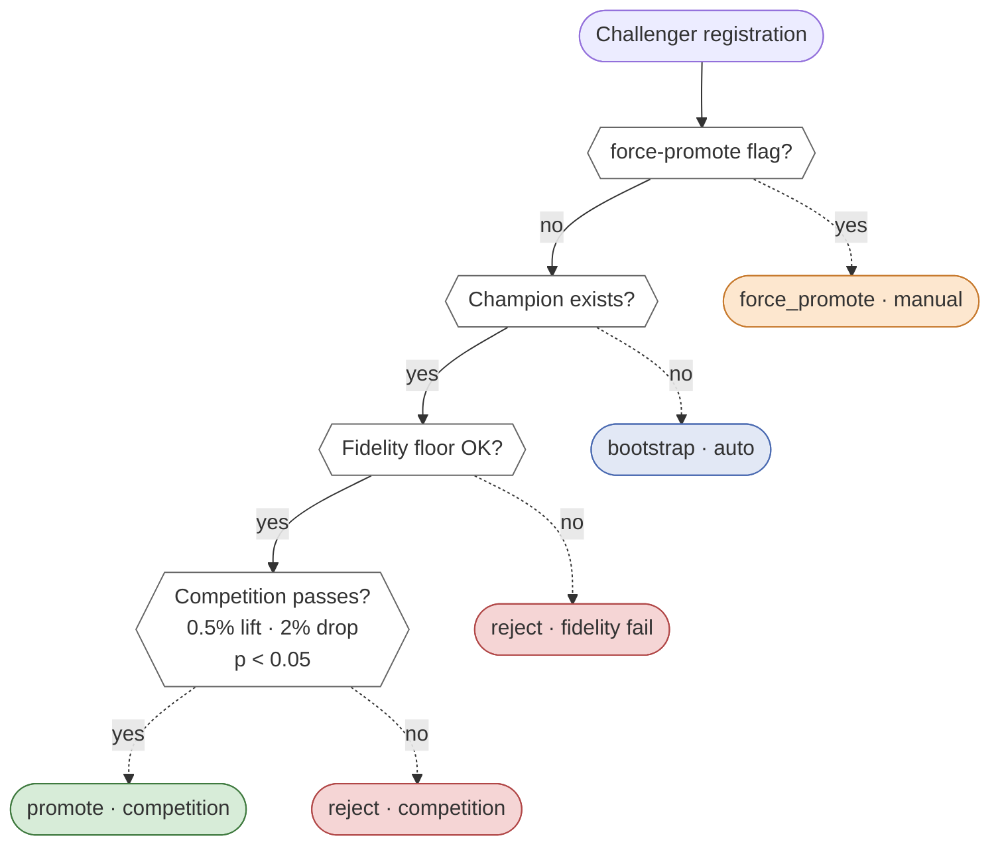

*Part 2 of "The MRM Thread". Ep 1 framed MRM as structural
invariants; this episode walks one Challenger through the flow —
from training completion to production, where rejection halts it,
how emergencies intrude, and how the post-deployment loop closes.*

## 3 a.m., Monday

The weekly scheduled retraining job finishes on SageMaker. A new
Challenger lands in the registry, waiting. What happens between
this moment and a customer getting a new recommendation is where
the old process and ours diverge completely.

In the conventional flow: a duty officer checks the retraining
completion notice Tuesday morning and forwards it to the model
risk team. The validation team spends several days drafting a
report — KS statistic, PSI, Gini coefficient — and routes it to
the Risk Management Committee or up the approval chain to the
responsible executive. Once approved, a deployment request is
filed through IT change management and lands in the next release
window. Training-end to production: *two to four weeks*; the
rationale lives scattered across validation reports and approval
documents.

In our flow: the registration event fires `_decide_promotion()`
synchronously. Within seconds of the training job finishing, a
verdict is reached, an audit entry is written, and if promoted
the Challenger serves the next Lambda request. The decision is
already closed before anyone is awake.

The time difference sounds like it's about automation, but the
real point is *where the judgment lives*. The conventional flow
pushes judgment out to a committee. We push it into a code path.

## What happens inside the gate

Step into `_decide_promotion()`. The gate is a short-circuit
structure that runs four checks in sequence. Whichever check
resolves first settles the verdict on the spot, writes one audit
entry, and the function returns.



The spine flows downward as `no → yes → yes → yes`; each step's
branch peels sideways and settles the verdict on the spot. Every
outcome (the color-coded nodes) writes one entry into the HMAC
hash-chained audit log. Below is what one Challenger actually looks
like walking this map.

*Step 1 — operator override check.* Is `--force-promote` set? It
is not; this is scheduled retraining. Move on.

*Step 2 — champion existence.* The registry has a current Champion.
This is a real competition, not a bootstrap.

*Step 3 — fidelity floor.* Does the distilled student clear the
fidelity floor against the teacher on each of thirteen tasks?
This Challenger clears all of them. If even one had failed, the
function would halt here and reject. The reason for this ordering
comes back below.

*Step 4 — `ModelCompetition.evaluate()`.* Compare the current
Champion and the new Challenger on training metrics. Three
criteria:

- Does primary metric avg\_auc improve by at least 0.5%? Pass.
- No secondary metric degrades by more than 2%? One task drops
  slightly, within tolerance. Pass.
- Is the improvement statistically significant? t-test p-value
  below the 0.05 threshold. Pass.

All three pass. `promotion_approved=True` lands, `registry.promote()`
is called. An audit entry is written — `champion_version` (prior),
`challenger_version` (this one), `decision=promote`, reason =
competition summary, comparison = per-metric values, significance
= p-value. The function returns and the pipeline continues to the
next stage (serving-manifest update, CloudWatch notification).

Total elapsed time: under ten seconds. By 4 a.m. it is all
finished.

## Two weeks later, another Challenger stops at the same gate

Same `_decide_promotion()`, different ending.

At step 3, on two of the thirteen tasks the student-teacher KL
divergence exceeds the floor. Training produced a distribution
shift somewhere and the student diverged from the teacher as a
function. Look only at training metrics and this week's Challenger
actually posts a higher avg\_auc than last week's. But fidelity is
checked *before* competition, so the rejection is sealed here.
Step 4 never runs.

Audit entry — `decision=reject`, reason = "2 fidelity failures:
task\_churn, task\_next\_best (KL above threshold)". The Challenger
is stored in the registry with `promoted=False`, but it never
enters production.

Why fidelity sits before competition becomes visible here. If the
order were reversed — competition first, fidelity as a final check
— the temptation would emerge: "avg\_auc climbed that much, surely
this much fidelity delta is tolerable?" Knowing the performance
delta makes it natural to nudge the fidelity floor. Putting
fidelity first means the floor operates independent of performance
information. Operational safety does not depend on competition
outcomes.

That sounds like a minor ordering detail, but it determines the
*shape of the answer* a year later when a regulator asks "why was
this model rejected?". Not "performance was insufficient after
comparison" but "fidelity floor violated, automatic rejection
regardless of performance" — the latter is a structural guarantee.

## Tuesday afternoon, an emergency

The current Champion has been in production a week. Tuesday
afternoon at 2 p.m., the fairness monitor raises an alert — on
a specific age × region segment, the Disparate Impact ratio drops
below threshold. The next scheduled retrain is five days away.
Can't wait.

The duty engineer finds a known-good version in the registry (one
that had successfully run production several weeks prior). One
explicit command:

```
python scripts/submit_pipeline.py --force-promote --version <known-good>
```

`_decide_promotion()` runs again. This time it terminates at step
1 — with `--force-promote` set, every subsequent check is skipped
and the known-good version is promoted. Audit entry —
`decision=force_promote`, `trigger=manual`, reason = "DI breach
emergency rollback", `operator` = engineer's ID.

Within two minutes, the known-good version is serving. The
committee reviews the audit entry later that Friday. The review
is about "was this override appropriate", not "did an override
happen". The entry is immutable; who intervened when and for what
reason is permanently fixed in the hash chain.

Making force-promote an explicit separate CLI option, not just
another flag, is the center of this design. There is no path
where a config file gets quietly edited to change the serving
version, nor a path that writes to the registry directly. Emergency
intervention must pass through the *explicit path*, and that path
necessarily writes an audit entry.

## The loop around the gate

MRM does not stop once a Challenger has been promoted to Champion.
That is where the second loop starts.

Every prediction is recorded in the HMAC hash chain (covered in
Ep 3). The fairness monitor computes Disparate Impact, Statistical
Parity Difference, and Equal Opportunity Difference on the
production stream in real time. The drift monitor aggregates PSI
and KL on feature and prediction distributions nightly.

When drift exceeds its threshold, the orchestrator automatically
triggers the next retraining job. When that job finishes, the
flow returns to the early-morning `_decide_promotion()`. Offline
gate → production monitors → retrain trigger → offline gate — a
closed loop.

What's interesting about this loop is that the human role inside
it is *not surveillance*. The loop runs itself. Human intervention
concentrates in two places: (1) emergency force-promote, and (2)
the meta-judgment about whether the loop's parameters —
`min_improvement`, `max_degradation`, the fidelity floor values,
drift thresholds — are still appropriate. The first falls to
engineers; the second to the MRM committee.

## What this flow changes about MRM

Ep 1 said "move MRM from a post-hoc report to a structural
property". This episode shows what that phrase looks like as a
flow.

Judgment no longer depends on the committee calendar. The fact
that a Challenger was rejected at 3 a.m. on a Monday is settled regardless
of whether anyone reads the email. A year after a promotion, when
a regulator asks, the audit log reconstructs that moment's
Champion metrics, Challenger metrics, significance test, and
rejection reason verbatim.

Conversely, what *remains the MRM committee's job* becomes
sharper. The gate only answers "is this better than the current
Champion". "Is the current Champion itself the right design?",
"Is a fidelity floor of 0.20 aligned with our risk tolerance?",
"Is 0.5% the right value for min\_improvement?" — those remain
human judgment. The committee's role shifts from *adjudicating
each Challenger* to *adjudicating the gate's design itself*.

That shift is Ep 1's core message. Human work did not decrease;
it concentrated on *what only humans can do*. It is why MRM can
function in a three-person organization that would never get
through a weekly queue of Challengers under the old model.

## Next

Ep 3 is about what else is being recorded around this flow — not
only promotion decisions but *every prediction* landing in the
HMAC chain, the role partition across seven audit tables, and how
EU AI Act Article 13-14 (transparency, human oversight) and KFCPA
§17 (financial-consumer dispute handling) mappings become code
paths rather than checklists.

Source material:
[Paper 2 (Zenodo)](https://doi.org/10.5281/zenodo.19622052) §4-5,
and the [open-source repo](https://github.com/bluethestyle/aws_ple_for_financial).
