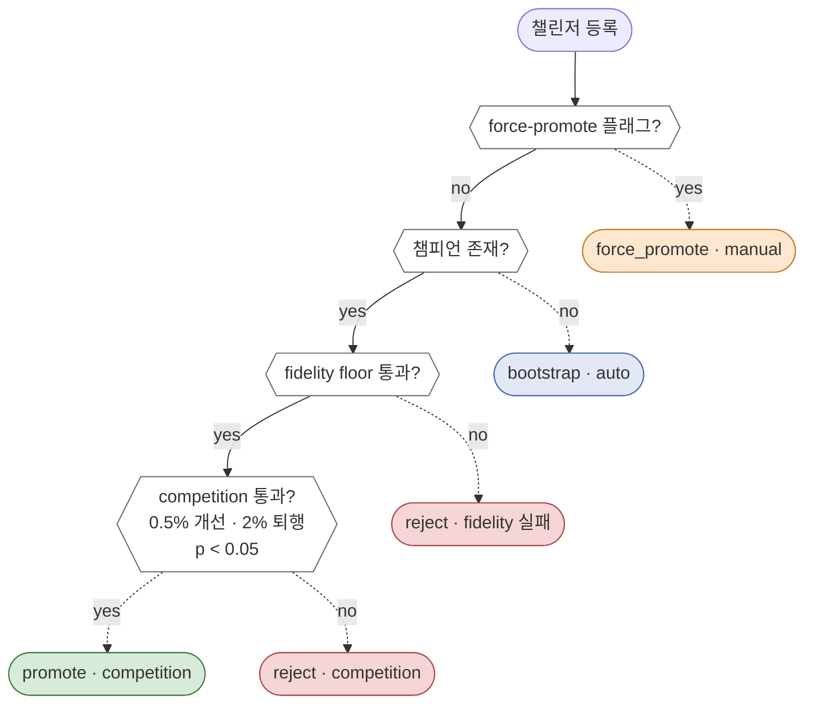

*"MRM 스레드" 2편. Ep 1 에서 세운 "구조적 불변성으로서의 MRM" 프레임을
Champion-Challenger 라는 하나의 흐름으로 따라가 본다 — 학습 종료에서
운영 투입까지, 거부된 경우엔 어디서 멈추는지, 비상 상황엔 어떻게
개입하는지, 그리고 운영 이후의 루프가 어떻게 닫히는지.*

## 월요일 새벽 3시

한 주간 스케줄된 재학습 Job 이 SageMaker 에서 종료된다. 신규 챌린저
모델이 레지스트리 등록 대기 상태가 된다. 이 시점부터 고객이 새 추천을
받는 시점까지의 경로가 종래 프로세스와 우리 프로세스에서 완전히
다르다.

종래 프로세스: 담당자가 출근 후 재학습 완료 알림을 확인하고, 모델리스크팀에
성능 비교 분석을 요청한다. 검증팀이 KS통계량·PSI·Gini계수를 포함한
검증 보고서를 수일에 걸쳐 작성하고, 리스크관리위원회 또는 담당
임원 결재선에 올린다. 승인 후 IT 변경관리 일정에 배포 요청을
등록하고 다음 릴리즈 윈도에 배포된다. 학습 종료 → 운영 투입까지
*2-4주*, 판단의 근거는 검증 보고서와 결재 문서에 분산.

우리 프로세스: 등록 이벤트가 발생하는 순간 `_decide_promotion()` 이
동기적으로 실행된다. 학습 Job 이 끝난 지 수초 안에 판정이 나고,
감사 로그가 쓰여지고, 승격되면 다음 Lambda 요청부터 신규 챌린저가
서빙된다. 사람이 깨어나기 전에 결정이 끝나 있다.

시간 차이만 보면 그냥 자동화 얘기처럼 들리지만, 중요한 건 *판단의
위치* 다. 종래 프로세스는 판단을 위원회로 밀어낸다. 우리는 판단을
*코드 경로* 에 박아넣는다.

## 게이트 안에서 벌어지는 일

`_decide_promotion()` 함수 안으로 들어가 본다. 게이트는 네 단계를
순차적으로 통과시키는 단락 평가 구조다. 어느 단계든 조건을 만족하면
그 자리에서 판정이 확정되고, 감사 엔트리 하나가 기록되며, 함수는
반환한다.



흐름은 `no→yes→yes→yes` 방향으로 내려가고, 각 단계에서 조건을
충족하면 그 자리에서 판정이 난다. 판정이 날 때마다 — 색깔별 노드
하나하나 — HMAC 해시 체인 감사 로그에 엔트리가 하나씩 남는다.
아래는 챌린저 한 개가 이 흐름을 실제로 통과하는 장면이다.

*1단계 — 운영자 오버라이드.* `--force-promote` 플래그가 있는가.
이번은 자동 스케줄 재학습이니 없다. 다음 단계로.

*2단계 — 챔피언 존재 확인.* 레지스트리에 현 챔피언이 있다.
부트스트랩이 아니라 실제 경쟁 평가가 필요한 상황이다.

*3단계 — fidelity floor.* 증류된 student 모델이 teacher 대비 13개
태스크 각각에서 기준을 충족하는가. 이번 챌린저는 전 태스크 통과.
하나라도 미달이었다면 여기서 거부됐을 것이다. 이 단계가 4단계 앞에
오는 이유는 뒤에서 짚는다.

*4단계 — `ModelCompetition.evaluate()`.* 챔피언과 챌린저의 학습
메트릭을 세 기준으로 비교한다:

- 기본 지표 avg\_auc 가 0.5% 이상 개선됐는가 — 통과.
- 보조 지표 중 2% 이상 퇴행한 항목이 없는가 — 한 태스크에서 소폭
  하락이 있었지만 임계치 내. 통과.
- 개선이 통계적으로 유의한가 — t-test p-value 0.05 미만. 통과.

세 기준 모두 통과. `promotion_approved=True` 가 반환되고
`registry.promote()` 가 호출된다. 감사 로그에 엔트리가 기록된다 —
champion\_version, challenger\_version, decision=promote, 경쟁 결과
요약, 지표별 비교값, p-value. 함수가 반환되고 파이프라인은 다음 단계
(서빙 매니페스트 업데이트, CloudWatch 알림) 로 넘어간다.

총 소요 시간 10초 내외. 새벽 4시 전에 모든 게 끝나있다.

## 또 다른 주의 챌린저, 같은 게이트에서 멈춘다

두 주 뒤. 다른 신규 챌린저가 등록된다. 같은 `_decide_promotion()` 이
실행되지만 이번에는 다르게 끝난다.

3단계 fidelity floor 에서, 13개 태스크 중 2개의 student-teacher
KL divergence 가 임계치를 넘었다. 학습 과정에서 distribution shift
가 발생해 student 가 teacher 와 다른 함수가 됐다. 학습 메트릭만
보면 avg\_auc 는 오히려 직전 주 챌린저보다 높다. 하지만 fidelity
검증이 *경쟁 이전에* 있어서, 이 시점에서 거부가 확정된다.
4단계로 가지 않는다.

감사 로그에 엔트리가 남는다 — decision=reject, reason="2 fidelity
failures: task\_churn, task\_next\_best (KL > 임계치)". 챌린저는
레지스트리에는 등록되지만 (promoted=False) 운영에는 들어가지 않는다.

왜 fidelity 를 경쟁 앞에 뒀는지가 여기서 드러난다. 순서가 반대였다면
"avg\_auc 가 저만큼 올랐는데 fidelity 0.31 정도면 봐줄 수 있지 않나?"
라는 유혹이 생긴다. 성능 수치를 먼저 본 상태에서 floor 를 조금
올리는 게 자연스럽게 느껴지기 때문이다. fidelity 를 먼저 보면 그
유혹 자체가 없다 — 성능이 얼마든 floor 는 그냥 작동한다.

사소해 보이지만, 1년 뒤 감독 당국이 "왜 이 모델은 거부됐는가" 를
물었을 때 답의 형태가 달라진다. "성능을 비교해보니 불충분했다" 가
아니라 "fidelity floor 위반으로 자동 거부, 성능과 무관" — 후자가
구조적 보장이다.

## 화요일 오후, 비상 상황

현 챔피언이 일주일째 운영 중이다. 화요일 오후 2시, 공정성 모니터가
경고를 띄운다. 특정 연령대 × 지역 조합에서 Disparate Impact 비율이
임계치를 하회. 다음 예정 재학습은 5일 뒤. 그때까지 기다릴 수 없다.

담당 엔지니어는 레지스트리에서 몇 주 전 known-good 상태의 모델을
찾는다 (이전에 한 번 운영을 무사히 거쳤던 버전). 명시적으로 한 줄
실행:

```
python scripts/submit_pipeline.py --force-promote --version <known-good>
```

`_decide_promotion()` 이 다시 실행된다. 이번엔 1단계에서 조기 종료 —
force-promote 플래그가 걸려있으니 모든 체크를 건너뛰고 바로 승격.
감사 로그 엔트리 — decision=force\_promote, trigger=manual, reason=
"DI breach emergency rollback", operator=엔지니어 ID.

2분 안에 known-good 버전이 운영 중. 위원회는 그 주 금요일에 감사
엔트리를 받아 사후 검토한다. 검토의 내용은 "이 override 가 적절했나"
지, "override 가 일어났는가" 가 아니다. 엔트리는 변경 불가능하게
기록됐고, 누가 언제 어떤 이유로 개입했는지가 hash chain 에 박혀있다.

force-promote 를 일반 flag 가 아니라 별도 명시적 CLI 옵션으로 분리한
게 이 설계의 중심이다. 설정 파일을 조용히 수정해서 버전을 바꾸거나,
registry 에 직접 쓰거나 하는 경로가 존재하지 않는다. 비상 개입은
반드시 *명시적 경로* 를 통과하게 되어 있고, 그 경로는 반드시 감사
엔트리를 남긴다.

## 게이트 바깥의 루프

챌린저가 챔피언으로 승격해 운영에 들어간 뒤에도 MRM 은 끝나지
않는다. 여기서 두 번째 루프가 시작된다.

매 예측은 HMAC 체인 로그에 기록된다 (Ep 3 에서 자세히). 공정성
모니터는 Disparate Impact · Statistical Parity Difference · Equal
Opportunity Difference 를 프로덕션 스트림에서 실시간으로 계산하고,
드리프트 모니터는 야간에 feature 분포와 예측 분포의 PSI/KL 을 집계한다.

드리프트가 임계치를 넘으면 orchestrator 가 자동으로 재학습 Job 을
띄운다. Job 이 끝나면 다시 새벽의 `_decide_promotion()` 으로 돌아온다.
오프라인 게이트 → 운영 모니터 → 재학습 트리거 → 오프라인 게이트.
이 순환이 끊기지 않는다.

이 루프 안에서 사람의 역할은 *감시자* 가 아니다. 루프는 알아서 돈다.
사람의 개입은 두 지점에만 집중된다. (1) 비상 상황의 force-promote.
(2) 루프 파라미터 — `min_improvement`, `max_degradation`, fidelity
floor, 드리프트 임계치 — 가 여전히 적절한지 판단. 전자는 엔지니어,
후자는 MRM 담당 임원 또는 리스크관리위원회가 검토한다.

## 이 흐름이 MRM 을 어떻게 바꾸는가

Ep 1 에서 "MRM 을 사후 보고서에서 구조적 특성으로 옮긴다" 라고 썼다.
이번 편에서 그 말이 구체적으로 어떤 모습인지가 드러났다.

판단이 위원회 일정에 의존하지 않는다. 챌린저가 월요일 새벽에 거부된
사실은 담당자가 이메일을 읽든 말든 확정되어 있다. 승격 후 1년 뒤
감독 당국이 물으면 감사 로그에서 그 순간의 Champion 메트릭, Challenger
메트릭, 유의성 검정, 거부 사유가 그대로 재구성된다.

반대로, *여전히 MRM 위원회의 일* 인 것이 더 선명해진다. 게이트는
"현 Champion 보다 나은가" 에만 답한다. "현 Champion 이 애초에 올바른
설계인가", "fidelity floor 0.20 이 우리 리스크 허용 수준에 맞는가",
"min\_improvement 0.5% 가 적절한가" — 이건 여전히 사람이 판단해야
한다. 위원회의 역할이 *각 Challenger 를 심사* 하는 것에서 *관문 자체
의 설계를 심사* 하는 것으로 이동했다.

이 이동이 Ep 1 의 핵심 메시지였다. 사람이 할 일이 줄어든 게 아니라,
사람이 할 일이 *사람만이 할 수 있는 것* 으로 집중됐다. 매주 돌아오는
Challenger 를 검토할 사람이 3명뿐인 조직에서도 MRM 이 성립할 수
있는 이유다.

## 다음 편

Ep 3 은 이 흐름 바깥에서 매 순간 기록되고 있는 것 — 승격 결정만이
아니라 *매 예측* 이 어떻게 HMAC 체인 로그에 쌓이는지, 7개 감사 테이블이
각각 무엇을 책임지는지, 그리고 EU AI Act Article 13-14 (투명성·인적
감독) 와 KFCPA §17 (금융소비자 분쟁 대응) 매핑이 체크리스트가
아니라 코드 경로가 되는 방식.

원문 자료:
[Paper 2 (Zenodo)](https://doi.org/10.5281/zenodo.19622052) §4-5,
그리고 [오픈소스 레포](https://github.com/bluethestyle/aws_ple_for_financial).
