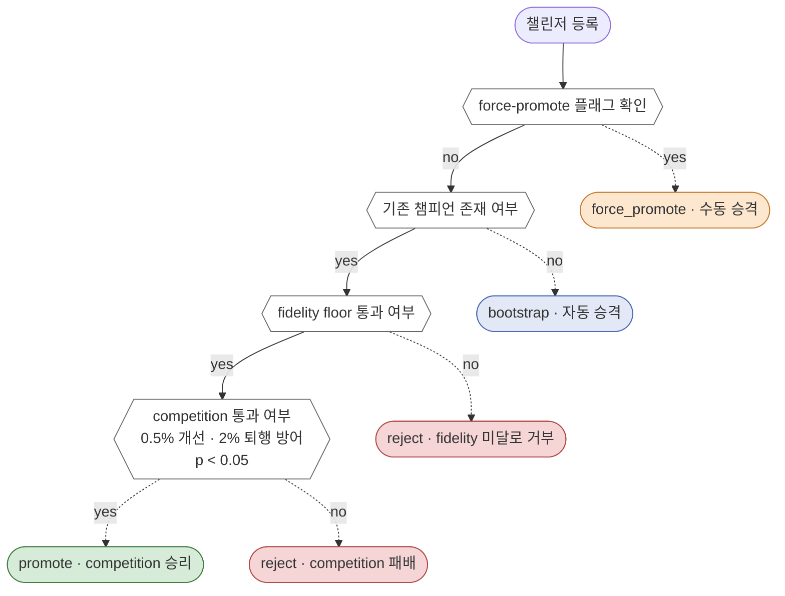

*"MRM 스레드" 2편. Ep 1에서 세운 "구조적 불변성으로서의 MRM"이라는 프레임을 챔피언-챌린저(Champion-Challenger)라는 하나의 구체적인 흐름으로 따라가 본다. 학습 종료부터 운영 투입까지의 과정, 거부된 모델은 어디서 멈추는지, 비상 상황에는 어떻게 개입하는지, 그리고 운영에 들어간 이후의 루프가 어떻게 닫히는지 살펴본다.*

## 월요일 새벽 3시

주말을 맞아 스케줄링된 재학습 작업(Job)이 SageMaker에서 무사히 종료된다. 새롭게 학습된 챌린저(Challenger) 모델이 레지스트리에 등록을 대기하는 상태가 된다. 바로 이 시점부터 고객이 새로운 추천 결과를 받아보기까지의 경로가, 종래의 관습적인 프로세스와 우리의 프로세스에서 완전히 갈라진다.

**종래의 프로세스:** 월요일 아침, 담당자가 출근하여 재학습 완료 알림을 확인한다. 담당자는 KS 통계량, PSI, Gini 계수 등을 긁어모아 수일에 걸쳐 성능 비교 검증 보고서를 직접 작성한 뒤, 리스크 관리 부서나 담당 임원의 결재선에 올린다(별도의 전담 MRM 팀이 없는 국내 금융기관의 전형적인 모습이다). 며칠 뒤 승인이 떨어지면 IT 변경 관리 일정에 맞춰 배포 요청을 등록하고, 다음 릴리즈 윈도우가 열릴 때 비로소 배포된다. 학습 종료부터 실제 운영 투입까지 **짧게는 2주, 길게는 4주**가 걸린다. 게다가 판단의 근거는 여러 검증 보고서와 결재 문서 파편들에 뿔뿔이 흩어져 있다.

**우리의 프로세스:** 모델 등록 이벤트가 발생하는 바로 그 순간, _decide_promotion() 함수가 동기적으로 실행된다. 학습 작업이 끝난 지 불과 수 초 안에 판정이 확정되고, 감사 로그가 단단하게 기록되며, 승격(Promote) 조건을 만족했다면 다음 Lambda 요청부터 곧바로 신규 챌린저 모델이 서빙된다. 사람이 아침에 눈을 뜨고 출근하기도 전에 모든 결정과 배포가 끝나 있는 것이다.

단순히 소요 시간의 차이만 놓고 보면 흔한 '자동화' 이야기처럼 들리겠지만, 여기서 정말 중요한 것은 **'판단이 내려지는 위치'**다. 종래의 프로세스는 판단의 책임을 서류 더미와 회의실로 밀어낸다. 반면 우리는 그 판단의 기준과 책임을 **명확한 코드 경로** 안에 단단히 박아넣었다.

## 통제 관문(Gate) 안에서 벌어지는 일

이제 _decide_promotion() 함수 내부로 들어가 보자. 이 관문은 4개의 단계를 순차적으로 통과시키는 단락 평가(Short-circuit Evaluation) 구조로 되어 있다. 어느 단계에서든 조건을 만족(혹은 실패)하면 그 자리에서 즉시 판정이 확정되고, 감사 로그 엔트리 하나가 기록된 뒤 함수가 종료된다.



흐름은 기본적으로 no → yes → yes → yes 방향으로 차례차례 내려가며, 각 단계에서 조건을 충족하면 곧바로 판정이 내려진다. 위 다이어그램의 색칠된 노드에 도달하여 판정이 확정될 때마다, HMAC 해시 체인 감사 로그에 지워지지 않는 엔트리가 하나씩 새겨진다.
아래는 어느 신규 챌린저 모델 하나가 이 엄격한 흐름을 실제로 통과하는 장면이다.

**1단계 — 운영자 오버라이드(Override).** --force-promote 플래그가 켜져 있는가? 이번은 자동 스케줄에 의한 정기 재학습이므로 당연히 없다. 무사히 다음 단계로 넘어간다.

**2단계 — 챔피언 존재 확인.** 레지스트리에 현재 운영 중인 챔피언 모델이 있는가? 있다. 즉, 맨 처음 바닥부터 띄우는 부트스트랩(Bootstrap) 상황이 아니라, 기존 모델과의 실제 경쟁 평가가 필요한 상황이다.

**3단계 — 최소 충실도 기준(Fidelity Floor).** 가벼운 학생(Student) 모델이 무거운 교사(Teacher) 모델을 증류(Distillation)하여 학습했을 때, 최소한의 모방 품질(Fidelity) 기준을 충족하는지 뭉뚱그려 평가하는 것이 아니라 **13개 태스크별로 개별 판정**한다. 만약 특정 태스크에서 교사 모델의 지식을 제대로 모방하지 못해 학습에 실패한다면, 해당 태스크에 한해서만 LGBM이 직접 원본 데이터를 학습하여 구멍을 메우는 **1차 폴백(Fallback)**이 발동한다. 그럼에도 문제가 생기면 최종적으로 비즈니스 룰 베이스(Rule-base) 로직으로 전환되는 **2차 폴백**이 촘촘하게 대기하고 있다. (단, 이러한 태스크별 2중 폴백 구조는 기존 챔피언 모델의 성능마저 완전히 박살 나서 어떻게든 시스템을 띄워야 하는 비상 상황을 가정한 생존 기제다. 정상적인 상황이라면 굳이 위험을 감수할 이유가 없으므로 미달된 태스크가 발생하는 즉시 챌린저 모델의 승격을 거부한다.) 이처럼 깐깐한 충실도 검증 단계가 왜 4단계인 성능 경쟁보다 앞서 배치되었는지는 잠시 뒤에 설명한다.

**4단계 — 실제 경쟁(ModelCompetition.evaluate()).** 챔피언과 챌린저의 학습 메트릭을 다음 세 가지 깐깐한 기준으로 비교한다.

- 기본 지표인 avg_auc가 챔피언 대비 0.5% 이상 개선되었는가? — 통과.
- 여러 보조 지표 중에서 2% 이상 퇴행(Degradation)한 항목이 없는가? — 한 태스크에서 소폭 하락이 있었지만 허용 임계치 이내였다. 통과.
- 이러한 개선이 통계적으로 유의미한가? — t-test 결과 p-value가 0.05 미만이다. 통과.

세 가지 기준을 모두 통과했다. promotion_approved=True가 반환되며 즉시 registry.promote()가 호출된다. 이와 동시에 감사 로그에는 champion_version, challenger_version, decision=promote, 경쟁 결과 요약, 지표별 비교값, p-value 수치 등이 영구적인 엔트리로 꼼꼼하게 기록된다. 함수가 반환되고 나면 파이프라인은 서빙 매니페스트를 업데이트하고 CloudWatch 알림을 발송하는 다음 단계로 매끄럽게 넘어간다.

이 모든 과정을 거치는 데 걸린 총 소요 시간은 불과 10초 남짓. 새벽 4시가 채 되기도 전에 모든 의사결정과 배포가 성공적으로 끝나 있다.

## 또 다른 주의 챌린저, 하지만 같은 관문에서 멈춰 서다

다시 2주 뒤. 새로운 챌린저 모델이 학습을 마치고 등록된다. 똑같은 _decide_promotion() 함수가 묵묵히 실행되지만, 이번에는 결말이 사뭇 다르다.

3단계 '최소 충실도(Fidelity Floor)' 검증에서, 13개 태스크 중 2개 태스크의 Student-Teacher 간 KL 발산(Divergence) 수치가 허용 임계치를 넘어가 버렸다. 학습 과정에서 데이터의 분포 변화(Distribution Shift)가 발생하여, Student 모델이 Teacher 모델의 의도와는 너무 다르게 튀어버린 것이다. 아이러니하게도 학습 메트릭만 놓고 보면 avg_auc 자체는 오히려 직전 주 챌린저보다 훨씬 높게 나왔다. 

하지만 지금은 기존 챔피언 모델이 멀쩡히 서비스되고 있는 정상 상황이므로, 위험을 무릅쓰고 앞서 언급한 태스크별 폴백(Fallback) 구조를 가동할 이유가 없다. 또한 충실도 검증이 **경쟁 평가보다 앞서** 배치되어 있었기에, 충실도 기준에 미달한 이 시점에서 모델 승격은 즉시 거부(Reject)된다. 4단계 경쟁 평가로는 아예 넘어가지도 못한다.

감사 로그에는 즉각 엔트리가 남는다. decision=reject, reason="2 fidelity failures: task_churn, task_next_best (KL > 임계치)". 이 챌린저는 레지스트리에 그저 기록용으로만 등록될 뿐(promoted=False), 실제 운영 환경에는 결코 발을 들이지 못한다.

왜 굳이 충실도 검증을 성능 경쟁보다 앞단에 두었는지가 바로 여기서 명확히 드러난다. 만약 순서가 반대였다면 어땠을까? *"AUC 성능 지표가 이렇게나 껑충 뛰었는데, 충실도 수치가 0.31 정도로 기준을 살짝 넘긴 건 그냥 유도리 있게 넘어가 주면 안 되나?"*라는 달콤한 유혹이 생기기 마련이다. 뛰어난 성능 수치를 먼저 본 상태에서는, 최소 충실도 기준(Floor)을 조용히 완화해 주고 싶은 마음이 자연스럽게 들기 때문이다. 하지만 충실도를 먼저 철저히 검증해 버리면 애초에 그런 타협의 유혹 자체가 원천 차단된다. 성능이 얼마나 뛰어나든 간에, 기본을 지키지 못한 모델은 규정(Floor)에 의해 기계적으로 잘려나간다.

이 설계가 겉보기엔 사소해 보일지 몰라도, 1년 뒤 감독 당국이 찾아와 "왜 성능이 더 좋은 이 모델이 당시에 거부되었는가?"라고 캐물을 때 내놓을 수 있는 답변의 질을 완전히 바꿔놓는다. *"성능을 비교해 보며 회의를 거친 결과 전반적으로 불충분하다고 판단했다"*라는 주관적이고 흐릿한 답변이 아니라, *"최소 충실도 규정 위반으로 인해 성능 지표 확인조차 생략된 채 자동 거부되었다"*라는 명쾌하고 **구조적인 보증**을 제시할 수 있게 되는 것이다.

## 화요일 오후, 비상 상황 발생

현재 챔피언 모델이 일주일째 무사히 운영되고 있다. 그런데 화요일 오후 2시, 공정성 모니터링 시스템이 붉은색 경고를 띄운다. 특정 연령대와 지역 조합에서 이질적 영향(Disparate Impact) 비율이 허용 임계치 아래로 곤두박질친 것이다. 다음 정기 재학습 스케줄은 아직 5일이나 남아 있다. 그때까지 두 손 놓고 기다릴 수는 없는 노릇이다.

담당 엔지니어는 지체 없이 레지스트리를 뒤져 몇 주 전에 무사히 운영을 마쳤던 '검증된 정상 상태(Known-good)'의 과거 모델 버전을 찾아낸다. 그리고 명시적으로 단 한 줄의 명령어를 실행한다.

```bash
python scripts/submit_pipeline.py --force-promote --version <known-good>
```

_decide_promotion() 함수가 다시 한번 번개처럼 실행된다. 하지만 이번에는 1단계에서 조기 종료된다. --force-promote 플래그가 꽂혀 있으니, 뒤이은 모든 깐깐한 검증 체크를 생략하고 즉시 승격(Promote)을 단행한다. 감사 로그 엔트리에는 decision=force_promote, trigger=manual, reason="DI breach emergency rollback", 그리고 operator=엔지니어 ID가 선명하게 아로새겨진다.

명령어 실행 후 2분도 채 지나지 않아, 안전성이 검증된 과거 모델이 다시 운영 환경을 장악한다. 리스크 담당자나 관련 부서는 그 주 금요일에 기록된 감사 엔트리를 건네받아 사후 검토를 진행한다. 여기서 검토의 초점은 *"누군가 임의로 모델을 바꿨는가(개입의 유무)"*가 아니다. 기록은 이미 빼도 박도 못하게 남아 있기 때문이다. 검토의 진짜 내용은 *"이 비상 오버라이드 조치가 과연 합당하고 적절했는가"*를 따져 묻는 것이다. 해시 체인(Hash Chain)에는 누가, 언제, 어떤 급박한 이유로 시스템에 개입했는지가 지워지지 않는 낙인처럼 박혀 있다.

이 설계의 핵심은, 시스템 비상 개입(Force-promote) 기능을 부정확한 일반 설정값 변경이 아니라, **반드시 명시적으로 호출해야 하는 별도의 CLI 옵션**으로 엄격하게 분리해 낸 데 있다. 누군가 설정 파일을 조용히 수정해서 모델 버전을 몰래 갈아치우거나, 데이터베이스 레지스트리를 직접 조작하는 등의 백도어(Backdoor) 경로는 애초에 존재하지 않는다. 비상 개입은 반드시 이 **명확하게 설계된 명시적 경로**만을 통과해야 하며, 이 경로는 언제나 꼬리표처럼 심각한 감사 엔트리를 남긴다.

## 관문 바깥에서 도는 또 다른 루프

챌린저가 챔피언으로 승격하여 화려하게 운영 환경에 데뷔했다고 해서 프로세스가 끝나는 것은 아니다. 여기서부터 시스템의 두 번째 거대한 루프가 서서히 돌기 시작한다.

운영 환경에서 발생하는 매번의 예측(Prediction) 결과는 HMAC 체인 로그에 낱낱이 기록된다 (이에 대해서는 Ep 3에서 더 깊이 다룬다). 공정성 모니터링 시스템은 이질적 영향, 통계적 패리티 차이, 균등 기회 차이 같은 민감한 지표들을 쏟아지는 프로덕션 스트림에서 실시간으로 계산해 낸다. 이와 동시에, 드리프트(Drift) 모니터링 시스템은 매일 밤 조용히 깨어나 피처 데이터의 분포와 예측 결과의 분포를 훑으며 PSI와 KL 발산 수치를 집계한다.

드리프트 수치가 위험 임계치를 넘어서면, 운영자에게 재학습 필요성이 보고된다. 현재 우리 구성에서는 오케스트레이터가 자동으로 재학습을 띄우지 않는다 — 온라인 게이트의 평가 결과를 담당 엔지니어가 확인한 뒤, 수동 또는 스케줄드 트리거로 다음 재학습 작업을 돌린다. 학습이 끝나면 다시 맨 처음 보았던 새벽의 _decide_promotion() 관문 앞이다. 오프라인 관문 평가 → 운영 모니터링 → 재학습 판단 → 다시 오프라인 관문 평가. 이 루프의 앞뒤 절반은 자동이지만, 가운데의 재학습 판단은 여전히 사람의 손에 남아있다.

이 설계에서 사람의 역할은 두 곳에 집중된다. 첫째, 드리프트가 터졌을 때 **재학습을 띄울지 말지**의 판단, 그리고 프로덕션 posture 상 `auto_promote=false`가 강제되어 있으므로 챌린저가 게이트를 통과한 뒤의 **최종 승격 결재(force-promote)**. 둘째, 자동화 루프를 지배하는 **핵심 파라미터**(최소 개선폭 min_improvement, 최대 퇴행폭 max_degradation, 최소 충실도 fidelity floor, 드리프트 임계치 등)가 현재의 비즈니스 상황에 비추어 여전히 적절한지를 판단하는 일이다. 전자는 일선 엔지니어의 몫이며, 후자는 담당 임원이나 리스크 관리 부서가 결정해야 할 몫이다.

## 이 흐름이 관리 체계의 본질을 어떻게 바꾸는가

앞선 Ep 1에서 우리는 "MRM의 역할을 사후 보고서 뭉치에서 시스템의 구조적 특성 자체로 옮겨야 한다"고 힘주어 말했다. 이번 에피소드를 통해 그 추상적인 선언이 실제 현장에서 얼마나 구체적이고 단단한 형태로 구현되는지 똑똑히 목격했을 것이다.

모델의 배포 여부를 결정하는 깐깐한 판단은 더 이상 한 달에 한 번 열릴까 말까 한 위원회 회의 일정이나 담당자의 결재 타이밍에 목매지 않는다. 챌린저 모델이 월요일 새벽 3시에 탈락했다는 냉혹한 사실은, 담당 엔지니어가 월요일 아침 출근길에 이메일을 열어보기도 전에 이미 시스템적으로 성공적으로 확정되어 있다. 승격이 이루어지고 1년이 훌쩍 지난 뒤 감독 당국이 찾아와 의문을 제기하더라도, 우리는 1년 전 그 새벽에 남겨진 감사 로그를 툭 던져주면 그만이다. 그 순간의 챔피언 메트릭, 챌린저 메트릭, 통계적 유의성 검정 결과, 그리고 정확한 거부 사유까지, 당시의 상황이 한 치의 오차 없이 그대로 재구성되기 때문이다.

역설적이게도, 이런 철저한 자동화 덕분에 **사람(리스크 담당자나 관련 부서)이 진짜로 해야 할 일**이 무엇인지가 훨씬 더 선명하게 드러난다. 시스템의 깐깐한 관문은 단지 "새로 온 챌린저가 현재의 챔피언보다 수치상으로 더 나은가?"라는 단순한 질문에만 기계적으로 답할 뿐이다. 하지만 "현재 챔피언 모델의 아키텍처 설계 자체가 애초에 올바른 방향인가?", "최소 충실도 기준(Fidelity Floor)을 0.20으로 설정한 것이 우리 회사의 리스크 허용 수준에 과연 부합하는가?", "최소 성능 개선폭(min_improvement)을 0.5%로 잡은 것이 비즈니스적으로 합당한가?"라는 본질적인 질문들 앞에서는 기계도 침묵할 수밖에 없다. 이 묵직한 질문들에 답하는 것은 여전히, 그리고 앞으로도 영원히 사람의 몫이다. 관리와 감독의 역할이 매번 올라오는 수백 개의 *개별 챌린저 모델을 일일이 심사*하는 소모적인 작업에서, 그 모델들을 걸러내는 *관문 자체의 설계와 기준을 심사*하는 고도의 의사결정으로 이동한 것이다.

이 결정적인 이동이야말로 Ep 1부터 일관되게 외쳐온 핵심 메시지다. 자동화가 사람의 일자리를 빼앗고 할 일을 줄여버린 것이 아니다. 오히려 사람이 해야 할 일, 오직 **사람만이 할 수 있는 가장 가치 있는 일**에만 온전히 집중할 수 있도록 해방시켜 준 것이다. 전담 전문 조직조차 없이, 매주 밀려드는 모델들을 검토할 인력이 불과 2~3명뿐인 중소 규모의 조직에서도 이토록 엄격하고 빈틈없는 모델 통제 관리가 성공적으로 성립할 수 있는 이유가 바로 여기에 있다.

## 다음 편

이어지는 **에피소드 3**에서는 이 거대한 흐름의 바깥, 즉 시스템이 운영되는 매 순간 쉼 없이 기록되고 있는 것들에 대해 분석하여 본다. 단순히 모델의 승격 결정 과정만이 아니라, 고객에게 제공되는 **매번의 추천 예측(Prediction)** 결과 하나하나가 어떻게 HMAC 체인 로그에 빈틈없이 쌓여가는지 살펴본다. 7개로 나뉜 감사 테이블이 각각 어떤 핵심적인 규제 의무를 방어해 내고 있는지, 그리고 EU AI 법안 제13~14조(투명성 및 인적 감독)와 한국 금융소비자보호법 제17조(분쟁 대응)의 요구사항이, 단순한 체크리스트가 아니라 어떻게 실제 실행 가능한 코드 경로로 성공적으로 치환되는지를 구체적으로 낱낱이 해부할 것이다.

원문 자료:
[Paper 2 (Zenodo)](https://doi.org/10.5281/zenodo.19622052) §4-5,
그리고 [오픈소스 레포](https://github.com/bluethestyle/aws_ple_for_financial).
